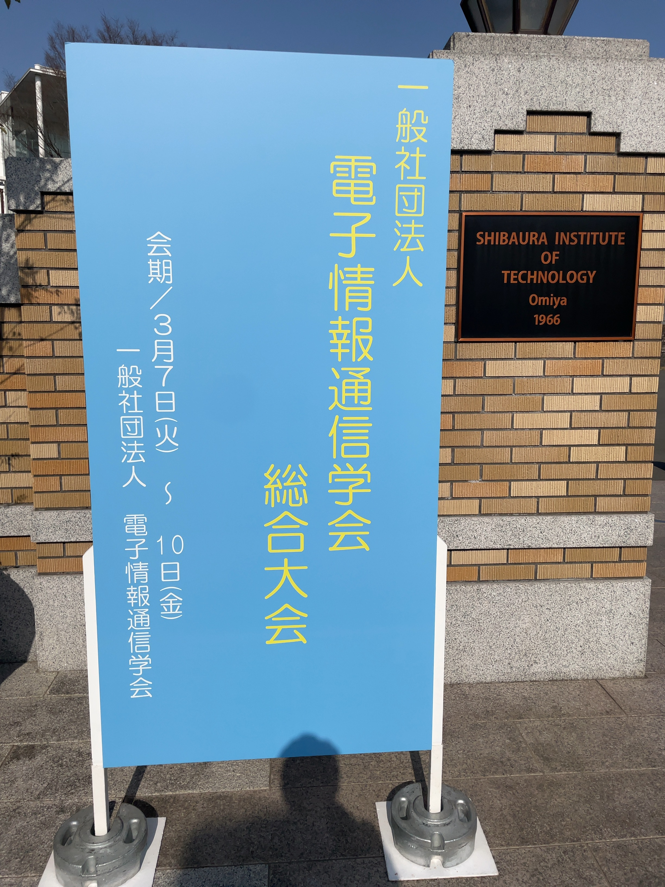

---

山里研の磯崎です．

2023/03/07-03/10 で開催された2023年電子情報通信学会総合大会で発表するため埼玉の芝浦工業大学に出張しました．
我々B4は初の学会発表で緊張もありましたが，山里先生のおかげで無事に発表をすることができました．
また学会期間中は色々な講座や発表を聴講しました．自分が特に印象に残っているのはBeyond5Gに関する発表です．日本を代表する企業さんから5G以降の通信のあり方について聞くことができました．
学会では大学院での研究の糧になるような経験が多くありました．今回の経験を生かして大学院でも研究に励んでいきます．
山里研究室では1年を通して積極的な発表を行っています．

