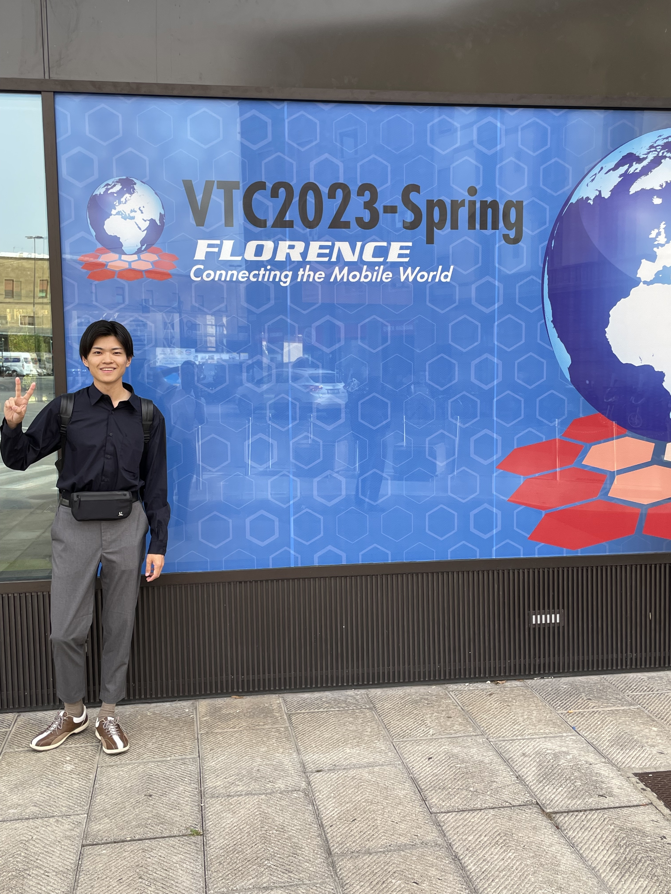

---

山里研の小鹿です．

2023/06/20-06/23 に開催された VTC2023-springで発表するため，イタリアのフィレンツェに出張しました．

僕が山里研究室に入ってからは国際会議はほとんどオンラインでの開催でしたが，コロナ禍も落ち着いたということで対面で参加することができました！
僕自身初めての国際会議だったのでわからないことだらけで不安な気持ちもありましたが，発表，バンケット，レセプションパーティーなどに参加し，有意義な時間を過ごすことができました．
また，海外の学生とも交流することができ普段日本で研究しているだけではできないような貴重な経験をすることができました！

---

