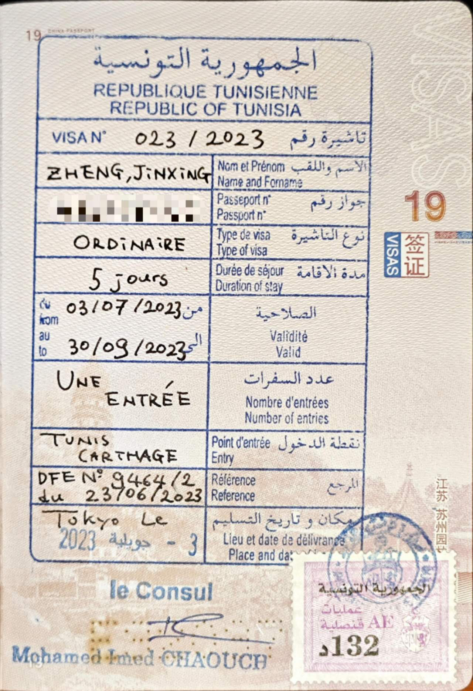
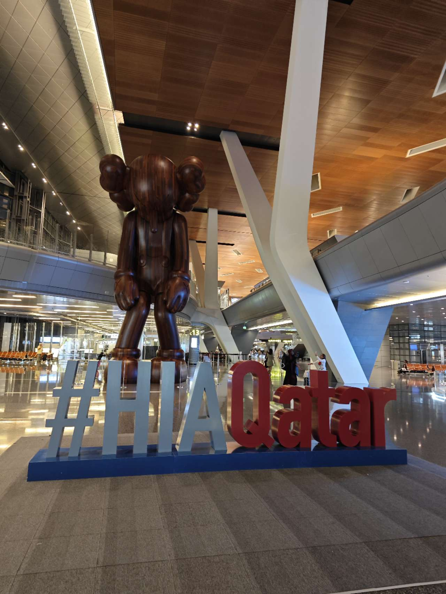
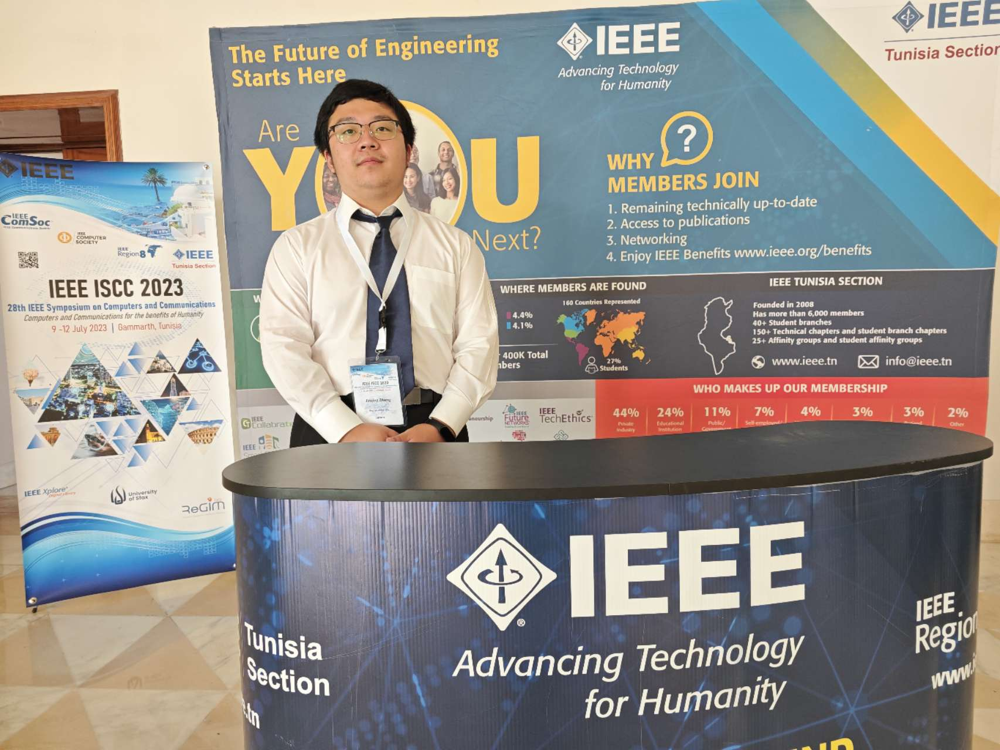
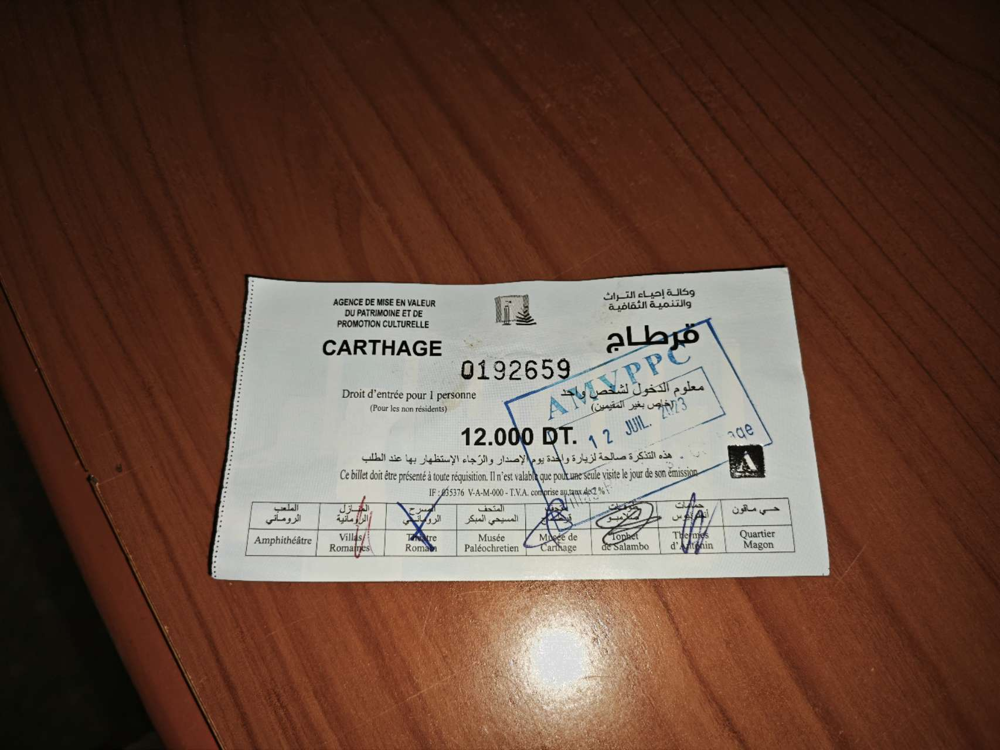
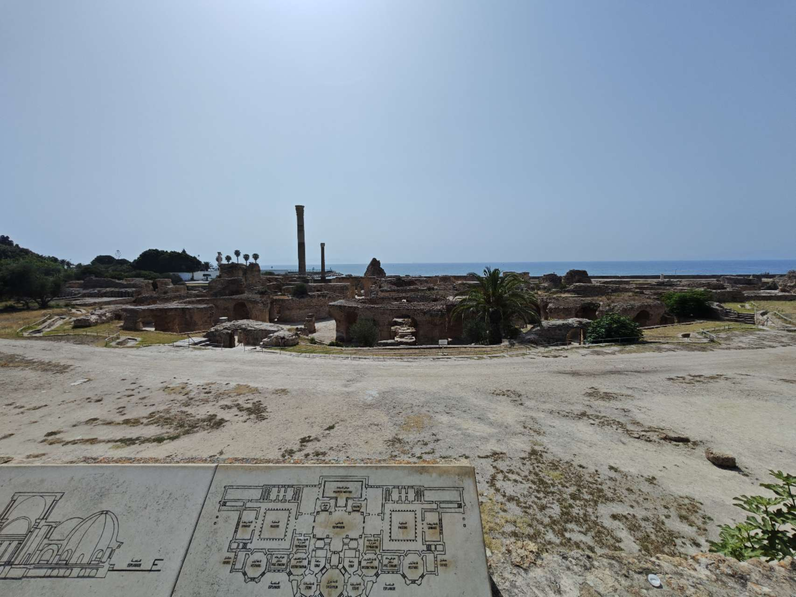
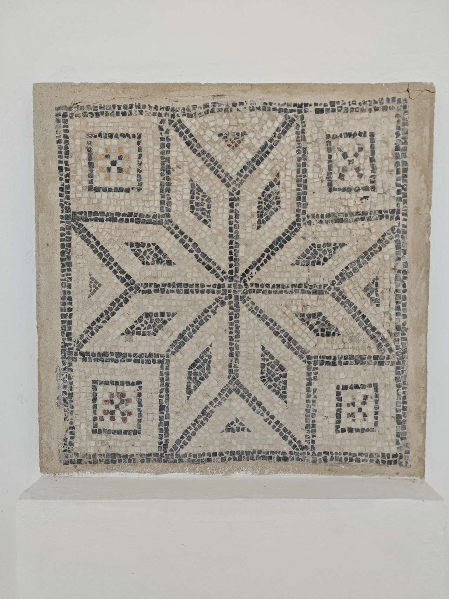
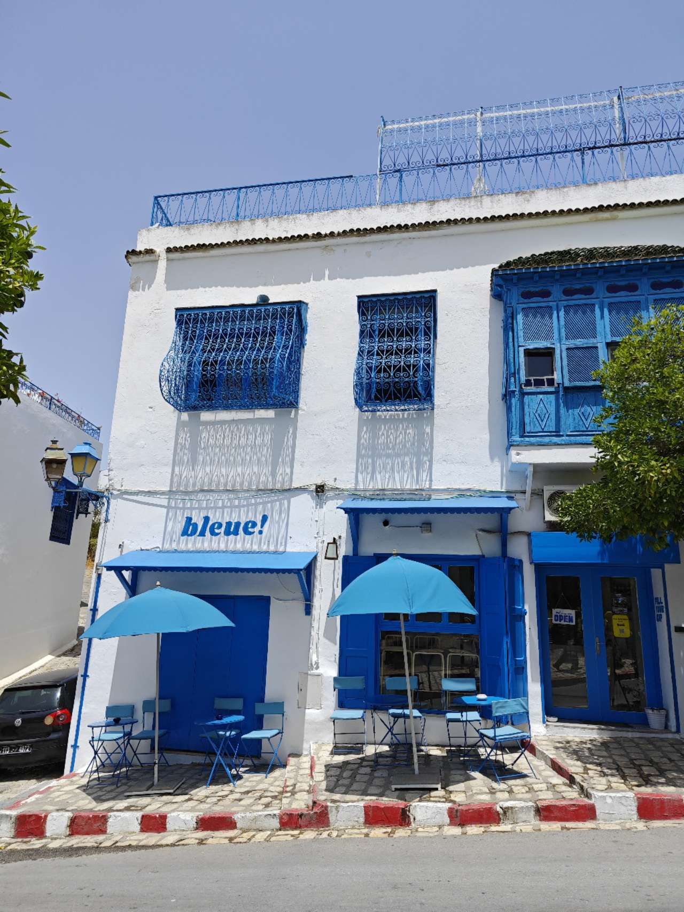
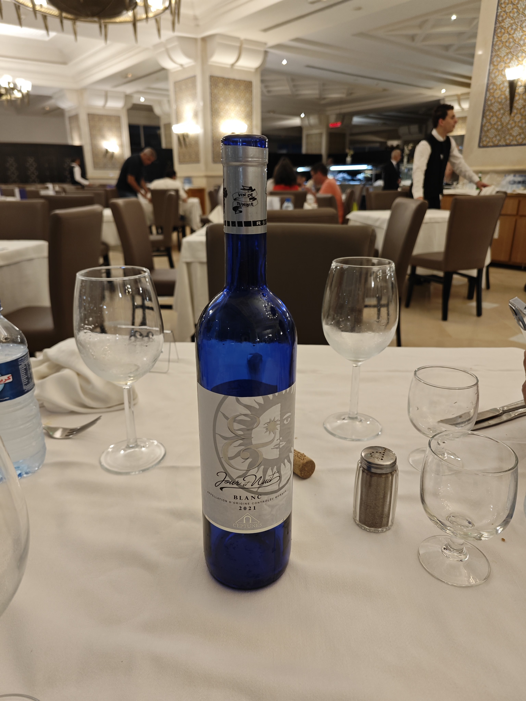

---

山里研の鄭です．

2023/07/09-07/12 に開催された28th IEEE ISCCのWorkshop on OWC 23'で発表するため，チュニジアのチュニスに出張しました．

初めて中国と日本以外の国に行けました．乗り継ぎと時差ぼけでとても疲れていましたが，発表と聴講，レセプションパーティーに参加してとても貴重な時間を過ごせました．

---

チュニジアのビザはこんな感じです．無事で審査通ってビザが間に合って良かったです．

カタールのドーハ空港で乗り継ぎ．とても広くて豪華な空港でした．さすが石油と天然ガスで金持ち国．（カタールの１人当たり名目GDPは世界5位らしいです）

会議初日にOWC23ワークショップで発表しました．

名城大学の中條先生と山里先生とチュニスにあるカルタゴの遺跡に観光に行きました．チュニジアはとても暑かったです（43℃）．この写真は古代ローマ人が建てたアントニヌス浴場の遺跡です．

チュニジアのモザイクです．

白と青の町「SIDI BOU SAID」にも行きました．
チュニスではよく現地（？）の人に“你好” “Chinese?”と聞かれました．中国には親しそうな国ですね．カルタゴの遺跡中国語で会話できた謎のアフリカ人がいて面白かったです．

山里先生にチュニジアワイン奢られました．イスラム教の国なのにワインを生産しているのは意外でした．

---

