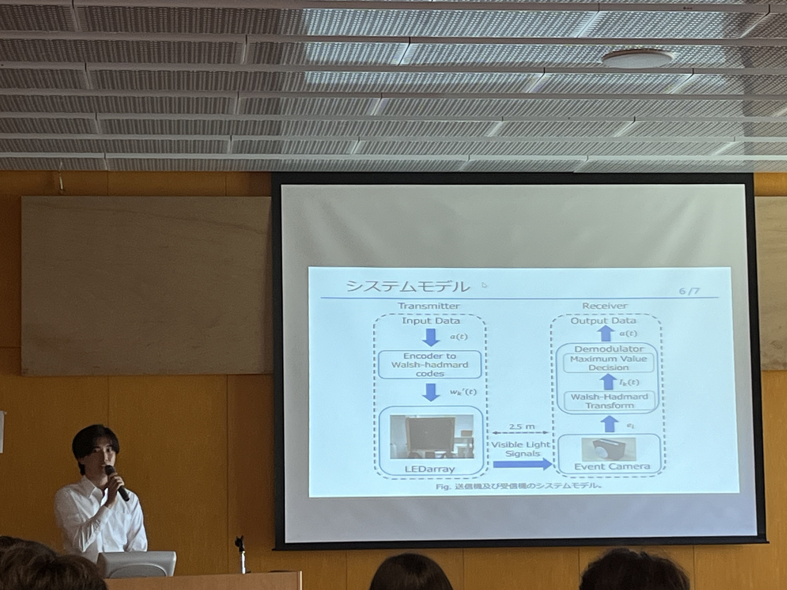
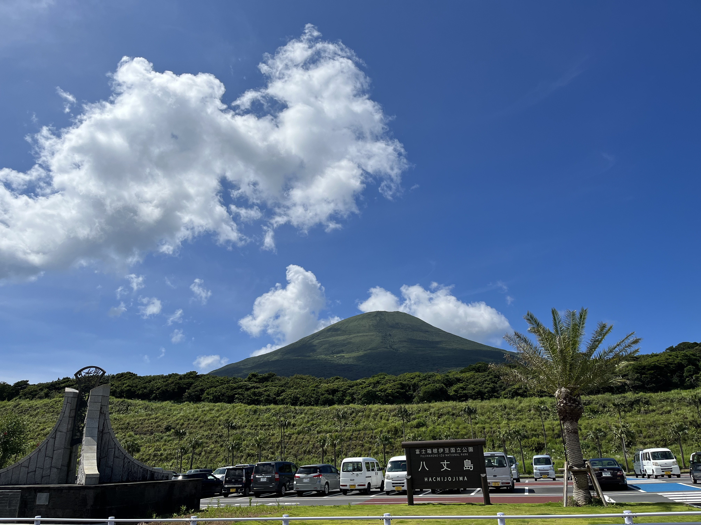

---

山里研の江原です．

2023/7/27-28 で開催された CS研究会 で発表するため，八丈島に出張しました．

今回はポスター発表での参加ということで慣れない形式に戸惑いましたが、議論を交わしながら自分の研究を発表することで新たな知見を得ることができました．
また、会場が八丈島ということで、普段は中々できないような体験ができ、自分の世界が広がるのも学会発表の大きな魅力と感じました．

