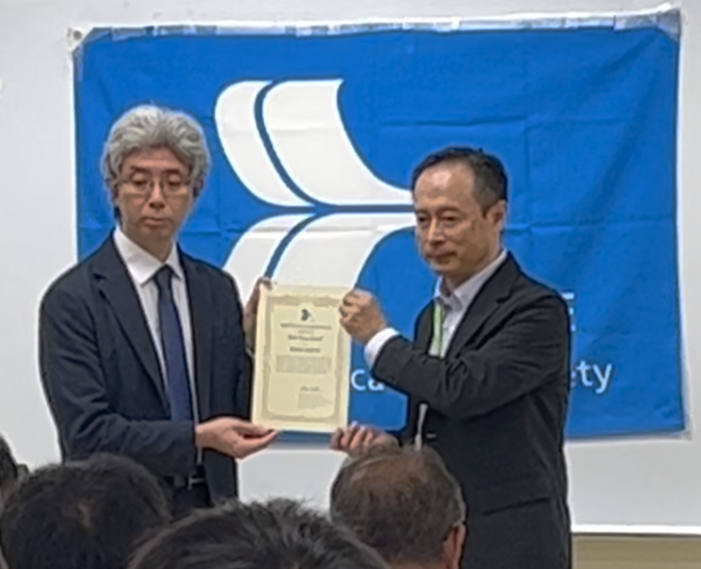

受賞論文は電子情報通信学会英文論文誌Bの 2022 年 10 月号に掲載されました．

- [Highly Accurate Vegetation Loss Model with Seasonal Characteristics for High-Altitude Platform Station](https://doi.org/10.1587/transcom.2021EBP3109)
- Hideki OMOTE, Akihiro SATO, Sho KIMURA, Shoma TANAKA, HoYu LIN
- Vol.E105-B No.10 pp.1209-1218, Aug., 2022.
- DOI: https://doi.org/10.1587/transcom.2021EBP3109

表さんの博士論文の一部を構成するものとなっております．素晴らしいですね！

皆様も，ぜひ，ご一読ください．

受賞式は名古屋大学で開催された[電子情報通信学会ソサイエティ大会](https://www.ieice.org/jpn_r/activities/taikai/society/2023/)の「通信ソサイエティ特別講演及び表彰式」で行われました．
以下，そのときの写真です．

表さん，また共著者の佐藤さん，木村さん，田中さん，林さん，論文賞の受賞，誠におめでとうございます．
