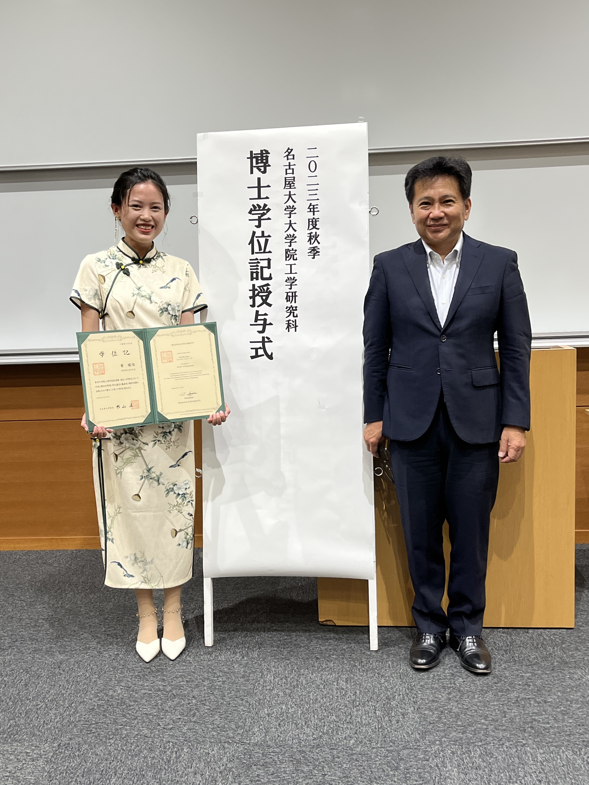
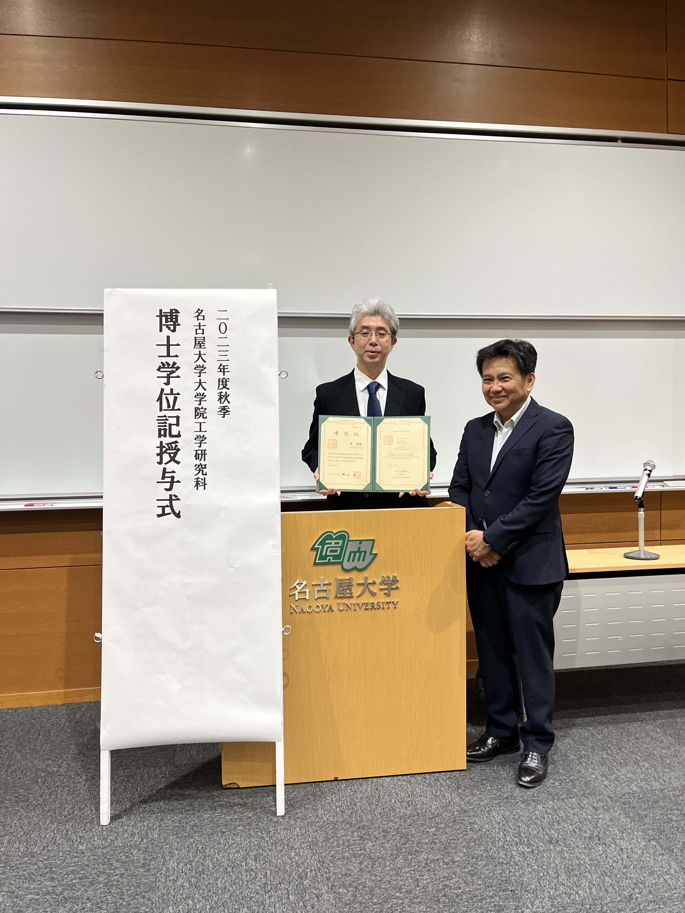

令和5年9月27日にIB大講義室にて，2023年度秋季博士学位記授与式が行われました．

秋季は留学生も多く，それぞれのお国の衣装で出席される方もいて，華やかです．
情報・通信工学専攻から5名の方が修了されましたが，内2名が山里研の方です．とても嬉しく思います．

黄瑞怡（Ruiyi HUANG）さんの学位論文は「ステレオビジョンに基づく可視光通信・測距」です．

表 英毅さんの学位論文は「非地上系ネットワークを対象とした電波伝搬測定と国際標準電波伝搬モデルの構築」です．

いずれも準備が整いしだい，公開されることと思います．

ルイさん，表さん，学位取得，誠におめでとうございます．

よろしければ，[2023年度名古屋大学秋季卒業式](https://www.youtube.com/watch?v=TKBqSNZTx3E&t=6s)もご覧下さい．
