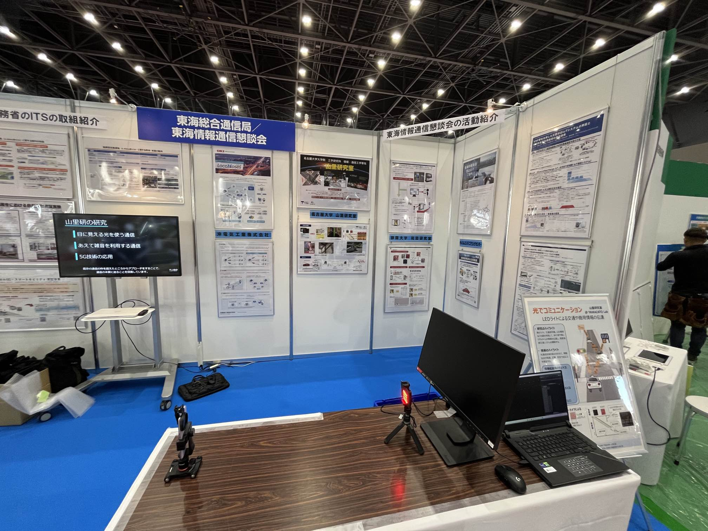

[あいちITSワールド](https://aichi-its.jp/itsworld/)は[名古屋モビリティショウ2023](https://www.nagoya-mobilityshow.jp)と一緒に開催される展示会で．

山里研究室は総務省東海総合通信局/東海情報通信懇談会のブースで展示しています．

D3唐 正強くんが作成したスマホと移動台車（と言っても小さいものです）による可視光通信のデモも行います．

山里研の学生さんが交代で説明員を務めますので，名古屋モビリティショウへお越しの方は，ぜひ足を伸ばしていただけると幸いです．

[静岡大学・和田研究室](https://wwp.shizuoka.ac.jp/telecom/)，[名古屋大学・片山研究室](https://www.katayama.nuee.nagoya-u.ac.jp)のパネルも展示しています．

