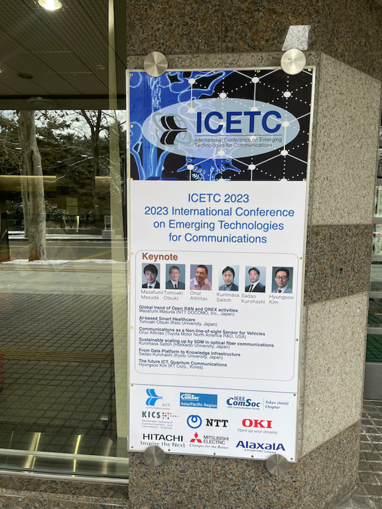

---

札幌市かでる2.7で開催されたICETC2023で唐君、磯崎君、大塚君が口頭発表を行いました。

2日目の夜にはバンケットが開催され、表彰式が行われました。

表彰式では、唐君がStudent Presentation Award、磯崎君と大塚君がBest Paper Awardを受賞しました。

Student Presentation Awardは全発表の15%程度、Best Paper Awardは全投稿論文の内4件に与えられました。
おめでとうございます！

山里研究室では積極的に学会発表、論文投稿を行なっています。

