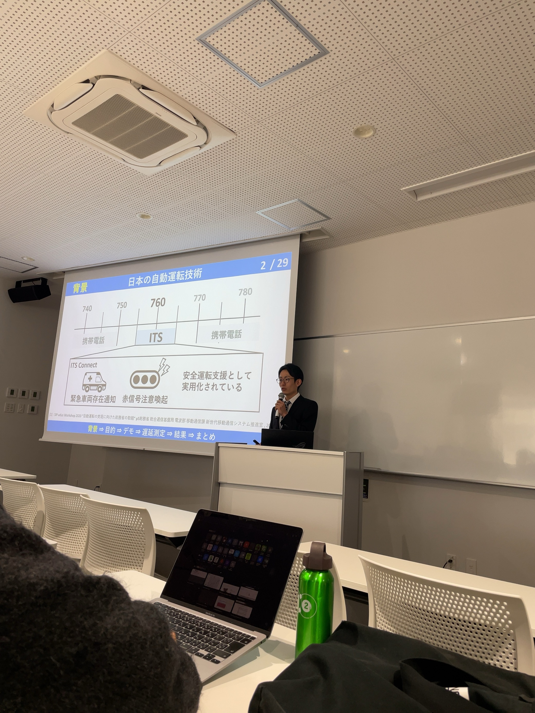
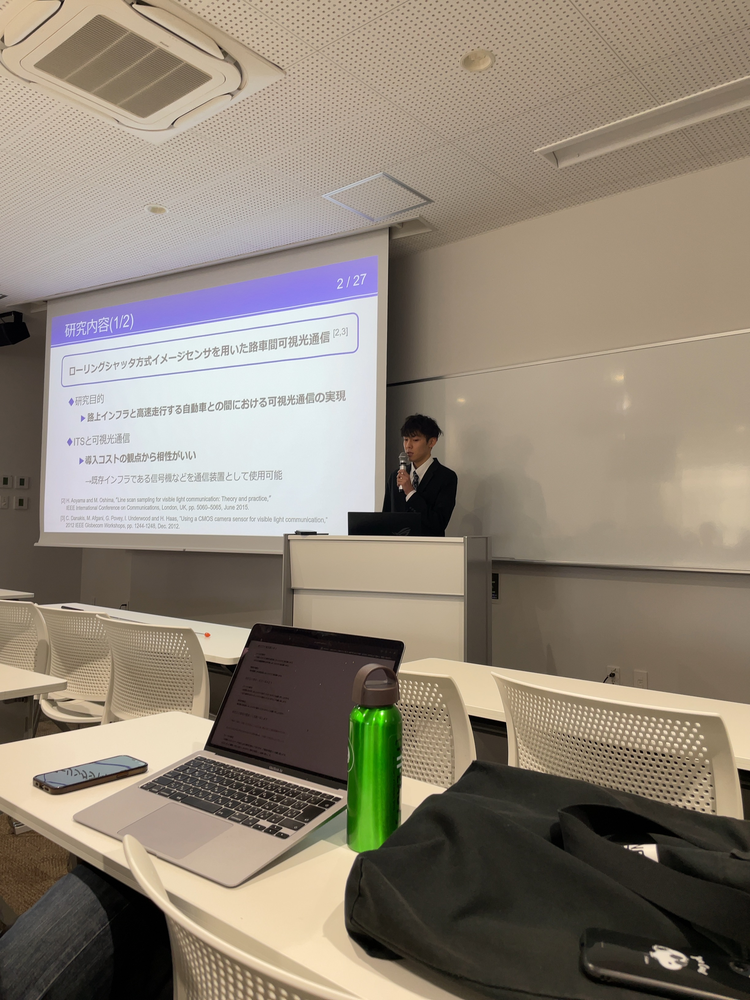
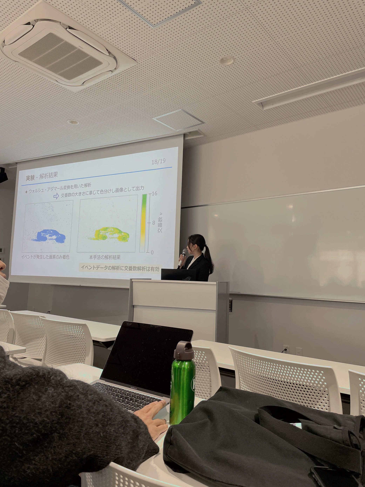
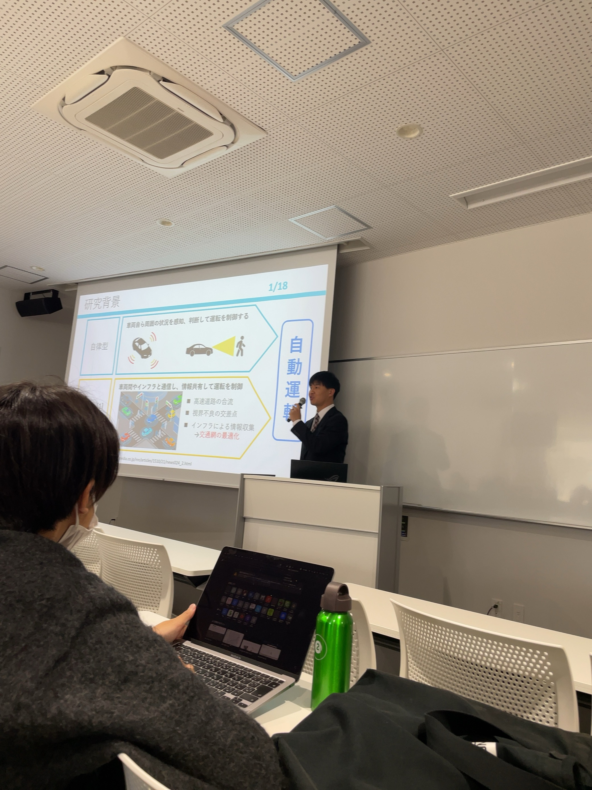

2024年3月1日に開催された名古屋大学電気電子・情報工学科合同卒業研究発表会(片山研，武田研，長谷川研，藤井研，山里研)でB4メンバーの近藤君、永井さん、中野君、呉君の4名が発表を行いました．

本発表会でB4メンバーの中野君が第3位になりました．素晴らしい！おめでとうございます！

---

B4中野くんのコメント：

初めての発表で緊張しましたが，練習通りにできてよかったです．修士ではもっと良い成果が出せるように一層奮励努力します． 
また，卒論の執筆，発表に際しご指導ご鞭撻いただきました山里先生，路先生，研究室のメンバー諸君に心より感謝申し上げます．

<!--  -->
