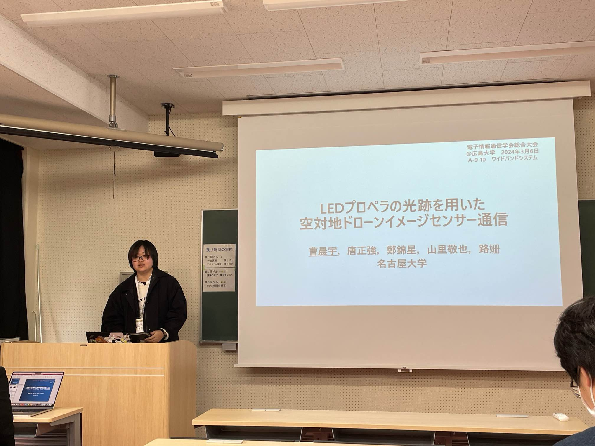
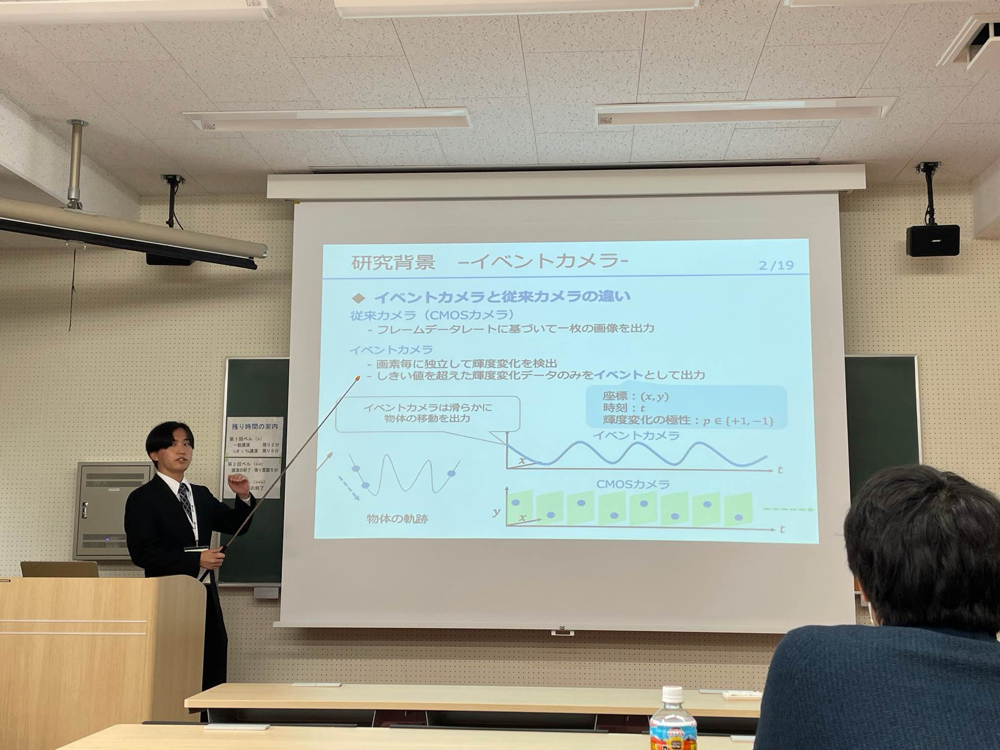

---

2024年3月4日~8日に広島大学東広島キャンパスにて開催された2024年総合大会でM2メンバーの小鹿君，江原君，鄭君，M1メンバーの曹さん，B4メンバーの近藤君，永井さん，中野君，呉君の8名が発表を行いました．

M2の江原です．

卒業間近ですが，今年度の研究がまとめられて良かったです！また三日間学会に参加し，他の研究者の方の発表を聴講したことで非常に勉強になしました．

山里研では毎年多数の学生が総合大会で発表を行なっています．

