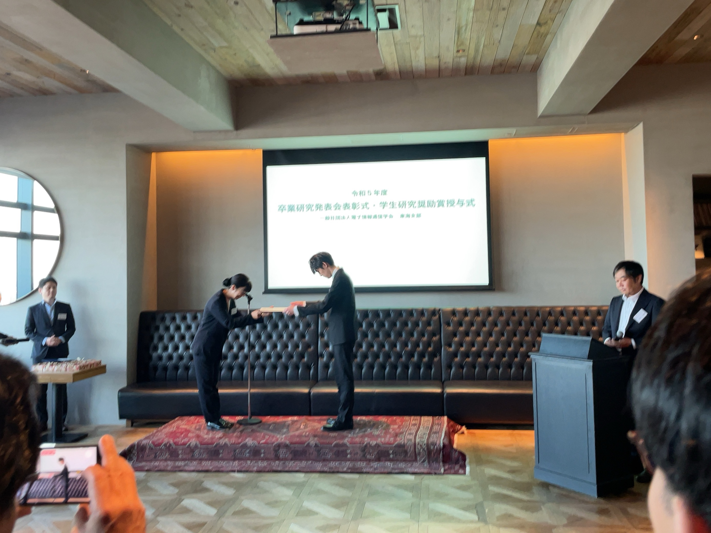

---

近藤君，中野君が令和5年度IEICE東海支部卒研発表優秀賞，磯崎君が学生研究奨励賞を受賞しました．

6月14日には名古屋駅JRゲートタワーにて表彰式が行われました．

M2磯崎のコメント：

磯崎です．今回はこのような賞を賜り，誠に光栄に思います．
約2年半，確率共鳴の研究に取り組んできましたが，この賞を励みに更なる成果を生み出していきたいと思います．

これまで貴重なご指導をいただきました先生方，そして共に学んだ研究室諸君に心より感謝します．

