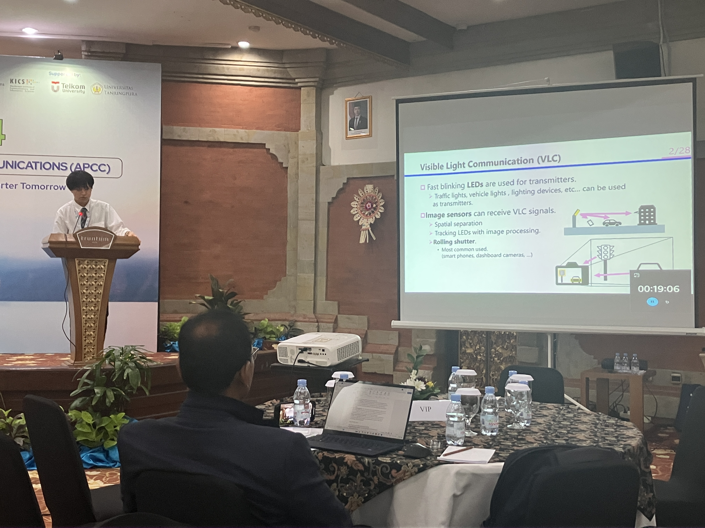
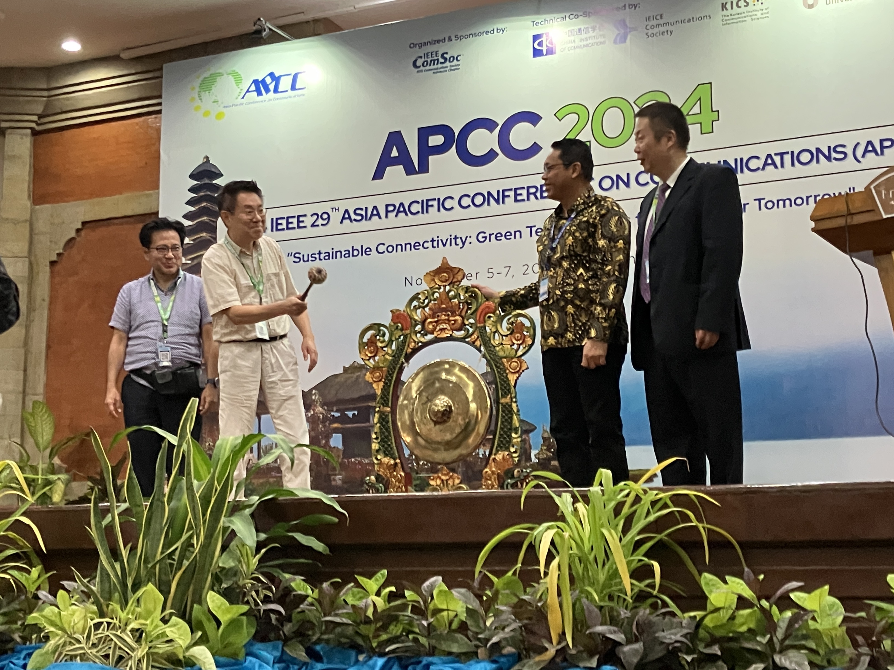
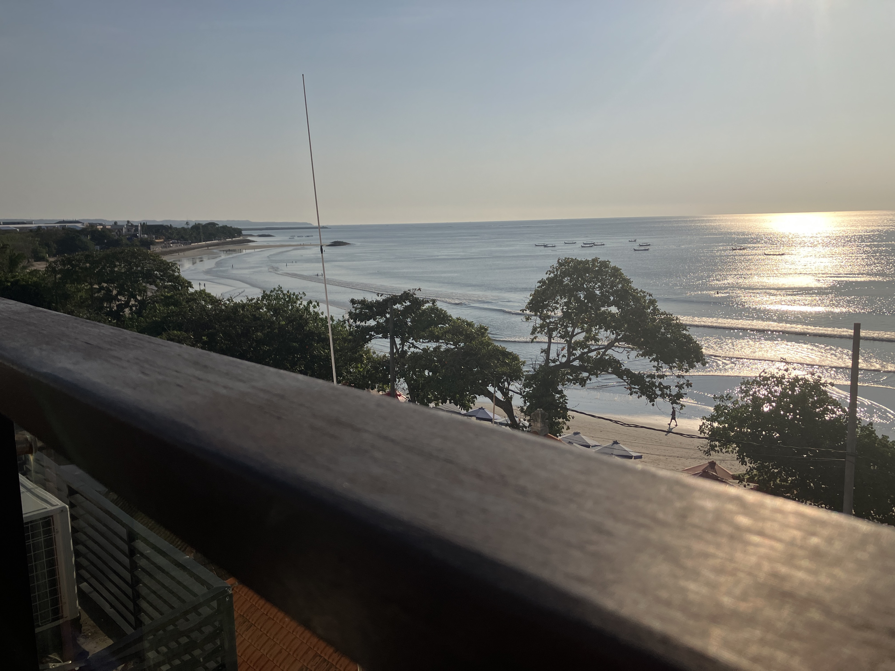

 
---
 
2024年11月05日〜11月07日にインドネシア・バリ島のホテル，トゥルントゥムクタで開催された2024 IEEE 29th Asia Pacific Conference on Communications (APCC)でM2の大塚君が発表を行いました．山里研では海外での研究発表もたくさん行っています．
---
山里研の大塚です．
11/4~11/7にインドネシア・バリ島で行われたAPCC'24で発表を行ってきました！
 
口頭発表では海外の方から多くの質問を頂き，自分自身の研究についてどのように説明，解説するとより伝わるか考え直す機会となりました．
また，基調講演では世界中の大学，企業の研究者の方から貴重なお話を聞くことができ，自らの見識を深めることができました！
 
会場はビーチのすぐそばだったので，レセプションや昼食の際はとても良い景色や自然を楽しむこともできました．
さらに，自分自身初めての海外であったので，文化や気候，街並みの違い，英語での生活などたくさんの新鮮な経験が得られました．
 
山里研では海外での研究発表もたくさん行っています．

