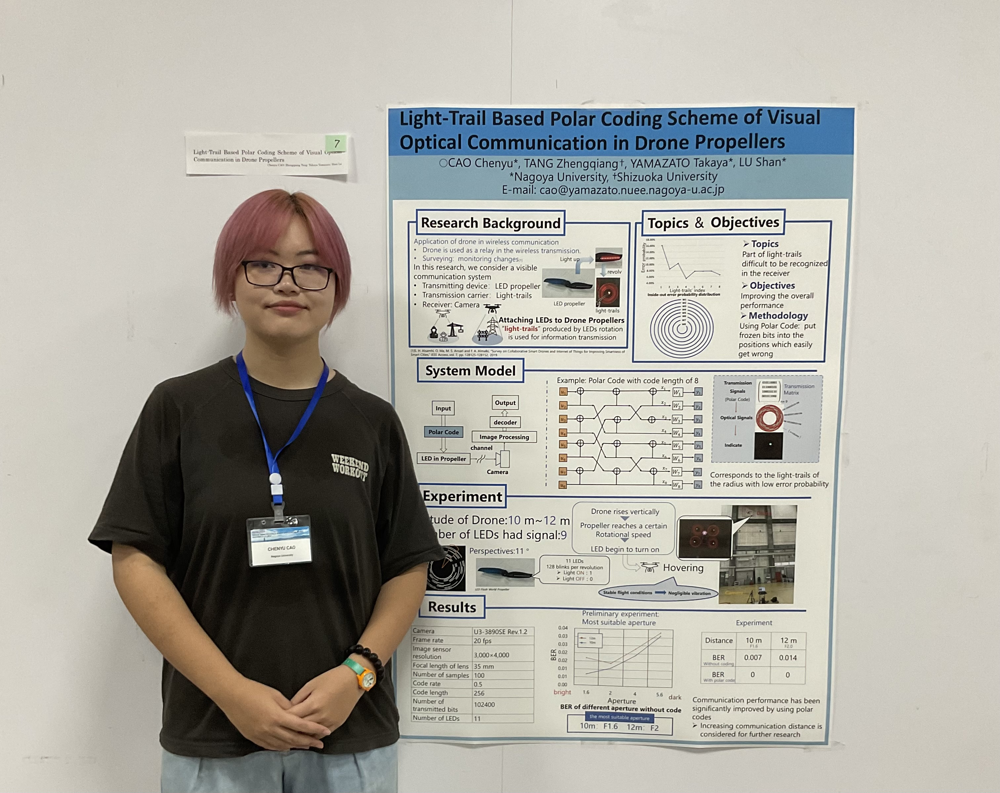
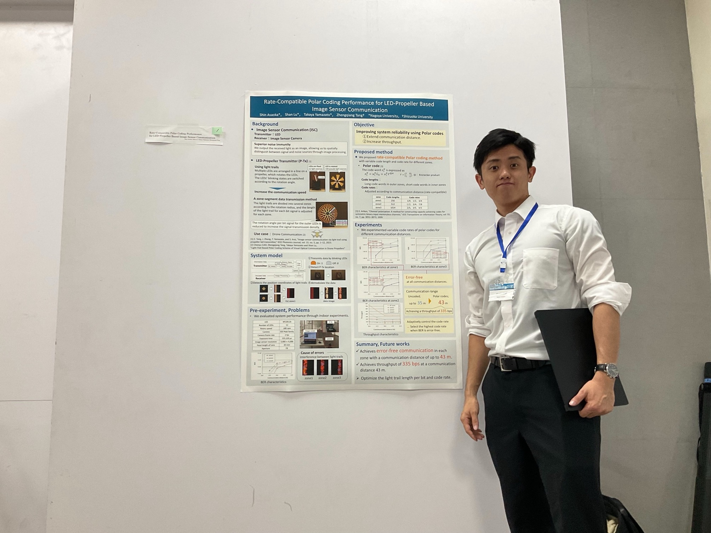
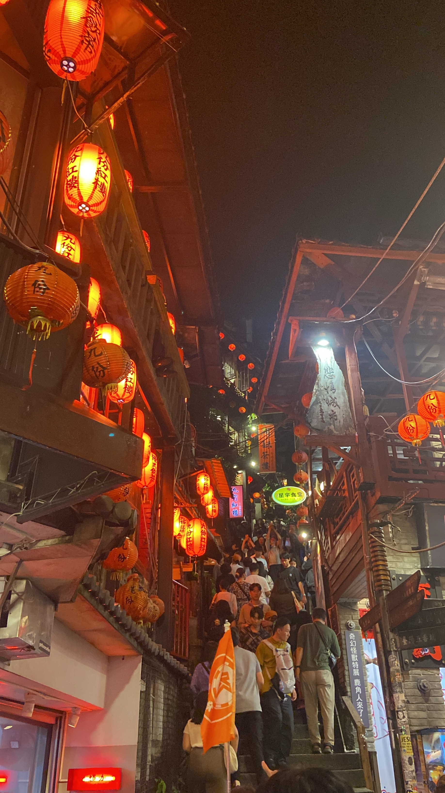

 
---
 
2024年11月10日〜11月13日に国立台湾科技大学（National Taiwan University of Science and Technology）で開催された The International Symposium on Information Theory and Its Applications (ISITA) 2024 で曹さん(M2)と浅岡くん(M1)が発表を行いました．

---
 
山里研の曹です．

本研究では，ドローンのプロペラにLEDを搭載し，その回転によって生成される光跡を利用して地上へ信号を伝送する方法について検討しました．しかし，この可視光通信システムでは，プロペラ外側の光跡が識別しにくいため，未符号化の信号に一部の損失が発生するという問題があります．この課題を解決するため，本発表では，符号率0.5のPolarコードを用いて符号化を行いました．結果として，符号化を適用することで，本システムのビット誤り率（BER）を0にまで低減することができました．

- 頂いた質問と回答
  - デコーダは何か．この以降，研究の課題は何ですか．
    - デコーダはsuccessive cancellation（ＳＣ）を使った．課題として，現在の実験は全部室内環境で行った，通信距離は短い．できれば通信距離を伸ばしたい．
  -  使ったLED数は？
    - 1つのプロペラに11個LED付ける，この中で一番内側と一番外側のLEDは位置特定用，一つのLEDはパイロット用，残り8個LEDはpolar符号を送信する．
- なぜ可視光通信？
  - 可視光通信は電磁波通信と共存でき，現在ドローン電磁波通信チャンネル混雑の問題があり，可視光通信を導入したらこの問題を緩和することができる．
- この通信方式のビットレートは？
  - 512bps

 
---

山里研の浅岡です．

2024/11/10~13で開催されたISITAにて，研究発表を行いました．

学会期間中，多くの研究者の方々の発表を聴講する中で，研究内容や取り組み方についてたくさんの学びを得ることができました．
また，ポスター発表では，様々な方々と交流する中で，自身の研究を見直す機会となり，今後の研究活動への新たな刺激を受ける貴重な機会となりました．
今回の研究発表にあたり，ご指導いただきました山里先生，路先生，そして研究室の皆さまに，心より感謝申し上げます．

学会期間中には九份（きゅうふん、ジォウフン）にも行きました．ジォウフンはノスタルジックな雰囲気が残る人気観光地で，夜になると提灯の灯りが何とも言えない妖しさと美しさを醸し出します．

