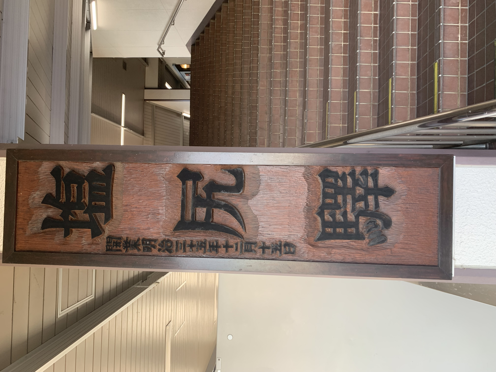
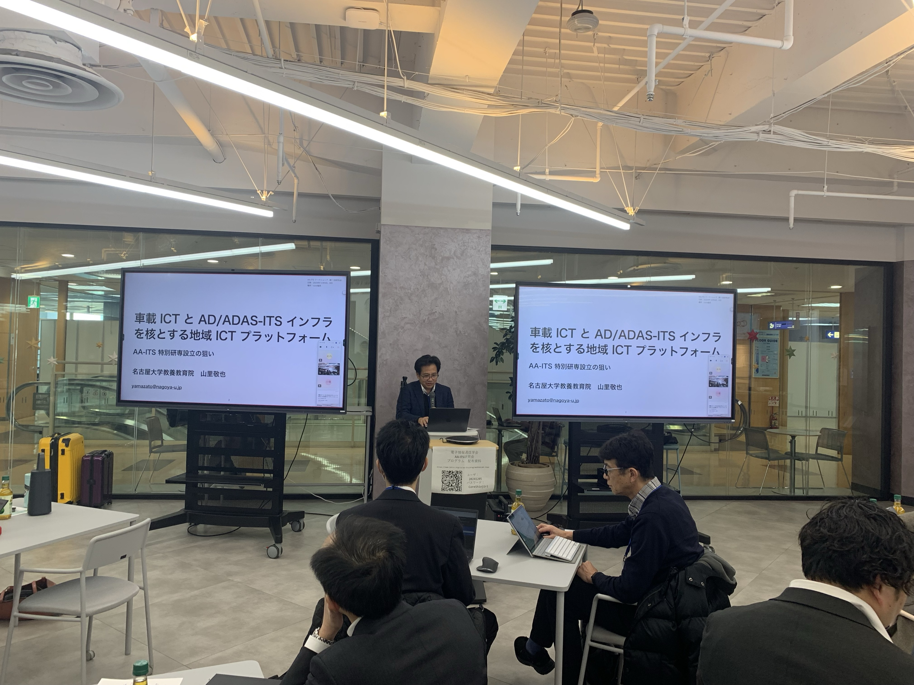
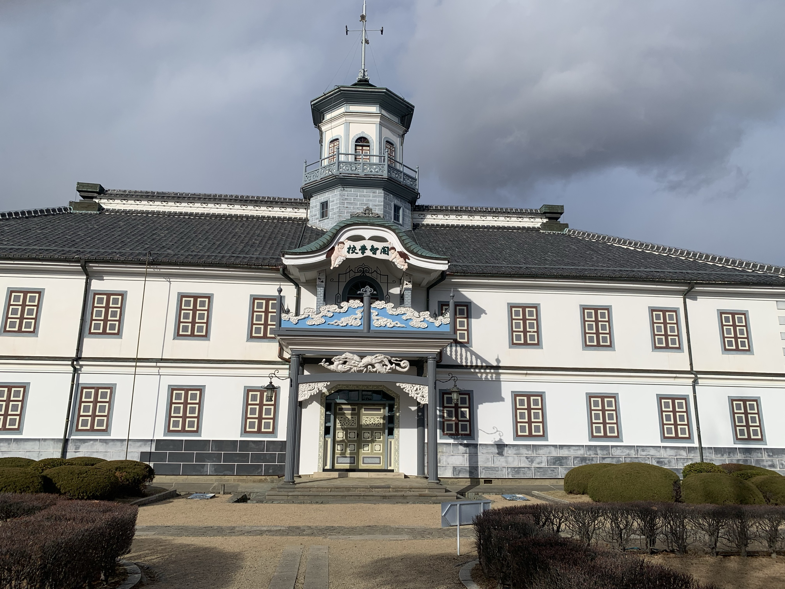

 
---
 
山里研の中野です．

2024/12/5~6に長野県の塩尻市で開催されたAA-ITS研究会にて発表を行いました．AA-ITSのAAとは，Autonomous Driving（自動運転）とAdvanced Driver-Assistance Systems（先進運転支援システム）の頭文字をとったものです．

この研究会は，主としてスマートポールと呼ばれるセンシングと通信機能を持ったインフラ設備を利用した路車協調について扱っています．今回私は，可視光を用いた路車協調のためのリアルタイム通信について発表してきました．ITS関連の研究会ということで安全性や拡張性，データ容量などについて多くの研究者の方々と議論を深めることができました．頂いたフィードバックを基に，今後の研究をさらに進展させていきたいと思います．研究発表にあたり，ご指導いただきました山里先生，路先生，そして研究室の皆さまに，心より感謝申し上げます．

今回の研究会はワインの名所塩尻市開催であったため，発表後にはお酒を楽しむこともできました．また，松本市にも観光に行き国宝である旧開智学校校舎をみてきました．日本教育の歴史を戦前から追うことができて，非常に興味深かったです．

 