 
---
 
いつもお世話になっております，山里研の磯崎です．
2024/12/6~2024/12/13で南アフリカへ行ってきました．参加記録をここに記します．

- 12/6(金)深夜0時，新幹線で羽田に向かいエミレーツ航空EK0313便で11hかけてドバイ国際空港へ．
  - 初めてのエミレーツ航空でテンション爆上がりしました．なぜならエミレーツ航空はロンドンに拠点を置くプレミアリーグの強豪，我がアーセナルFCのオフィシャルパートナーで，ユニフォームにもデカデカとロゴが載っている企業だからである．
  - エミレーツ航空に乗ることは，ただ目的地に行くための移動ではありません．それは，特別なひとときを体験する旅そのもの．空の上で出会える極上のサービスと忘れられない思い出．リクライニングしたシートに身を預けながら窓の外を見ると，砂漠の上に朝日が昇っていく．これが彼らの提供する"空の魔法"なのだろうか．

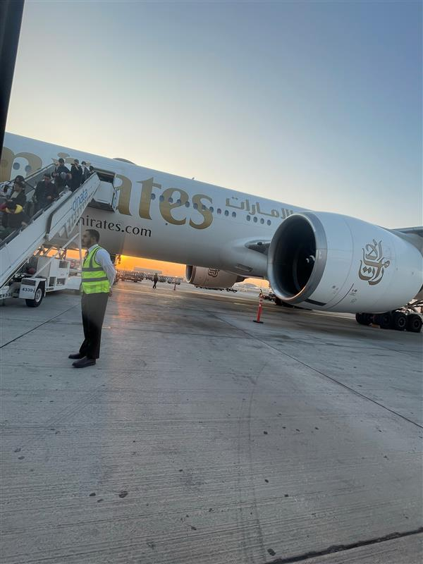

- 12/6(金)午前7時，ドバイ空港へ到着
  - 一発でストレートネックになった．次のケープタウンまでの乗り継ぎ時間が20時間以上あったのでドバイの街へ行ってみました．UAEは観光に力を入れているらしく，高級ホテルやインフラ整備に莫大な投資が行われているとのことで非常に楽しみでした．
  - 航空会社が無料でホテルを用意してくれて，空港で10GBの無料SIMが配布されました（羽振り良すぎｲ）．
  - 電車を乗り継いでブルジュハリファの展望台へ．高さ828メートル、世界の屋根に立つと，人間の想像力と技術がここまで到達するのかと圧倒される．ただの眺望ではない．この場所は地球の曲線すら見渡せる未来の窓だ．ドバイの街は1つ1つの建物が煌めき，砂漠に浮かぶ奇跡そのもの．どこか夢のようで，手を伸ばしても届かない蜃気楼のようです．
  - 正直，アラブの伝統的な街並みや敬虔な文化を体験したかったのだが，街がデカすぎて大量の資金が注ぎ込まれたピカピカのコンクリートジャングルを抜けることができませんでした．今回は時間がなかったので限られた場所しか行けませんでしたが，もっと時間がある時に訪れてじっくり見てみたいと切に思います．空港でドリンクと普通のサンドイッチで4000円徴収されたのち，ケープタウンへ出発．

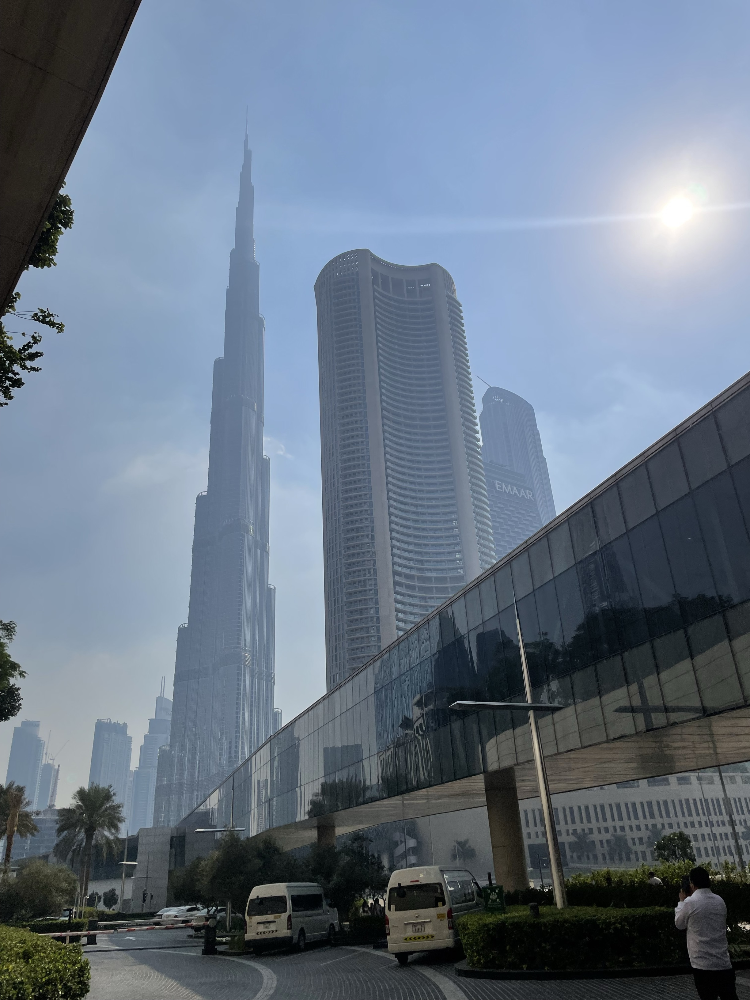
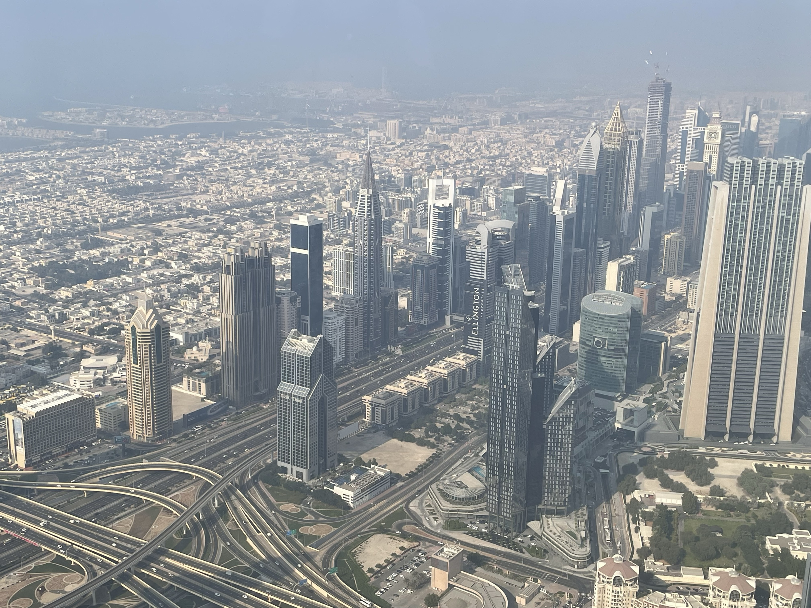

- 12/7(土)午前11時，ケープタウンへ到着
  - 空港からUberでホテルに向かい，14時にホテルにチェックイン．夕方，時間があったので夜ご飯を食べにウォーターフロント地区へ徒歩で向かいました．ウォーターフロント地区は19世紀に築かれた港湾施設をリノベーションしたエリアで，青く広がる海を背景に美しいヨットが行き交い，その傍らには洗練されたショップやレストラン，エンターテインメント施設が立ち並びます．観覧車や水族館もありもはやテーマパークです．路上ではアフリカ音楽が鳴り響き民族舞踊を踊っている人が大勢います．野生動物もたくさん見ることができました．ここでハンバーガーと白ワインをいただき，帰りにケープタウンの市内を散策しつつホテルに戻り就寝．

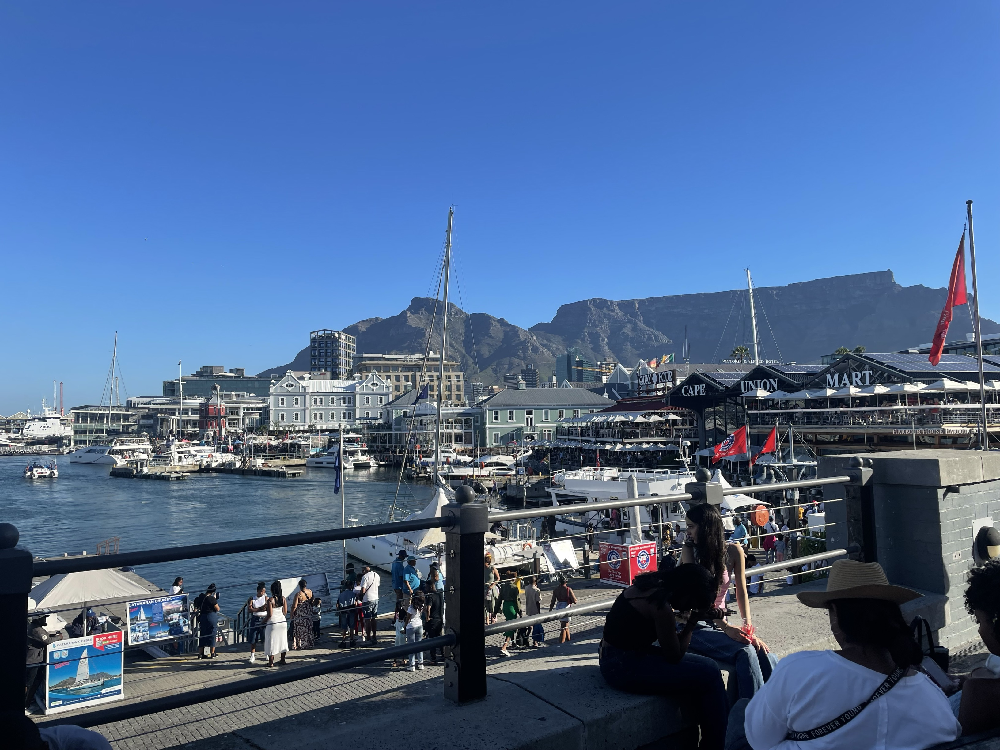
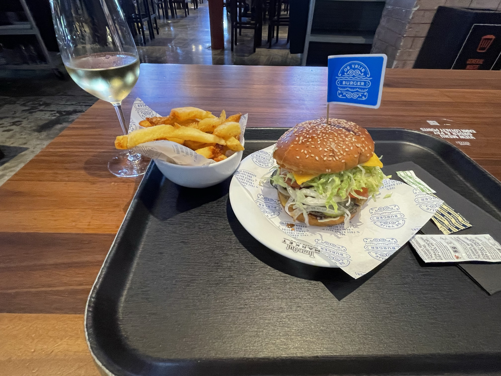

- 12/8(日)朝からサファリツアーに出発
  - 朝7時から学会が用意してくれたサファリツアーに参加しました．ツアー会社がホテルの前まで迎えにきてくれて，先生と一緒にアキーラ動物保護区へ向かいました．ケープタウン市内から2時間ほどで着き，ホテルで朝食バイキングを頂きました．
   - サファリツアーは雄大な保護区の中をピックアップトラックを改造した様な車で回りました．サファリツアーが教えてくれたのは単に動物の生態ではなく，人間もまた自然の一部であるということ．大地のリズムに耳を傾け，自然を尊敬する心を持つことで，私たちは初めてこの星の真の美しさを理解できるのかもしれません（知らんけど）．ケープタウンのサファリはただの旅先の1つではなく，心に刻まれる人生の大きな章となりました．これを読んでいるあなたもぜひ一度この奇跡の地を訪れ大地の息吹を感じてみてください．
   - 15時ごろにホテルへ戻ってきてから学会会場へ行き，レジストレーションを済ませた後にレセプションパーティに参加した．アフリカ料理が美味しくて，「これは文化交流だ」と自分に言い訳しながらおかわりをたくさん頼みました．

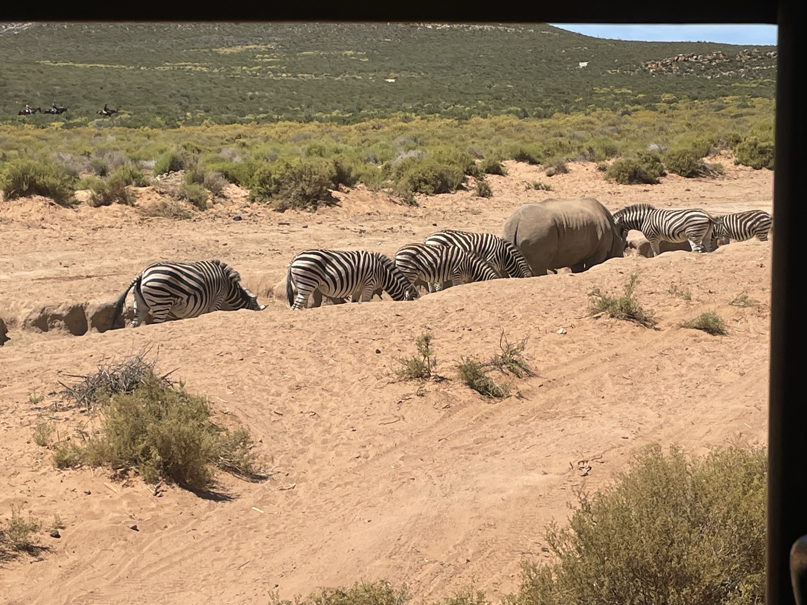
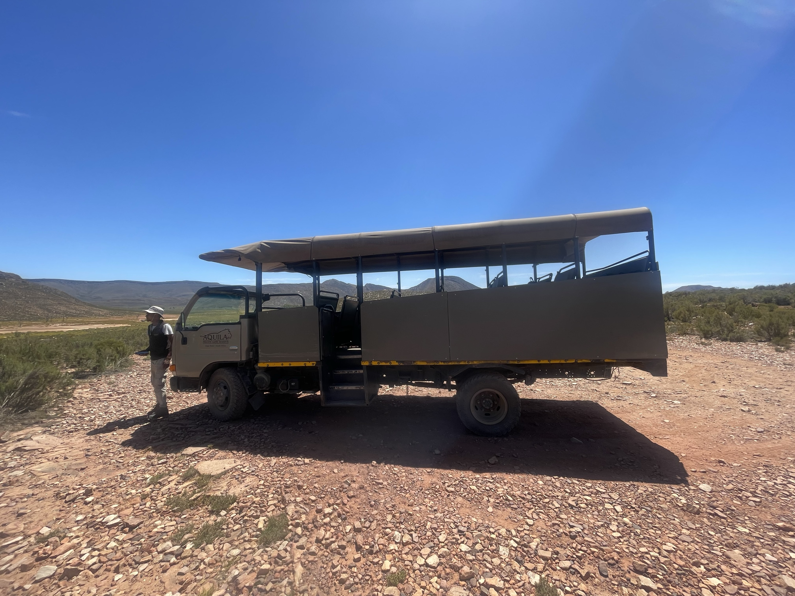
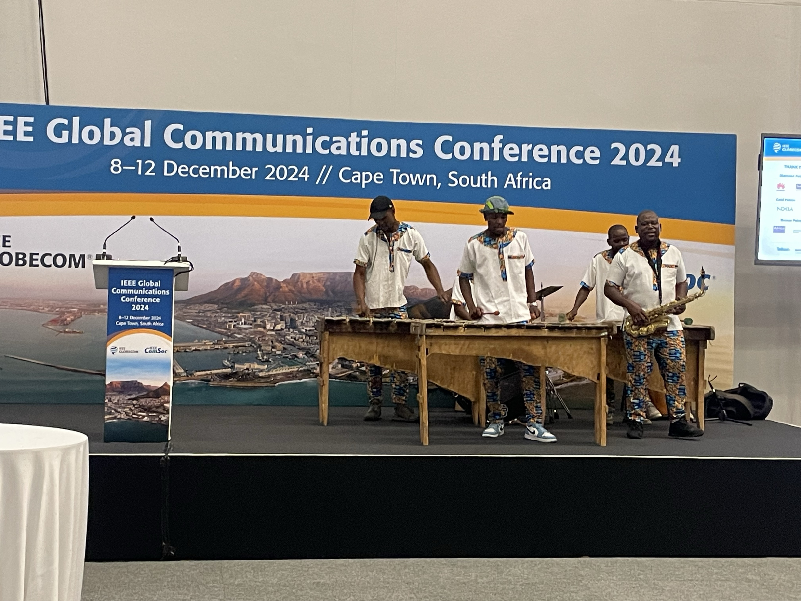
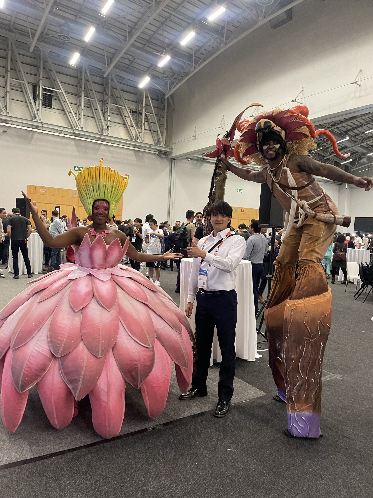
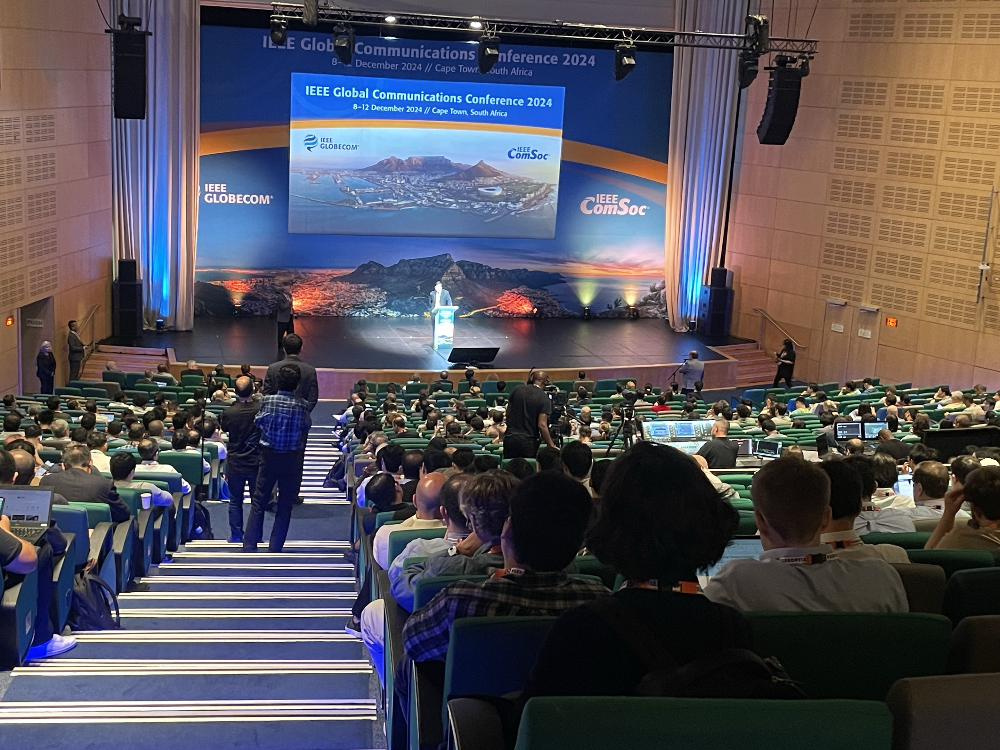

- 12/9(月)~11(水)
   - 学会に参加．様々なセッションに赴き無線通信に関する新たな知見を得ることができました．時折，発声や間がよくて観衆引き込む話し方をする発表者がおり，発表の仕方についても非常に勉強になりました．IEEE ComSoc Asia Pacific Boardのミーティングにも参加し，アジア地域の研究者の方とたくさん話す機会を得られました．
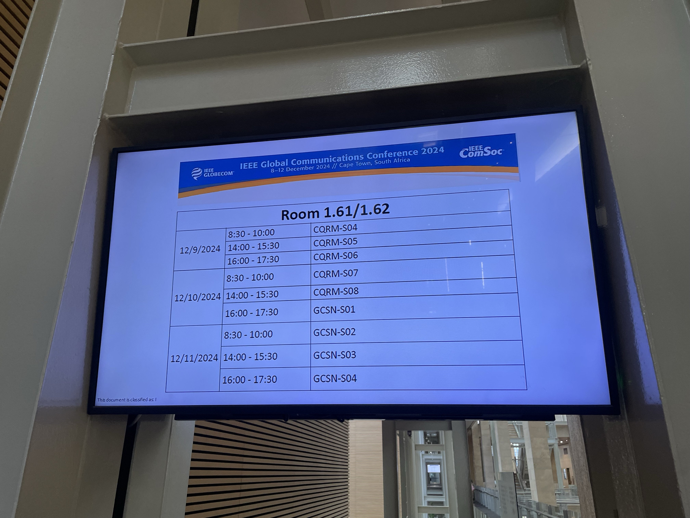

- 12/12（木）
   - 発表の日．朝8時半から発表するセッションが始まるので（しかもセッションの最初の発表），寝坊しないかとてもヒヤヒヤしましたが，きっちり6時に目が覚めて安心しました．質疑応答では，「今回の発表ではAWGNチャネルにおける結果が示されていたが，フェージングでの検証は行ったか？」という質問をいただきました．残念ながらまだフェージングでの検証は行なっていなかったので結果を説明することはできませんでしたが質疑応答が滞りなくいって安心しました．ただ，もっと英語力を高める必要があると実感しました．
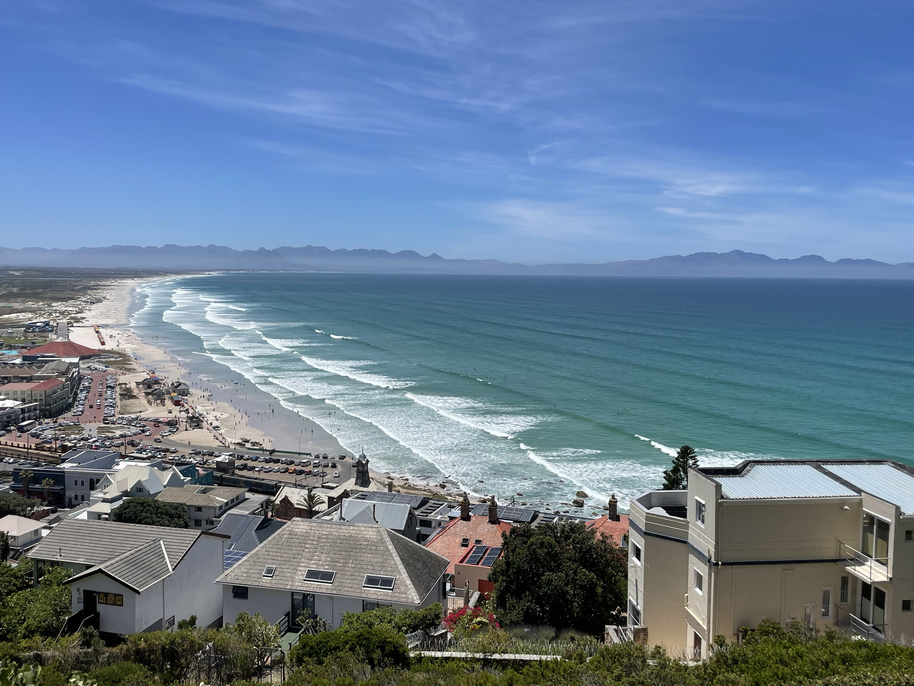

- 12/13（金）
   - 飛行機が18時発だったのでチェックアウトしてから市内観光をしました．ケープタウンには真っ赤の "Hop On Hop Off Bus"という観光バスが大量に走っており，市内をぐるぐる回っています．これに乗って東のワインランドへ行ったり野生のペンギンのいるボルダースビーチへ行くことができます．乗り降り自由で，停留所で待っていればすぐに次のバスが来るので非常に便利です．これに乗りケープタウンの市内を一周しました．バスの2階席に腰を下ろすと，耳元では音声ガイドが日本語でケープタウンの歴史やエピソードを教えてくれます．そのストーリーに耳を傾けながら街のシンボルであるテーブルマウンテンが少しずつ近づいてくる景色には思わず胸が高鳴りました．まず向かったのはテーブルマウンテンのロープウェイ駅です。山頂へのアクセスもスムーズで，ここからケープタウン全体を見下ろすことができました．次の停留所は世界のセレブの別荘も数多くあるキャンプスベイです．黄金の砂浜とターコイズブルーの海が広がり，背後には迫力ある12使徒（山の名前）がそびえ立ちます．ここではバスを降りて海辺のレストランで新鮮なシーフードを堪能しました．心地よい潮風に吹かれながらのランチタイムは，まるで絵葉書の中にいるかのようでしたホップオンホップオフの魅力は、自分のペースで街を巡れることです．途中，ハウトベイのマーケットで地元のアートやクラフトに触れるもよし．コンスタンシアのワイナリーで極上のワインを味わうもよし．それぞれのスポットで「自分らしいケープタウン」を見つけることができるます．夕陽が街を黄金色に染める中、再びバスの2階席に座る。街の喧騒と穏やかな波音が混ざり合い、心が満たされていく。これからケープタウンを訪れる人には、この赤いバスに乗ることを心からおすすめします。
    - 18時にケープタウン市内からタクシーで空港に向かい，ドバイへ出発．

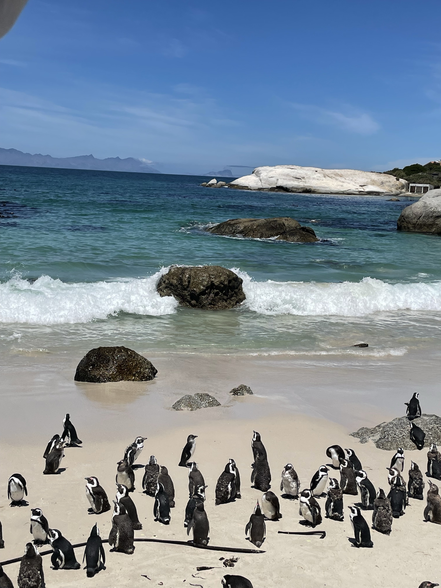
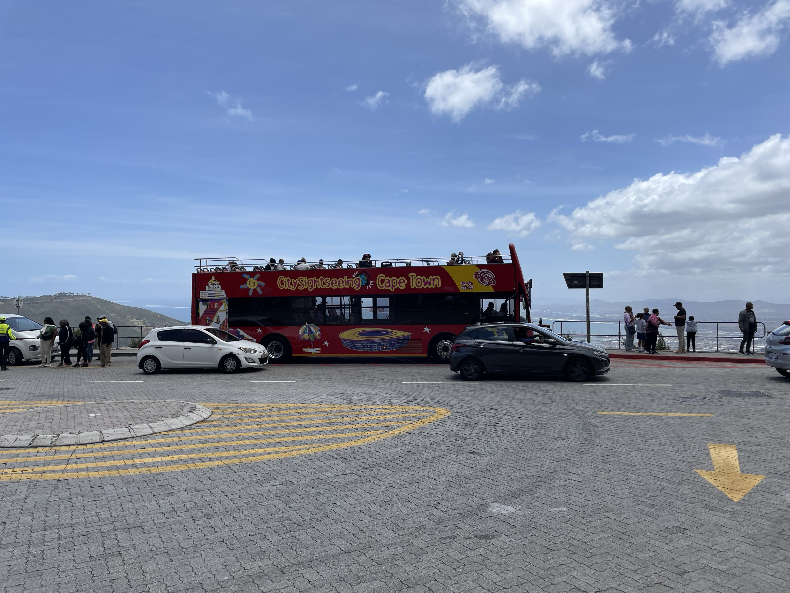
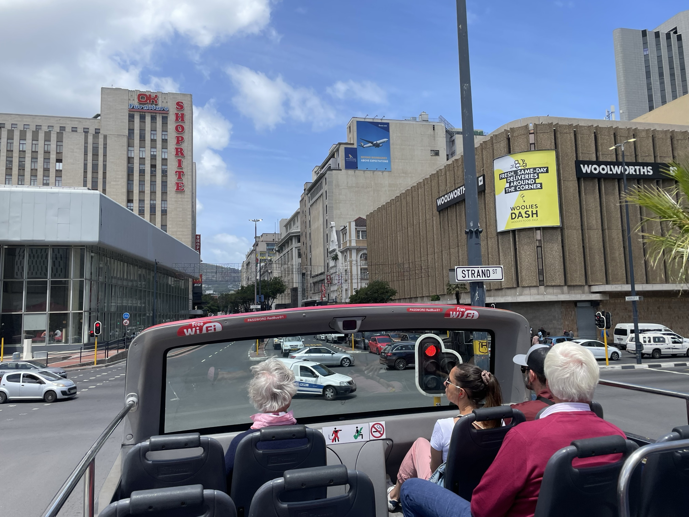

- 12/14（土）
   - ドバイで飛行機を乗り換えて羽田空港へ出発．ドバイ空港が広すぎ，かつ直前で搭乗口が変更になり迷子になりかけたがことなきを得た．

以上，Globecom2024の参加記録です．南アフリカ・ケープタウンで学会に参加できたことは私のかけがえのない思い出です．ご指導頂きました山里先生，路先生，琉球大学の齋藤先生および共に学んだ研究室の同輩諸君に心より感謝申し上げます．

 