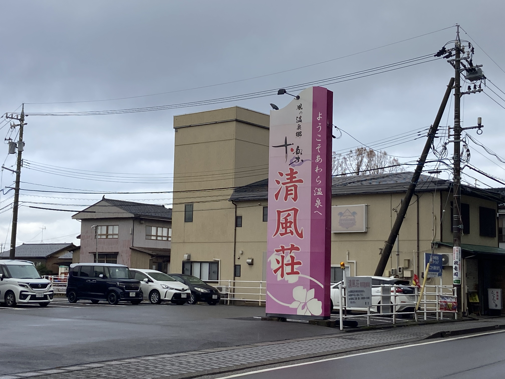
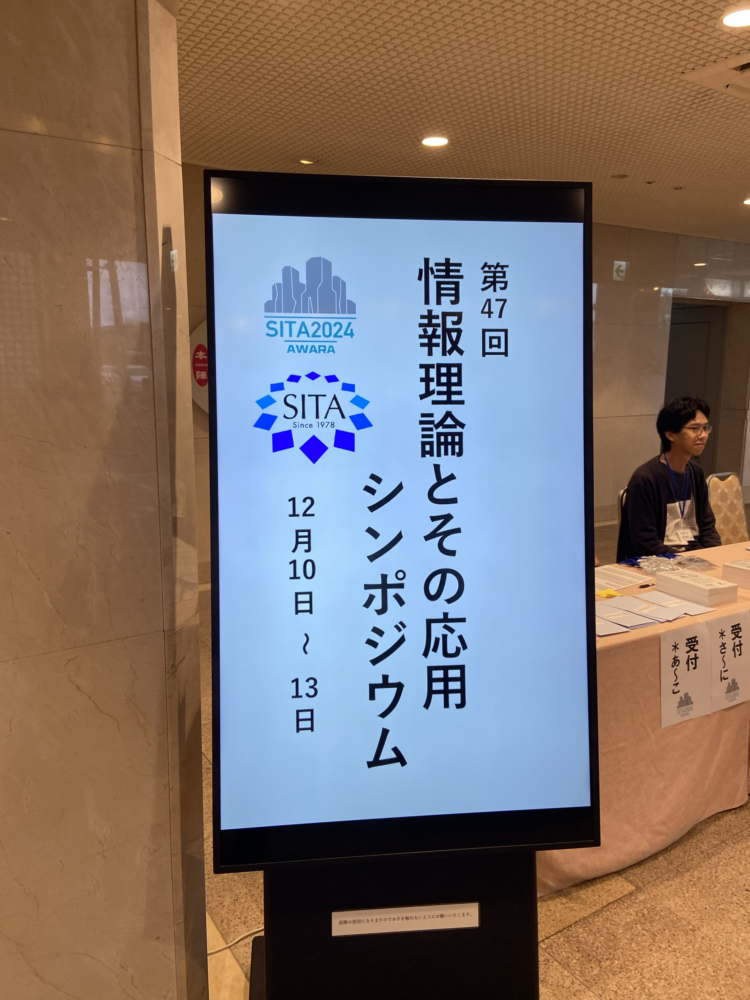
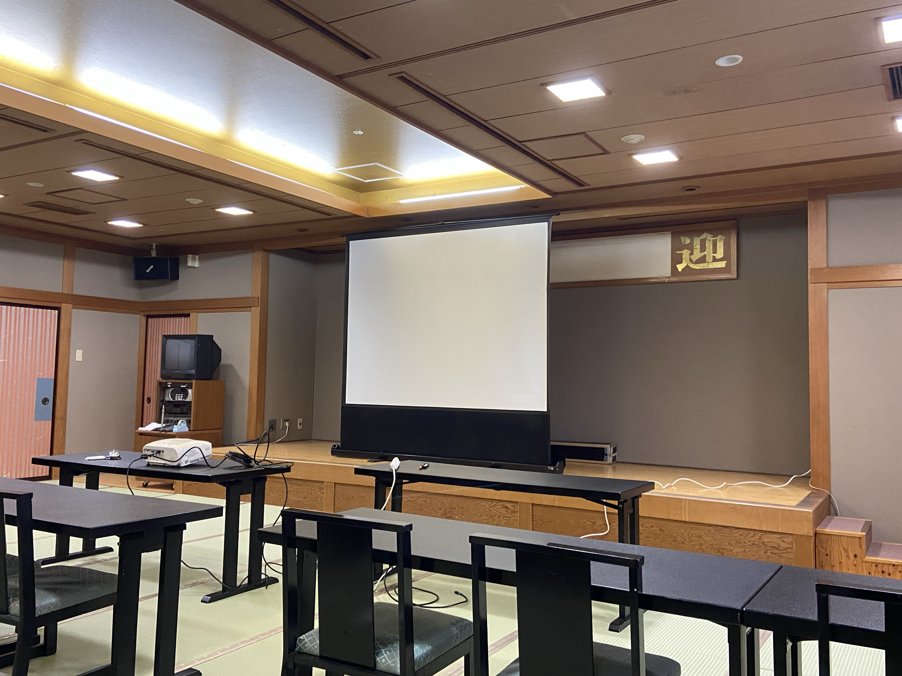

---
皆様，こんにちは．山里研の浅岡です．

この度，福井県の芦原温泉で開催されたSITAにて研究発表を行いました．私はプロペラ型の送信機を用いた可視光通信に関する研究を行っています．飛行機のプロペラのように回転する物体にLEDライトを取り付け，イメージセンサで受信を行います．将来的にはドローンの羽根にLEDを取り付けることで幅広い応用ができると考えています．

今回の学会では，システムの通信距離とスループット向上のためにPolar符号を適用する手法を提案しました．
頂いたフィードバックを基に，今後の研究をさらに進展させていきたいと思います．研究発表にあたり，ご指導いただきました山里先生，路先生，そして研究室の皆さまに，心より感謝申し上げます．

また，今回の学会は温泉街での開催ということもあり，学会期間中に温泉を楽しむことができました．特に，朝風呂では心身ともにリフレッシュし，すっきりとした気持ちで学会に臨めました．研究活動だけでなく，温泉街ならではの魅力も満喫できた素晴らしい機会でした．

 