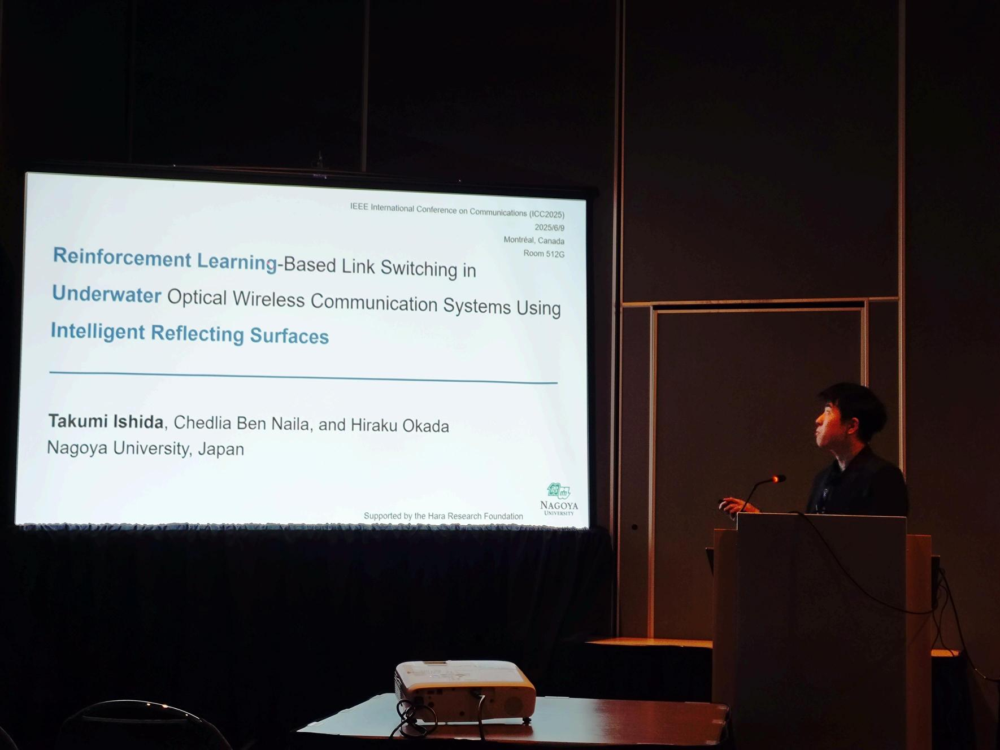
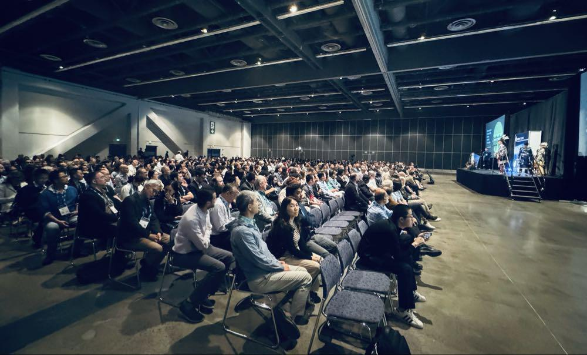

 
---
 
いつもお世話になっております，山里研の石田です．
2025/6/8~2025/6/12でカナダ・モントリオールへ行ってきました．参加記録をここに記します．

- 6/7に中部国際空港を出発
  - 成田国際空港経由でモントリオールに向かいます．
  - 出発前に岡田先生に空港ラウンジに連れて行っていただきました．ビュッフェ形式の食事があって，カレーが美味しかったです．
  - 機内食はまあまあでした．モントリオールの食事が楽しみですね．

- 6/7(現地時間) カナダに到着
  - ずっと飛行機に乗っていたので，全身が痛いですね．
  - 午後6時ごろ到着で，結局午後9時くらいまで外が明るかったです．気候も涼しくていい感じですね．

- 6/8レセプションパーティ
  - パフォーマンスの後，いよいよご飯に．モントリオールで有名なプーティンをいただきました．

- 6/9発表
   - 午前から発表を見に行って，耳を鳴らしておきます．
   - 発表は無事終わり，質疑応答の時間になります．質問は聞き取れましたが，回答を英語でうまく伝えることができたのか不安です．

- 6/10, 11 学会兼散策
   - ノートルダム大聖堂はとても荘厳でした．これからモントリオールを訪れる人にも間違いなくおすすめできます．

- 6/12帰国
   - 無事，帰国の途につきます．
   - お土産にメープルシロップ．

以上，IEEE ICC2025の参加記録です．カナダ・モントリオールで学会に参加できたことは私のかけがえのない思い出です．ご指導頂きました山里先生，岡田先生，ベンナイラ先生および共に学んだ研究室の同輩諸君に心より感謝申し上げます．

 