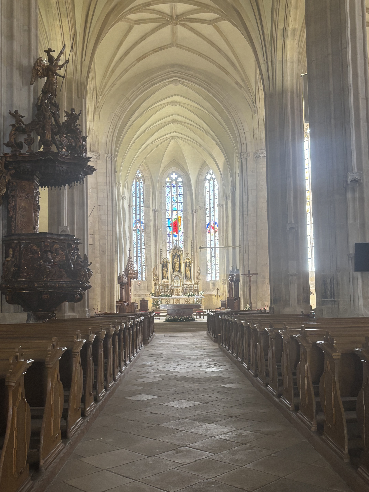
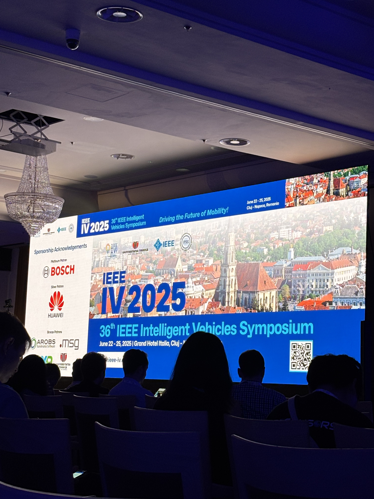
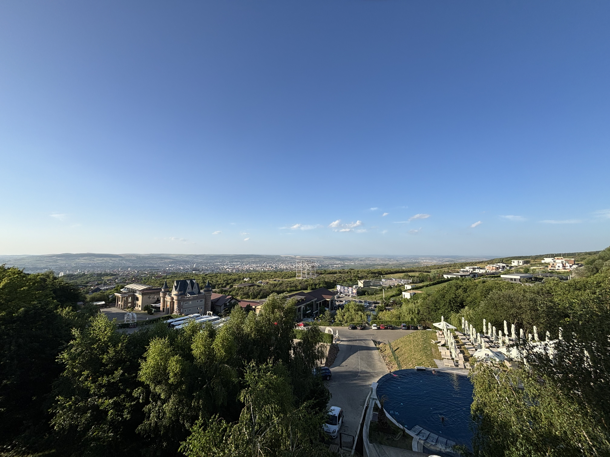

いつもお世話になっております,山里研の小林です。2025/6/20~2025/6/28でルーマニア・クルジュナポカへ行ってきました,参加記録をここに記します.

- 6/19成田国際空港で前泊
 - 名古屋駅に行く途中に,数年使ったイヤホンを無くし,幸先が思いやられた.
 - 空港に向かう途中にgraphical abstractが必要であることを知り,急遽作成.
 - 
　
- 6/19 PM13:00に成田をたち,13時間のフライトの末イスタンブール国際空港に到着
  - バスに乗ってその日に泊まるホテルへと移動.
  - 次の日の空港に向けてのバスの時間が早すぎ、起床時間はAM2:00だった.
  - 3:30~6:00程まで空港内を散策
  本屋さんで大きく売られていた漫画がブルーロックや終わりのセラフで驚いた.ワンピースじゃないんだ...
  

- 6/21AM9:00クルジュナポカ空港に到着
  -
  事前に予約していたホテルまでの送迎車により移動、運転手の方が英語を話せないながらに、意思疎通を図ろうとしてくださり、優しさを感じた.
  -
  この日はクルジュナポカ市街地を一日観光。街で有名なご飯屋さんや教会,ショッピングモール,消防塔などを回れて楽しかった.

- 6/22~6/24　学会参加
  - IEEE IVの会場であるGrand Hotel  Italiaはとても豪華なホテルで,宿泊したホテルからは徒歩数分で毎日行きやすかった.
  - 国内の学会とは,会場の大きさも人の多さも規模感が違って新鮮な体験だった.
  - 発表や公聴を通して自分の英語力のなさを実感し,卒業までに英語力をつけようと痛感.
  - 学会後は毎晩晩酌,近くのスーパーでワインが安く買えたので,沢山飲めて楽しかった.
  - 最終日にはバンケットにも参加した.クルジュの丘の上にある建物で開催され,眺めがとても良かった.日本の企業の方達ともお話しできていい経験だった.

- 6/25~ クルジュナポカ・トルコ観光,帰国
  - 最終日はクルジュナポカの名所であるトゥルダ岩塩坑に行った.名の通り全てが塩で溢れており,とても寒かった.最深部は遊園地となっており,ビリヤードや卓球,ボートなどもあり,不思議な空間だった.
  - 帰国の際はトルコに一泊し,トランジットの観光ツアーに参加.一国隣になるだけでここまで変わるのかという程景色が違い新鮮だった.
  - 帰りは飛行機が3時間遅延したので,イスタンブール空港で6時間暇だったが,無事に帰ることができて良かった.

このたび,ルーマニアで開催された IEEE IVに参加する貴重な機会をいただき,私の人生において忘れがたい経験となりました.世界中の優れた研究者が集い,最先端の成果を共有する場に立ち会えたことを,心より嬉しく,また光栄に存じます.
この機会は,日頃から実験をご一緒いただいた曽我君,投稿を諦めかけた際に励ましと叱咤をくださり,真摯にご指導くださった山里先生,ならびにご協力くださいました皆さまのお力添えによって実現したものです.ここに深く感謝申し上げます.

