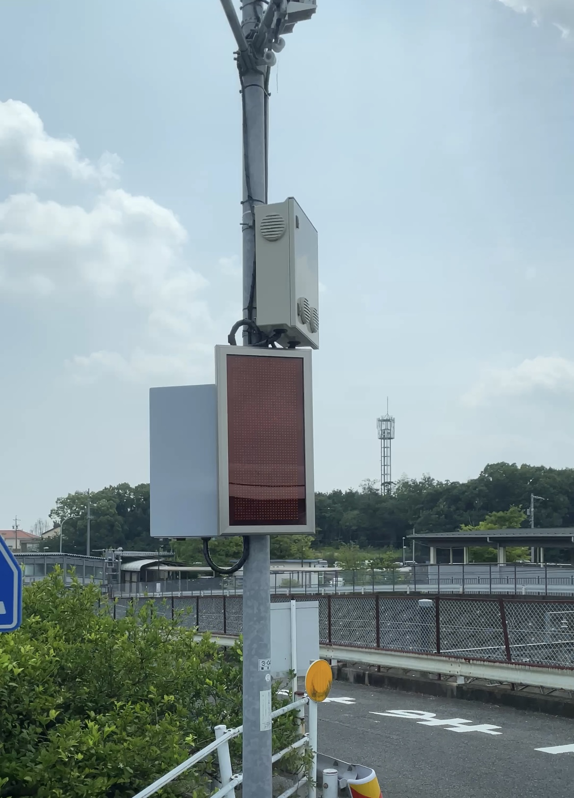
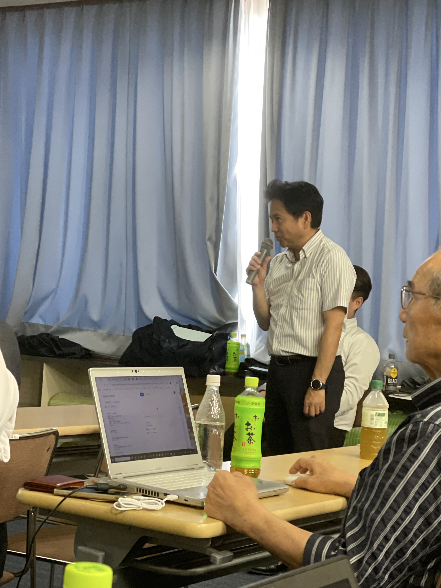
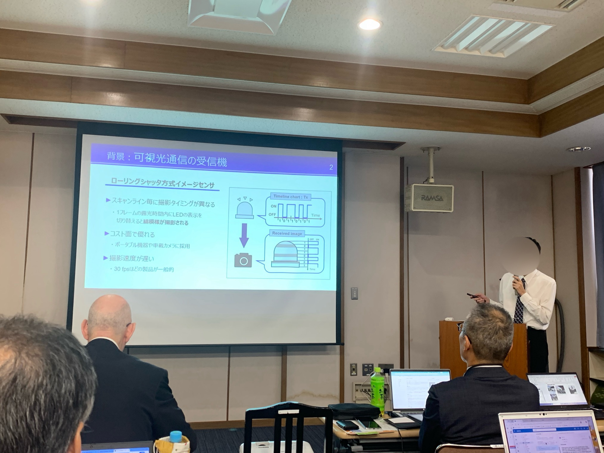

山里研M2の近藤です．

2025/7/4に豊田市・末野原交流館で開催された第二回AA-ITS研究会で発表を行いました．私の発表では，スマートフォンなどによく用いられているカメラを用いた自動車向け通信について報告しました．

発表後には，聴衆の方々から多くの貴重なご質問をいただき，活発な議論ができました．これらのフィードバックを今後の研究に活かしていきたいと思います．

愛知県豊田市は，スマートポールと呼ばれるセンシング機能と通信機能を持ったインフラ設備が試験的に設置されており，その見学もプログラムに含まれていました．スマートポールは私たちの研究と密接に関連しており，その実物を間近で見学できたことは大変貴重な経験となりました．

