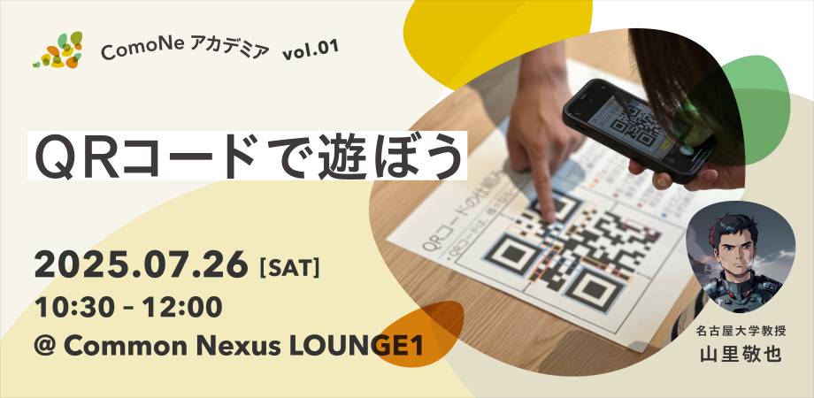

---
なんと，ComoNeアカデミアの最初のイベントです！

ComoNeアカデミアとは、大学の研究を基盤とした次世代向けの教育プログラムです。
本プログラムは、研究者が自身の専門分野に関する講義やワークショップを行います。
お子さまや生徒さんの知的好奇心を広げたり、興味の入り口になるような、研究の一端を体験できる機会を提供します。ぜひ参加ください！

## [お申し込みはこちら](https://comoneacademiavol1.peatix.com)

上の画像をクリックしても[お申し込みサイト(Peatix)](https://comoneacademiavol1.peatix.com)に飛べます．

## [「QRコードで遊ぼう」の詳細はこちら](/research/OER/QR-code/)

