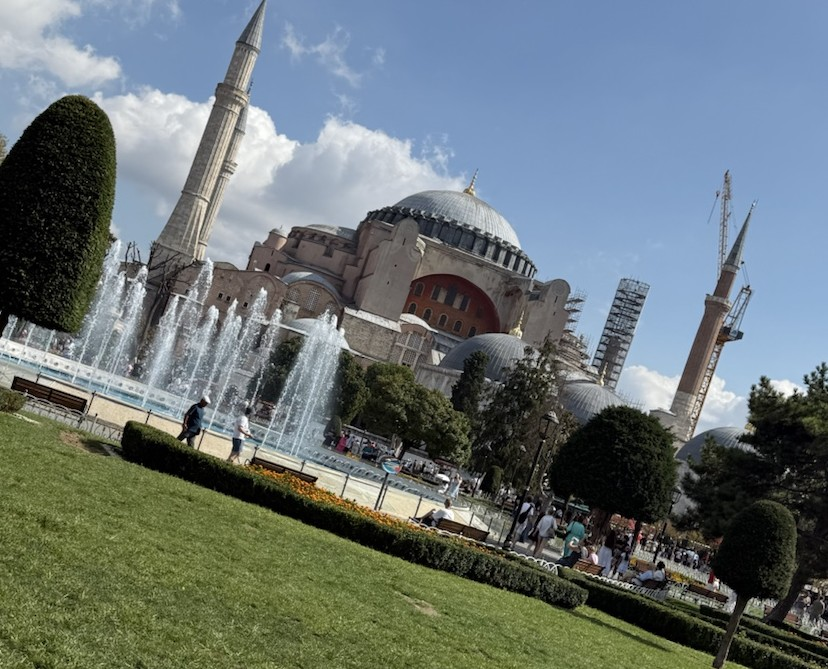

---
いつもお世話になっております，山里研の伊与田です． 2025/9/1~2025/9/4でトルコ・イスタンブールへ行ってきました．参加記録をここに記します．

- 8/30に羽田国際空港を出発
  - 羽田国際空港まで新幹線で行き，そこから飛行機でイスタンブール国際空港に向かいます．
  - 羽田-イスタンブール間はターキッシュエアラインズが直行便を提供しているので乗り換えなしで行けます．
  - 出発前にPriolity Passを利用してSky Luonge Southでシャワーを浴びました．
  - 21:45発の飛行機だったのでさっぱりしてから眠れてよかったです． 
  - 機内食は結構おいしかったです．2回食べることになりましたが，朝食のNoodleが焼うどんでうれしかったです．

- 8/31(現地時間4:50) トルコに到着
  - 飛行機の中ではiPadで事前にダウンロードした映画を見たり，眠って過ごしました．
  - 字幕版にして英語に慣れようと計画しており，結構いい感じでした．
  - 早朝の到着で，まだ暗い中地下鉄とバスでホテルに移動しました．
  - 空港での両替は割高なのでやめて，地下鉄の駅でイスタンブールカード(トルコのチャージ式交通系ICカード)を購入して移動しました．
  - 結果的にこのイスタンブールカードを買う判断は非常に良い結果をもたらしました．
  - というのも，タクシーと比較してバスやフェリーや地下鉄は非常に安価で，本数も多くあまりにも便利だったからです．
  - イスタンブールカードを購入せずにVisaやMasterカードで直接タッチ決済も可能なのですが，2～3倍ほどの高値を請求されるらしいので注意が必要です．
  - 結局ホテルに到着したのは8時前で，チェックインまでスーツケースを預けて朝食や両替のついでに観光に行くことにしました．

- 8/31(現地時間10:00~14:00) ガラタ橋
  - せっかくなのでホテルから最寄りの大きな公園の周辺で両替を行い，モスクを見に行きました．
  - ムスリムにとって大切な施設であると同時に我々観光客にも大変重要な施設です．
  - なぜなら，きれいなムスクにはきれいで広いお手洗いが併設されているからです．
  - 特に，大きなムスクでは様式のお手洗いも設置されており，非常に都合が良いです．
  - イスタンブールカードで10リラ(40円程度)を支払うことで入場できました．
  - イスタンブールカードありがとう． 

  - そこからバスで1本のガラタ橋に行くことにしました．
  - かなり有名な橋で，橋の上からみんなが竿を垂らして小型の青魚を釣り上げていました．

  - せっかくなので橋の下のレストランで有名な鯖サンドとミディエ・ドルマスを食べることにしました．

- 9/1国際会議の参加登録と世界遺産アヤソフィア
 - ひとまず参加登録を済ませてきました．発表は翌日なので部屋の確認と基調講演を聞きました．
 

 - 午後からは世界遺産に登録されている「イスタンブール歴史地区」に行くことにしました．
 - 中でも、キリスト教大聖堂からイスラム教のモスクに姿を変えてきた歴史を持つアヤソフィア大聖堂に行くことにしました．
 - 入場料は25ユーロということで，トルコリラの弱さを感じます．

- 9/2発表
 - 無事に発表を終えることができました．
 
 - 質問も事前に想定していた内容で，うまく解答できたと思います．

- 9/3トルココーヒーとバンケット
 - せっかくトルコに来たのでトルココーヒーをいただきました．
 - 頼んだお菓子が非常に甘く，コーヒーが少なすぎて少ししんどかったです．
 - コーヒーを頼むと水もついてくるのですが，これは口に入ってしまった粉を流し込むためのものだそうです．
 
 - 夜はバンケットに行きました．高い建物で，景色がとてもよかったです．
 - コース料理で，メインを選べたのでラム肉のタンドール焼を選びました．
 
 

- 9/4ドネルケバブと帰国
 - トルコに来たのにケバブを食べないのはあり得ないということで，比較的衛生的なショッピングセンターのケバブを食べました．
 
 - 帰りのイスタンブール空港でもラウンジでシャワーを浴びて帰国しました．
 - こちらのラウンジのほうが豪華でとてもよかったです．

 - 帰りの飛行機が2時間遅延し，帰国日に台風が日本を襲った影響で羽田空港から名古屋に帰って繰り新幹線のダイヤがぐちゃぐちゃでした．
 - 何とかおうちに帰ってくることができて良かったです．

以上，IEEE PIMRC2025の参加記録です．トルコ・イスタンブールで学会に参加できたことは私のかけがえのない思い出です．ご指導頂きました小林先生，岡田先生，山里先生，路先生，ベンナイラ先生および共に学んだ研究室の同輩諸君に心より感謝申し上げます．

