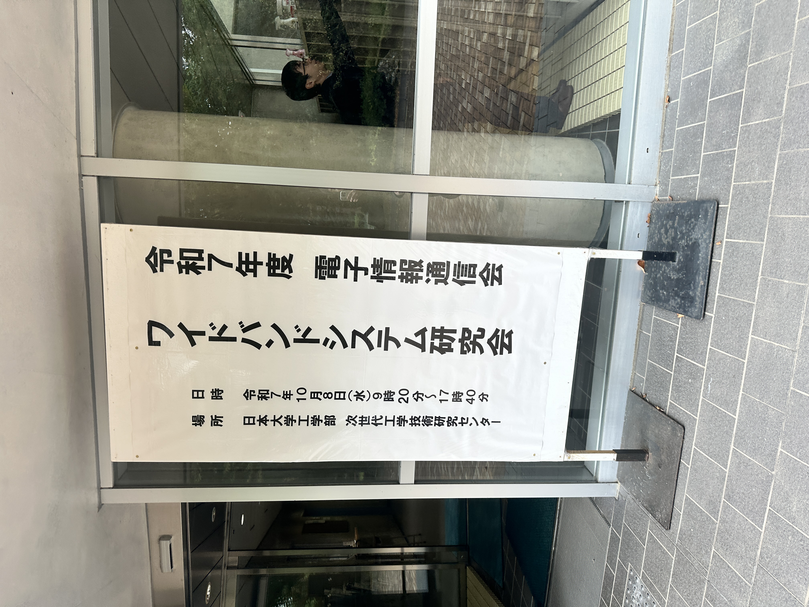
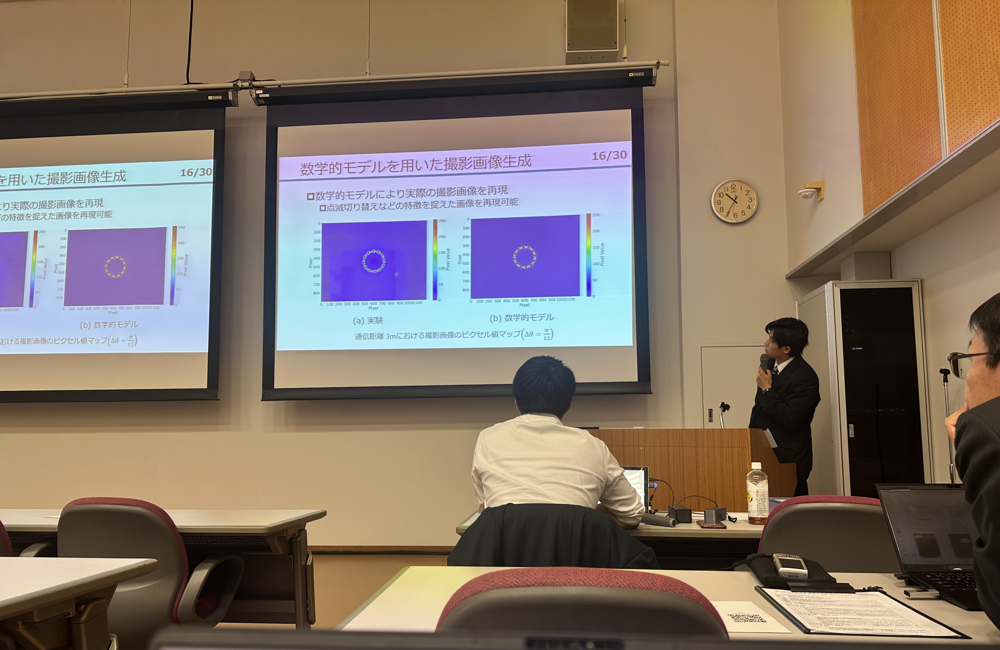

---
山里研M2の浅岡です．

この度，福島県で開催されたWBS研究会にて，プロペラ型送信機を用いた可視光通信におけるシステム性能の理論解析手法について発表いたしました．発表後の質疑応答では多くの貴重なご意見をいただき，自身の研究を見つめ直すとともに，今後の方向性を考える上で大変有益な機会となりました．

さらに，表彰式では若手奨励賞をいただくことができ，大変光栄に思います．このような賞をいただけたのも，ひとえにご指導いただいている山里先生，路先生，そして日頃から活発な議論を交わしてくれる研究室の皆様の支えがあってこそです．この場を借りて心より御礼申し上げます．

また，本研究会では自身の専門分野だけでなく，様々な分野の研究に触れることができ，参加者の皆様との議論を通じて大きな刺激を受けました．この貴重な経験を糧に，今後一層研究に精進してまいります．

---
山里研M2の石です。

2025年10月8日に郡山市の日本大学工学部次世代工学技術研究センターで開催されたワイドバンドシステム研究会（WBS）にて、
「Robust Detection of Overlapping LED Spots in Dense VLC via Pilot-Aided Geometric Recognitions」という題目で発表を行いました。

本研究では、高密度LEDアレイを用いた可視光通信（VLC）において、信号スポットが重なり合う環境下でも頑健に検出できる手法を提案しました。
発表後には多くの参加者の方々から貴重なご質問やご意見を頂き、活発な議論を通じて多くの示唆を得ることができました。
これらのフィードバックをもとに研究をさらに発展させていきたいと思います。

発表にあたり、ご指導を賜りました山里先生、路先生、そして研究室の皆さまに心より感謝申し上げます。
また、今回の研究会は郡山市での開催であり、発表後には地元の名物料理を楽しむなど、良い気分転換の機会にもなりました。

<!-- ## タイトル無しの画像を埋め込む -->

