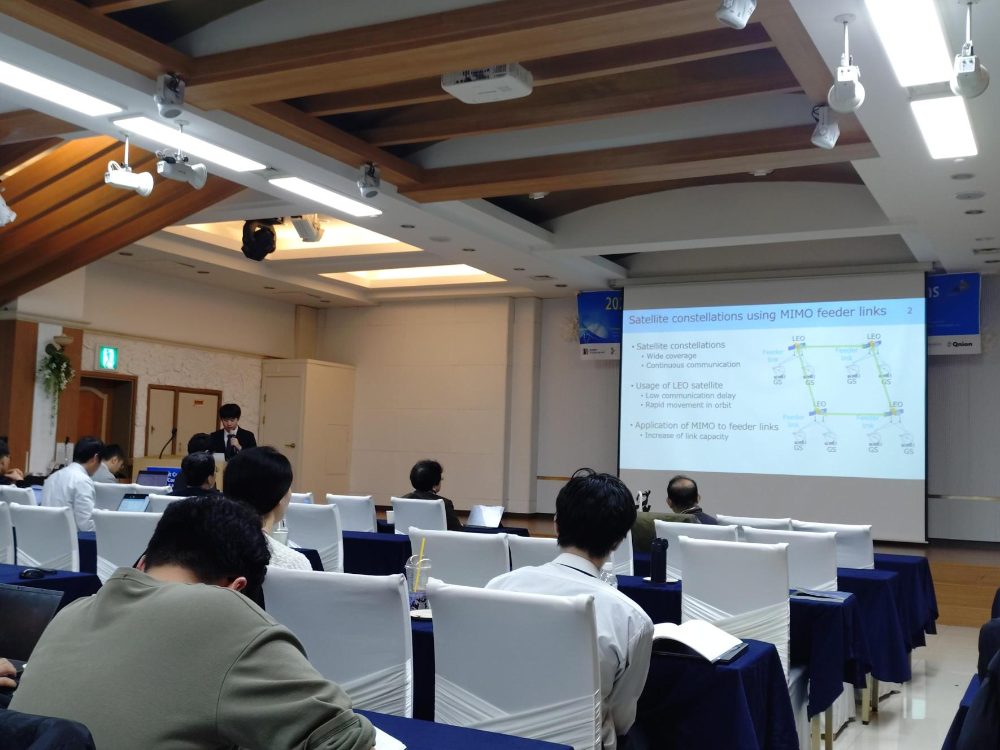
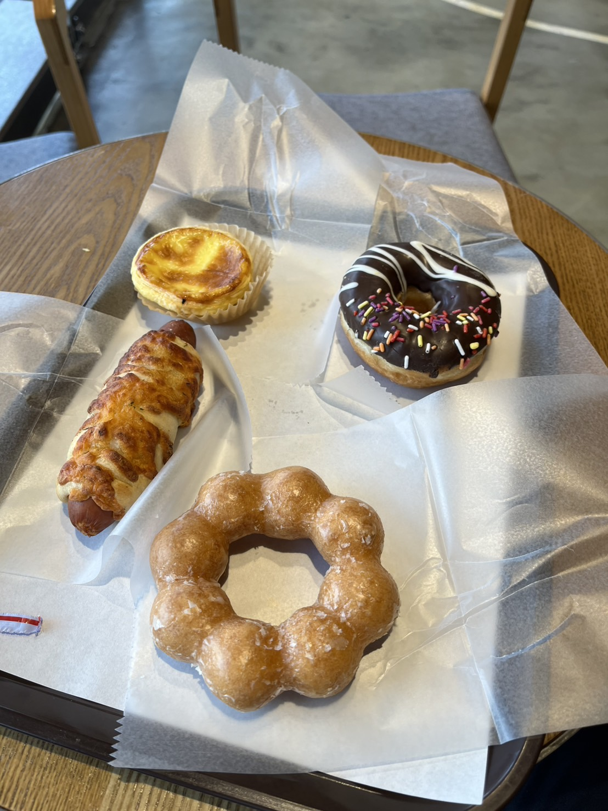

---
山里研M2の大脇です。

2025年11月7日に韓国の大田(テジョン)で開催されたJC-SAT研究会にて，「Traffic Loss Reduction via Rerouting with Inter-Satellite Links in Satellite Constellations Using MIMO Feeder Links」という題目で発表いたしました．Joint Conference on Satellite Commnication (JC-SAT) は，日本のSAT研と韓国のKOSST研が連催する研究会です．

本研究会で私は，複数の衛星を活用し連携した経路制御を提案しました．衛星の和や配置が経路制御に及ぼす影響について多くの研究者の方々と議論を深めることができました．頂いたフィードバックを基に，今後の研究をさらに進展させていきたいと思います．研究発表にあたり，ご指導いただきました岡田先生，山里先生，路先生，そして研究室の皆さまに，心より感謝申し上げます．

会場で昼食も出たそうですが，午後からの発表だったため食べそびれました．また，観光としてソウルに行き，王宮跡地で門番の交代式を見学しました．

発表の様子

昼食が出ると知らずに食べていたドーナツ．

DONKIN'DONUTS(韓国版ミスド)で食べました．

夜に岡田先生と食べたサムギョプサルは写真撮るの忘れてました．

王宮跡地の入口と門番．門の鮮やかな配色や兵士の衣装に日本との違いを感じました．

交代式ではラッパと太鼓の音と共に大勢の兵がぞろぞろと現れ,見応えがありました．