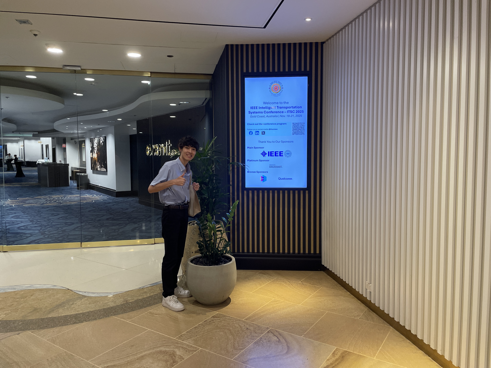
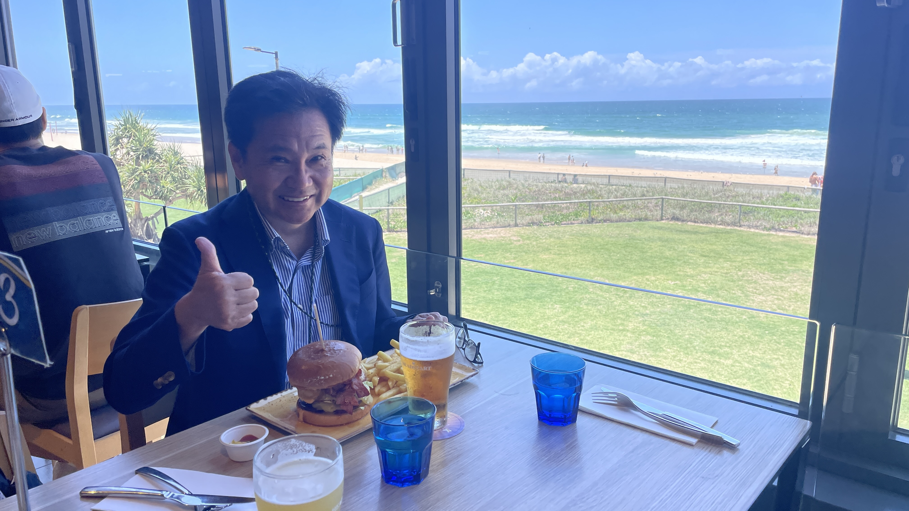

---
山里研の近藤です． 11/18~11/21にゴールドコースト（オーストラリア）で行われたITSC2025（IEEE 28th International Conference on Intelligent Transportation Systems）で発表を行いました．

本学会では，車載カメラを用いた可視光通信に関する発表を行いました．質疑では，制限時間を超過するくらい多くの質問をいただき，この分野への関心の高さを肌で感じることができました．しかし，ネイティブの速い英語に圧倒され，伝えたいことを十分に表現できない悔しさも味わいました．

今回の会場である「The Star Gold Coast」はカジノも併設された豪華なリゾートホテルで，学会会場としても設備が充実しており，海外からの参加者で賑わう華やかな空間でした．また，食事も滞在中の楽しみの一つで，オーストラリアらしいボリューム満点の肉料理を堪能しました．

## 会場前の様子

## ハンバーガーとビールとビーチにご満悦な山里先生
