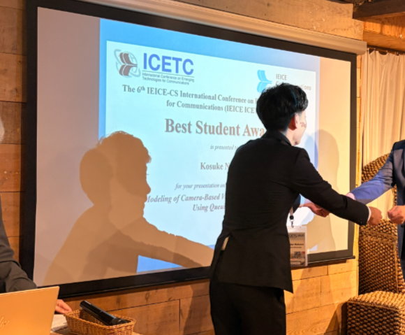

---

ご無沙汰しております。山里研 M2 の中野です。  
大阪で開催された ICETC に参加し、「Delay Modeling of Camera-Based Visible Light Communication Systems Using Queuing Theory」という題目で発表を行いました。  
英語での発表は慣れないことも多く、質疑応答ではうまく回答できない場面もありましたが、学びの多い発表となりました。  
“学生の成長” を第一に考えてくださる山里先生は、私が拙い英語で四苦八苦している様子を見て大変ご満悦でした。その後、先生は体調を崩され、バンケットの参加を見送る形となってしまいました....  
他のセッションにも積極的に参加し、通信分野の最新トレンドを追うことができました。今回の学会では、IRS を用いた通信を研究している方が非常に多い印象を受けました。  
トレンドといえば、海外から日本行き旅行プランのキャンセルがニュースになっていましたが、道頓堀周辺は外国籍の方であふれておりました。  
本発表にあたり、多大なるご指導をいただきました山里先生、路先生、唐先生、岡田先生、そして研究室の皆様に深く感謝いたします。

---

山里研M2の浅岡です．  
大阪にて開催されたICETCに参加し、「Theoretical Performance Analysis for Image Sensor Communication using a Propeller LED Transmitter」という題目で発表を行いました。  
今年のICETCはAPCCとの同時開催ということもあり、非常に活気あふれる学会となりました。ポスターセッションも盛況で、多くの方との議論を通じて、専門外の分野も含めた幅広い知見を得ることができました。  
自身の発表では、光跡を用いた可視光通信の理論解析について報告を行いました。質疑応答では本技術の応用展開について具体的なフィードバックを頂くことができ、今後の研究活動への大きな刺激となりました。  
本発表にあたり、多大なるご指導をいただきました山里先生、路先生、唐先生、そして研究室の皆様に深く感謝いたします。

---

名古屋大学 山里研究室 M1の阿邊です。  
大阪で開催された ICETC 2025 に参加し、「A Two-Dimensional Constrained Code for Light-Trail-Based Image Sensor Communication」という題目でポスター発表を行いました。今年のICETCはAPCCとの同時開催であり、会場は非常に活気にあふれており、多くの研究者との意見交換を通じて有意義な時間を過ごすことができました。  
自身の発表では、プロペラ型LED送信機によって生成される光跡を用いたイメージセンサ通信において、隣接する光跡間の干渉を抑制するための二次元制約符号を提案しました。光跡の干渉による誤り率劣化という従来の課題に対し、ゾーンごとにビット配置を制御する符号化設計により、誤り率低減の可能性を示しました。  
質疑応答では、本技術の移動環境への応用可能性について議論が行われ、ドローンやAGVなどを想定した場合の光跡の変形やぶれに対するロバスト性について貴重な意見を頂きました。これらの議論は、今後の研究を進める上で大きな示唆となりました。  
本発表にあたり、ご指導いただいた山里先生、路先生、唐先生、ならびに研究室の皆様に深く感謝いたします。  

