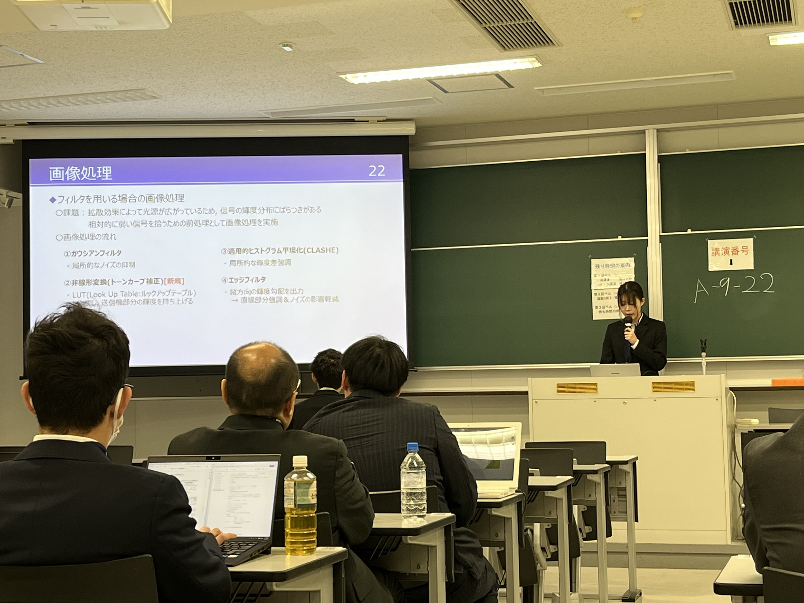
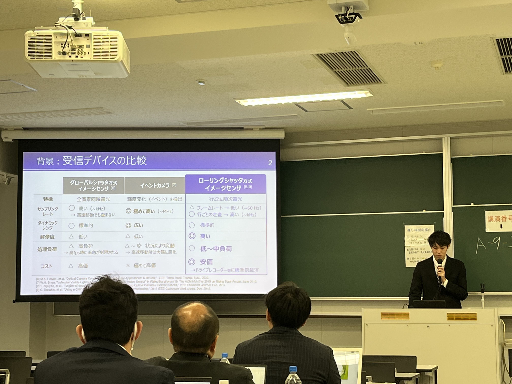

---
2026年3月9日~13日に九州産業大学にて開催された2026年総合大会でM2メンバーの近藤君，中野君，大脇君，M1メンバーの小林君，曽我君, B4メンバーの久保君，佐藤君，澤田さんの8名が発表を行いました．

山里研究室 M1の久保です. 

九州産業大学で行われた電子情報通信学会総合大会に参加し, 「単進符号を用いたイベントカメラ可視光通信の車載環境評価」という題目で発表を行いました. 
初めての学会参加で緊張しましたが, 今回は参加メンバーが多かったため心強く, 質疑応答にも何とか回答できたのではないかと感じています. 
また, 自身の研究分野に関わりのある他の参加者の発表を聞いて, 様々な知見が得られました. これらの経験をもとに, より深く研究を進めていきたいと思います. 

発表にあたり, ご指導を賜りました山里先生, 路先生, そして研究室の皆さまに心より感謝申し上げます. 

## タイトル無しの画像を埋め込む

