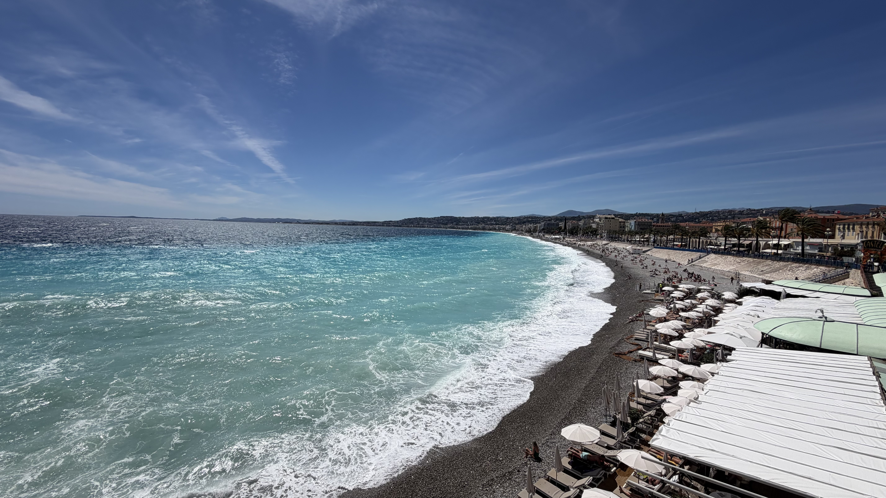
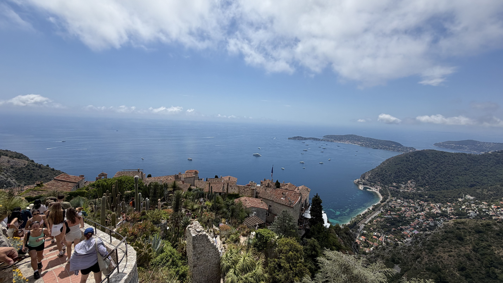
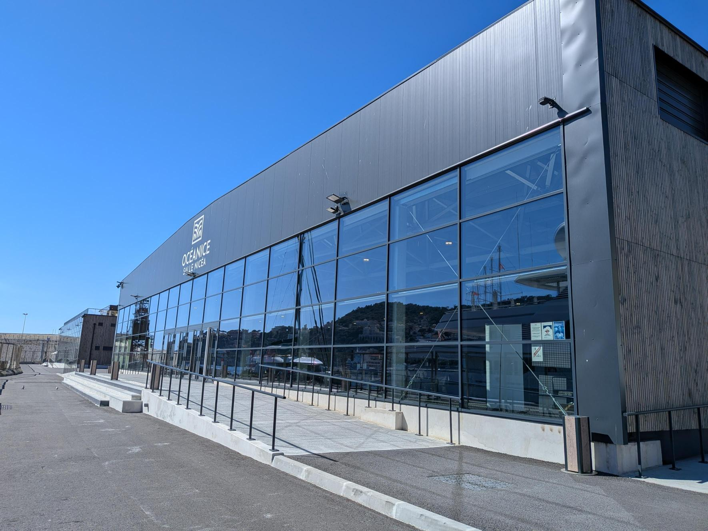
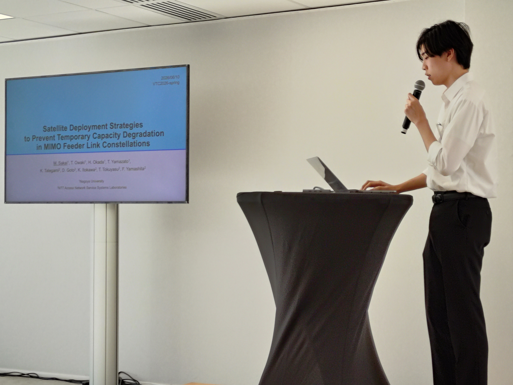
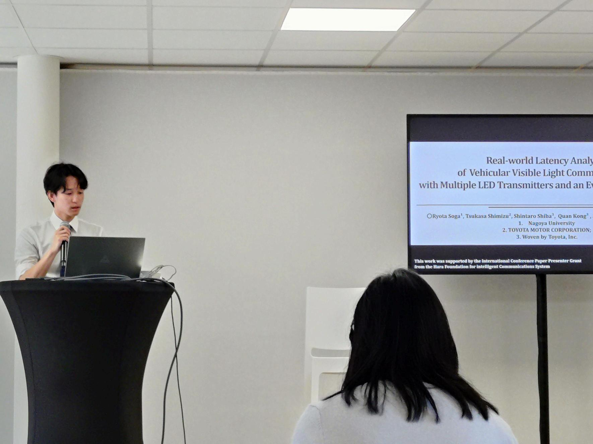

---
山里研M2の酒井です．

この度，フランスのニースで開催された103rd Vehicular Technology Conference（VTC2026-Spring）にて、衛星コンステレーションシステムにおけるMIMOフィーダリンク容量の一時的な低下を改善する手法について発表しました．

初めての国際会議で緊張しましたが，私が行ってきた研究を，素晴らしいロケーションで世界に対して発表できるとても素晴らしい機会であり，私自身大きく成長できたと感じています．このような貴重な機会を与えてくださった先生方や，研究を共に支えてくれた山里研究室のメンバーに心より感謝申し上げます．

また発表後の質疑応答では，聴講者側ならではの発見や，今後気をつけるべき点など，様々なご意見をいただき，今後の研究に活かすことができる大変貴重な機会となりました．学会を通して，無線通信や衛星通信など様々な分野の研究者の方々と意見を交換し，知見を深めることができました．

---
---

山里研M2の曽我です．

私は，イベントカメラを受信機として用いる車両用可視光通信について，複数のLED送信機が存在する実車環境における通信遅延の測定および評価結果を発表しました．送信機数や走行速度，受信パケット数などの条件を変化させて遅延を測定し，ETSIが定める協調認識向けの遅延要件と比較することで，本方式が低遅延通信を必要とする車両アプリケーションに適用可能であることを示しました．

発表後の質疑応答では，測定した遅延の定義や，物体認識に要する時間を含めたシステム全体での評価についてご意見をいただきました．これにより，今後は受信処理のみでなく，物体認識からメッセージ送信までを含めた一連のシステムとして評価する必要があると認識しました．また，他の研究者による可視光通信や車両通信に関する発表を聴講し，自身の研究に応用できる新たな知見や研究アイデアを得ることができました．

今回の国際会議への参加を通して，自身の研究成果を海外の研究者に発信するとともに，異なる視点からの意見を直接いただくことができました．この経験を今後の研究に活かし，通信遅延の低減だけでなく，通信距離やスループットの向上，複雑な交通環境における性能評価にも取り組んでいきたいと考えています．このような貴重な機会を与えてくださった先生方や，日頃から研究を支えてくださっている山里研究室の皆様に心より感謝申し上げます．

---

---

