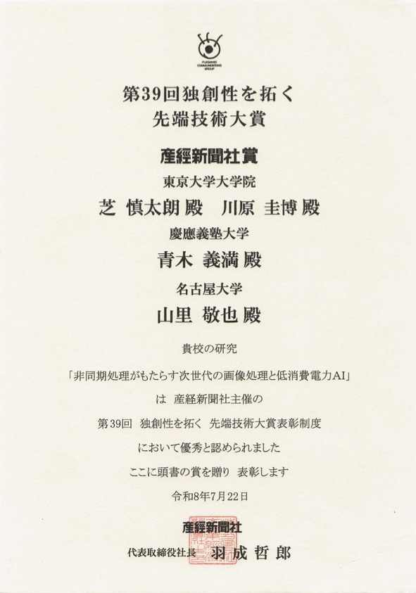

## 第39回独創性を拓く先端技術大賞_産經新聞社賞

[授賞式の様子：産経新聞](https://www.sankei.com/article/20260722-4H27E3N7EBMV5D3H3EOUDQC3XM/)

### 第39回独創性を拓く先端技術大賞 産經新聞社賞
- 東京大学大学院 芝慎太朗殿 川原 圭博殿
- 慶應義塾大学 青木義満殿
- 名古屋大学 山里敬也殿

貴校の研究

「非同期処理がもたらす次世代の画像処理と低消費電力AI」

は産経新聞社主催の第39回 独創性を拓く先端技術大賞表彰制度
において優秀と認められましたここに頭書の賞を贈り表彰します

令和8年7月22日

産經新聞社

代表取締役社長　羽成哲郎

