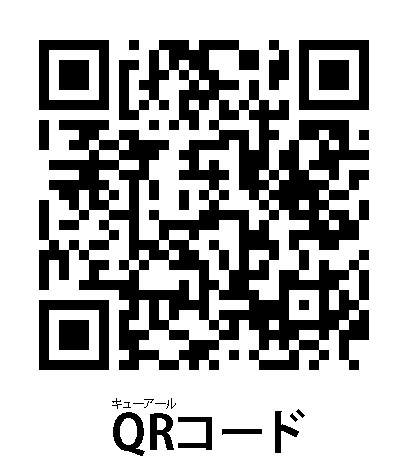

# [東海国立大学機構 Common Nexus](https://comone.thers.ac.jp/)
# [<ruby>ComoNe<rt>こもね</rt></ruby>アカデミア](https://comone.thers.ac.jp/program/)

#### QRコードで遊ぼう

- <ruby>対象<rt>たいしょう</rt></ruby>：<ruby>小学生<rt>しょうがくせい</rt></ruby>（<ruby>低学年<rt>ていがくねん</rt></ruby>は<ruby>保護者同伴<rt>ほごしゃどうはん</rt></ruby>））
- <ruby>定員<rt>ていいん</rt></ruby>：30<ruby>名<rt>めい</rt></ruby>
- <ruby>会場<rt>かいじょう</rt></ruby>：[<ruby>ComoNe<rt>コモネ</rt></ruby>](https://comone.thers.ac.jp/)
- <ruby>日時<rt>にちじ</rt></ruby>：2025<ruby>年<rt>ねん</rt></ruby>7<ruby>月<rt>がつ</rt></ruby>26<ruby>日<rt>にち</rt></ruby>（<ruby>土曜日<rt>どようび</rt></ruby>）10:30-12:00
- <ruby>担当<rt>たんとう</rt></ruby>：[<ruby>教養教育院<rt>きょうようきょういくいん</rt></ruby>](https://www.ilas.nagoya-u.ac.jp)、[<ruby>工学研究科<rt>こうがくけんきゅうか</rt></ruby>・<ruby>情報・通信工学専攻<rt>じょうほう・つうしんこうがくせんこう</rt></ruby>](https://www.nuee.nagoya-u.ac.jp)　[<ruby>教授<rt>きょうじゅ</rt></ruby>　<ruby>山里敬也<rt>やまざとたかや</rt></ruby>](../../../team/Takaya-Yamazato)
- お<ruby>手伝<rt>てつだ</rt></ruby>いしてくれるお<ruby>兄<rt>にい</rt></ruby>さん：
  - <ruby>石田<rt>いしだ</rt></ruby> <ruby>匠<rt>たくみ</rt></ruby>
  - <ruby>中野<rt>なかの</rt></ruby> <ruby>幸亮<rt>こうすけ</rt></ruby>
<!--  -->

## こんなことを<ruby>学<rt>まな</rt></ruby>ぶよ

この<ruby>講義<rt>こうぎ</rt></ruby>では<ruby>QR<rt>キューアール</rt></ruby>コードについて，ゲームをしながら<ruby>学<rt>まな</rt></ruby>ぶよ．<ruby>QR<rt>キューアール</rt></ruby>コードは，スマホやタブレットで<ruby>読<rt>よ</rt></ruby>み<ruby>込<rt>こ</rt></ruby>むことができる，<ruby>迷路<rt>めいろ</rt></ruby>みたいな<ruby>白黒<rt>しろくろ</rt></ruby>の<ruby>四角<rt>しかく</rt></ruby>の<ruby>模様<rt>もよう</rt></ruby>のことだよ．いろんなところで<ruby>使<rt>つか</rt></ruby>われているので，きっとみたことがあると<ruby>思<rt>おも</rt></ruby>うよ．

たとえば，お<ruby>店<rt>みせ</rt></ruby>のチラシや，メニュー，お<ruby>買<rt>か</rt></ruby>い<ruby>物<rt>もの</rt></ruby>するときに<ruby>使<rt>つか</rt></ruby>ったりもするのだよ．<ruby>電車<rt>でんしゃ</rt></ruby>に<ruby>乗<rt>の</rt></ruby>るときにも<ruby>使<rt>つか</rt></ruby>えたりするんだよ．こんな<ruby>QR<rt>キューアール</rt></ruby>コードの<ruby>仕組<rt>しく</rt></ruby>みを<ruby>学<rt>まな</rt></ruby>ぶよ．

> ## 参加される保護者の皆様へのお願い<!-- omit in toc -->
>
> この度は、ComoNe アカデミアへご応募くださり、ありがとうございます。
> 「QRコードで遊ぼう」の講師を務めます、名古屋大学の山里でございます。
>
> さて、この講演では参加者の皆様に実際に「QRコード」を使ったゲームを試していただく予定です。そこで、皆様にはQRコードを読み込むことができるスマートホンあるいはタブレットをご持参いただきたく存じます。できれば，この講義に参加中の間はお子様に利用してもらえると嬉しく存じます．
> 
> また，予めデンソーウェーブ様が開発したQRコードリーダー（QRQRクルクル）をインストールしておいてください．
> 
>    - [App Store](https://apps.apple.com/jp/app/%E3%82%AF%E3%83%AB%E3%82%AF%E3%83%AB-qr%E3%82%B3%E3%83%BC%E3%83%89%E3%83%AA%E3%83%BC%E3%83%80%E3%83%BC/id911719423)
>    - [Google Play](https://play.google.com/store/apps/details?id=com.arara.q&pli=1)
>
> もちろん，普段お使いのQRコードリーダでも大丈夫ですが，QRコードを開発したデンソーウェーブ様のアプリですので，QRQRクルクルはとても早く使い安いです．
> ぜひ，お試し下さい．
> 
> なお，このワークショップは二部制で行います．
>
> 前半の 10:30 - 11:00 は主に小学生低学年の方を対象にしています．みんなでQRコードのゲームを行います．もちろん高学年の方の参加も歓迎します．
> 低学年の方はここで帰ってもらって構いません．
>
> その後，10分ほど休憩をはさんで後半（11:10 - 12:00）は主に小学校高学年の方を対象にしています．低学年の方に難しい内容になりますが，チャレンジしてもらっても構いません．ご父兄の方の手助けがあればできるかも，です．
---

