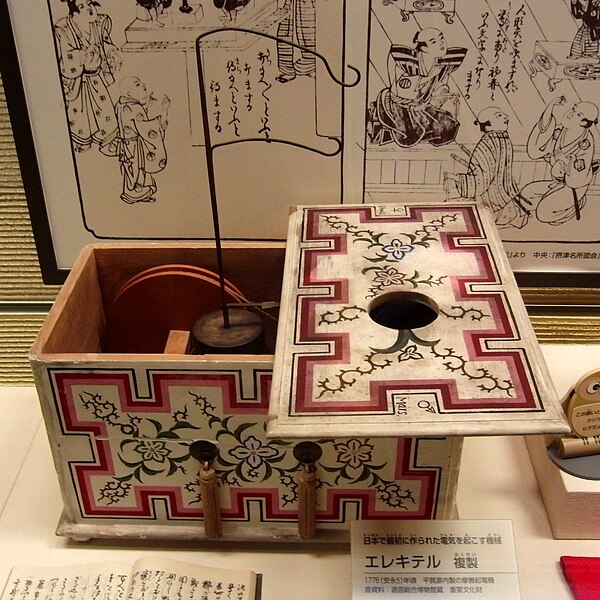
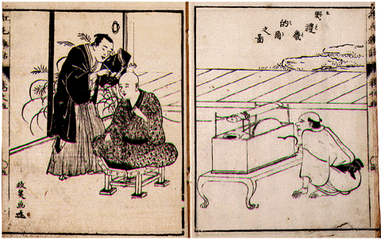

# [<ruby>名古屋<rt>なごや</rt></ruby><ruby>大学<rt>だいがく</rt></ruby> <ruby>夏<rt>なつ</rt></ruby>のテクノロジーフェスティバル](https://tech.imass.nagoya-u.ac.jp/)
# [おならでもつうしんできる？](https://tech.imass.nagoya-u.ac.jp/lecture.html#L4B)
#### なるほど！つうしんのしくみ

- セッションコード：[L4B](https://tech.imass.nagoya-u.ac.jp/lecture.html#L4B)
- <ruby>対象<rt>たいしょう</rt></ruby>：<ruby>小学生<rt>しょうがくせい</rt></ruby>（<ruby>特<rt>とく</rt></ruby>に<ruby>低学年<rt>ていがくねん</rt></ruby>・<ruby>中学年<rt>ちゅうがくねん</rt></ruby>におすすめ）
- <ruby>定員<rt>ていいん</rt></ruby>：250<ruby>名<rt>めい</rt></ruby>
- <ruby>会場<rt>かいじょう</rt></ruby>：<ruby>名古屋<rt>なごや</rt></ruby><ruby>大学<rt>だいがく</rt></ruby>　<ruby>坂田<rt>さかた</rt></ruby>・<ruby>平田<rt>ひらた</rt></ruby>ホール
- <ruby>日時<rt>にちじ</rt></ruby>：2024<ruby>年<rt>ねん</rt></ruby>８<ruby>月<rt>がつ</rt></ruby>２８<ruby>日<rt>にち</rt></ruby>（<ruby>水<rt>すい</rt></ruby>）４<ruby>時間目<rt>じかんめ</rt></ruby>（15:20-16:50）
- <ruby>担当<rt>たんとう</rt></ruby>：[<ruby>教養教育院<rt>きょうようきょういくいん</rt></ruby>](https://www.ilas.nagoya-u.ac.jp)、[<ruby>工学研究科<rt>こうがくけんきゅうか</rt></ruby>・<ruby>情報・通信工学専攻<rt>じょうほう・つうしんこうがくせんこう</rt></ruby>](https://www.nuee.nagoya-u.ac.jp)　[<ruby>教授<rt>きょうじゅ</rt></ruby>　<ruby>山里敬也<rt>やまざとたかや</rt></ruby>](../../../team/Takaya-Yamazato)

<!--  -->

## こんなことを<ruby>学<rt>まな</rt></ruby>ぶよ

けいたい<ruby>電話<rt>でんわ</rt></ruby>は、<ruby>電波<rt>でんぱ</rt></ruby>を<ruby>使<rt>つか</rt></ruby>って<ruby>音<rt>おと</rt></ruby>を<ruby>遠<rt>とお</rt></ruby>くに<ruby>届<rt>とど</rt></ruby>けます。でも、<ruby>近<rt>ちか</rt></ruby>いところであれば、<ruby>糸<rt>いと</rt></ruby>を<ruby>使<rt>つか</rt></ruby>っても<ruby>音<rt>おと</rt></ruby>を<ruby>届<rt>とど</rt></ruby>けることができます。そう、<ruby>糸電話<rt>いとでんわ</rt></ruby>ですね！じつは、<ruby>糸<rt>いと</rt></ruby>だけじゃなく、<ruby>光<rt>ひかり</rt></ruby>や<ruby>音<rt>おと</rt></ruby>を<ruby>使<rt>つか</rt></ruby>っても<ruby>通信<rt>つうしん</rt></ruby>することができます。このしくみが<ruby>分<rt>わか</rt></ruby>かれば、「おなら」でも<ruby>通信<rt>つうしん</rt></ruby>ができるかもしれません。この<ruby>授業<rt>じゅぎょう</rt></ruby>では、「おなら<ruby>通信<rt>つうしん</rt></ruby>」にチャレンジします。みんな、おならで<ruby>通信<rt>つうしん</rt></ruby>はできるかな？

> ## 参加される保護者の皆様へのお願い<!-- omit in toc -->
>
> この度は、名古屋大学 夏のテクノロジーフェスティバルへご応募くださり、ありがとうございます。
> L4B「おならでもつうしんできる？なるほど！つうしんのしくみ」の講師を務めます、名古屋大学の山里でございます。
>
> さて、この講演では参加者の皆様に実際に「おならの音」を使った通信を試していただく予定です。そこで、ぜひ皆様に「おならの音」を録音して、お送りいただきたいと思います。ご家族でも、お友達でも、もちろんペットのおならの音でもかまいません。ご協力いただけますと幸いです。
> 
> 録音した「おならの音」をお送りいただける方はお手数ですが
> 
>    onara@yamazato.nuee.nagoya-u.ac.jp
>
> までご連絡ください。折り返しアップロード用URLをお送りします。
> 
> 準備の都合上、８月１９日（月）までにお送りいただけますと助かります。
>
>「おならの音」のご提供は、もちろん任意ですが、多数の方にご協力いただけますと幸いです。
>
>ご提供いただいた「おならの音」は名古屋大学での教育・研究目的（本講演を含む）にのみ利用させていただき、それ以外では利用しません。ご提供いただく方のプライバシーには配慮し、お名前などは一切公表いたしません。
>
>公表に差し障りのないイニシャル、ニックネームなどを併せてお知らせ頂けますと、講演中にご紹介できます。
>
>どうぞたくさんの「おならの音」をご提供くださいますよう、お願い申し上げます。
>
>また、当日はおならを模擬した音を出せるものをご持参ください。パフパフと鳴るおもちゃのラッパなどで構いません。もちろん、お子様ご自身に「プーッ」と叫んでもらっても構いません。お子様とご相談の上、ご準備ください。

---

このページでは[<ruby>名古屋<rt>なごや</rt></ruby><ruby>大学<rt>だいがく</rt></ruby> <ruby>夏<rt>なつ</rt></ruby>のテクノロジーフェスティバル](https://tech.imass.nagoya-u.ac.jp/)の[おならでもつうしんできる？](https://tech.imass.nagoya-u.ac.jp/lecture.html)について、<ruby>知<rt>し</rt></ruby>っておいてほしいことを<ruby>書<rt>か</rt></ruby>くね。

お<ruby>父<rt>とう</rt></ruby>さん、お<ruby>母<rt>かあ</rt></ruby>さんといっしょに<ruby>読<rt>よ</rt></ruby>んでね！

---

## 目次　 <!-- omit in toc -->

- [「おなら<ruby>通信<rt>つうしん</rt></ruby>」チャレンジ！](#fart-challenge)
- [おならで<ruby>SOS<rt>エスオーエス</rt></ruby>を<ruby>送<rt>おく</rt></ruby>ってみよう！（おなら<ruby>通信<rt>つうしん</rt></ruby>のしくみ）](#how-it-works)
- [おならのにおいでも<ruby>通信<rt>つうしん</rt></ruby>はできるの？（デジタル<ruby>通信<rt>つうしん</rt></ruby>の<ruby>原理<rt>げんり</rt></ruby>）](#smell-communication)
- [もっと<ruby>速<rt>はや</rt></ruby>い<ruby>通信<rt>つうしん</rt></ruby>はできるの？（<ruby>光<rt>ひかり</rt></ruby>をつかった<ruby>通信<rt>つうしん</rt></ruby>と<ruby>電波<rt>でんぱ</rt></ruby>をつかった<ruby>通信<rt>つうしん</rt></ruby>）](#wired-and-wireless-communication)
- [さらに<ruby>勉強<rt>べんきょう</rt></ruby>するために](#For-further-study)
- [おなら<ruby>通信<rt>つうしん</rt></ruby>のアイデアはここから生まれた？！](the-fart-communication)

---

<!-- 
中国にとって<ruby>熊猫<rt>パンダ</rt></ruby>は国宝です。
 -->

## 「おなら<ruby>通信<rt>つうしん</rt></ruby>」チャレンジ！

  

    
  

    
<ruby>先生<rt>せんせい</rt></ruby>、この<ruby>授業<rt>じゅぎょう</rt></ruby>では「おなら<ruby>通信<rt>つうしん</rt></ruby>」にチャレンジするって<ruby>書<rt>か</rt></ruby>いてあるけど、ほんとうにおならで<ruby>通信<rt>つうしん</rt></ruby>するの？

    

      
    

    
もちろん。

  

    
  

    
でも、<ruby>授業中<rt>じゅぎょうちゅう</rt></ruby>にみんなが　プッ　プッ　プー　とおならしたら、<ruby>教室<rt>きょうしつ</rt></ruby>がおならでいっぱいになってたいへんだよ。マスクをもってくるようにアナウンスしなきゃ。

    

      
    

    
それはこまったなぁ、どうしよう・・・

  

    
  

    
だいじょうぶだよ。ぼく、くさくないおならのしかた<ruby>知<rt>し</rt></ruby>っているもん。ぜんぜんくさくないよ。
    

    

      
    

    
え、どうやるの。おしえて。
    

  

    
  

    
はやね、はやおき、<ruby>毎日<rt>まいにち</rt></ruby>ぐっすりねむること。すききらいなく、なんでもよく<ruby>食<rt>た</rt></ruby>べること。
    

    

      
    

    
なるほど。お<ruby>肉<rt>にく</rt></ruby>ばっかり<ruby>食<rt>た</rt></ruby>べていると、つぎの<ruby>日<rt>ひ</rt></ruby>のおならはくさいからね。
    

  

    
  

    
うん。お<ruby>肉<rt>にく</rt></ruby>じゃなくお<ruby>野菜<rt>やさい</rt></ruby>をたくさん<ruby>食<rt>た</rt></ruby>べるといいよ。あと<ruby>体<rt>からだ</rt></ruby>をうごかして、<ruby>運動<rt>うんどう</rt></ruby>するのもいいよ。ぼくは<ruby>毎日<rt>まいにち</rt></ruby>ラジオたいそうをやっているよ。
    

    

      
    

    
<ruby>健康的<rt>けんこうてき</rt></ruby>でいいね。おならくんすごい！
    

  

    
  

    
でも、<ruby>先生<rt>せんせい</rt></ruby>、おならって<ruby>声<rt>こえ</rt></ruby>みたいにだそうとおもっても、　プ〜　ってでないよ。<ruby>授業<rt>じゅぎょう</rt></ruby>のときにおならでないかも・・・
    

    

      
    

    
それはこまったなぁ、おならがでないと<ruby>通信<rt>つうしん</rt></ruby>もできないぞ。
    

  

    
  

    
おならの<ruby>音<rt>おと</rt></ruby>を<ruby>録音<rt>ろくおん</rt></ruby>して<ruby>使<rt>つか</rt></ruby>ったらどう？ぼくのおならは　プ〜　って、<ruby>明<rt>あか</rt></ruby>るく<ruby>元気<rt>げんき</rt></ruby>な<ruby>音<rt>おと</rt></ruby>がするよ。<ruby>録音<rt>ろくおん</rt></ruby>したおならの<ruby>音<rt>おと</rt></ruby>はつかえる？
    

    

      
    

    
いいね！みんなにおならの<ruby>音<rt>おと</rt></ruby>を<ruby>録音<rt>ろくおん</rt></ruby>して<ruby>送<rt>おく</rt></ruby>ってもらおうか。それをつかった<ruby>通信<rt>つうしん</rt></ruby>を<ruby>考<rt>かんが</rt></ruby>えるね。
    

  

    
  

    
ぼく、おもちゃのラッパをもっているけど、パフパフってぼくのおならの<ruby>音<rt>おと</rt></ruby>とにてるよ。
    

    

      
    

    
パフパフラッパならくさくないから<ruby>教室<rt>きょうしつ</rt></ruby>にもってきても<ruby>大丈夫<rt>だいじょうぶ</rt></ruby>だね。それをつかって「おなら<ruby>通信<rt>つうしん</rt></ruby>」をためしてみよう。
    

  

    
  

    
なんだか、すごく<ruby>楽<rt>たの</rt></ruby>しそうな<ruby>授業<rt>じゅぎょう</rt></ruby>だね！きたいしてもいい？
    

    

      
    

    
もちろん！みんなのおならの<ruby>音<rt>おと</rt></ruby>で<ruby>通信<rt>つうしん</rt></ruby>しちゃうね。おならの<ruby>音<rt>おと</rt></ruby>をたくさん<ruby>送<rt>おく</rt></ruby>ってね！
    

  

    
  

    
うん、わかった。プゥ〜って<ruby>元気<rt>げんき</rt></ruby>な大きな<ruby>音<rt>おと</rt></ruby>のおならを<ruby>録音<rt>ろくおん</rt></ruby>できるようにがんばるね！
    

-------

## おならで<ruby>SOS<rt>エスオーエス</rt></ruby>を<ruby>送<rt>おく</rt></ruby>ってみよう！（おなら<ruby>通信<rt>つうしん</rt></ruby>のしくみ）

  

    
  

    
<ruby>先生<rt>せんせい</rt></ruby>、おならでどうやって<ruby>通信<rt>つうしん</rt></ruby>するの？おしえて。
    

    

      
    

    
それは<ruby>授業<rt>じゅぎょう</rt></ruby>の<ruby>日<rt>ひ</rt></ruby>までお<ruby>楽<rt>たの</rt></ruby>しみにして。でも、ちょっとだけおしえるね。
    

  

    
  

    
わくわく。
    

    

      
    

    
おならくんはタイタニック<ruby>号<rt>ごう</rt></ruby>ってしってる？
    

  

    
  

    
しっているよ。ローザがのっていた<ruby>船<rt>ふね</rt></ruby>でしょ。<ruby>氷山<rt>ひょうざん</rt></ruby>にぶつかって<ruby>沈没<rt>ちんぼつ</rt></ruby>するんだよね。ザ・ドラえもんズ スペシャルでよんだよ。
    

    

      
    

    
おぉ、おならくんすごい。よくしっているね。<ruby>映画<rt>えいが</rt></ruby>のほうが<ruby>有名<rt>ゆうめい</rt></ruby>だと<ruby>思<rt>おも</rt></ruby>うけど、ドラえもんにものっているんだね。
    

  

    
  

    
<ruby>映画<rt>えいが</rt></ruby>はお<ruby>母<rt>かあ</rt></ruby>さんがみたことあるって<ruby>話<rt>はな</rt></ruby>していたよ。ヒロインのローズが<ruby>船<rt>ふね</rt></ruby>の<ruby>先<rt>さき</rt></ruby>で<ruby>手<rt>て</rt></ruby>を<ruby>広<rt>ひろ</rt></ruby>げるシーンが<ruby>有名<rt>ゆうめい</rt></ruby>だって。
    

    

      
    

    
そのタイタニック<ruby>号<rt>ごう</rt></ruby>から<ruby>世界<rt>せかい</rt></ruby>ではじめて<ruby>SOS<rt>エスオーエス</rt></ruby><ruby>信号<rt>しんごう</rt></ruby>が<ruby>送<rt>おく</rt></ruby>られたんだ。
    

  

    
  

    
<ruby>SOS<rt>エスオーエス</rt></ruby><ruby>信号<rt>しんごう</rt></ruby>？
    

    

      
    

    
<ruby>SOS<rt>エスオーエス</rt></ruby>は<ruby>英語<rt>えいご</rt></ruby>でわたしたちの<ruby>船<rt>ふね</rt></ruby>を<ruby>助<rt>たすけ</rt></ruby>けてください（<ruby>Save Our Ship<rt>セーブ　アワ シップ</rt></ruby>）のことで<ruby>遭難信号<rt>そうなんしんごう</rt></ruby>なんだ。
    

  

    
  

    
そうなんだ。
    

    

      
    

    
ハハハ、しゃれだね。 <ruby>当時<rt>とうじ</rt></ruby>は<ruby>SOS信号<rt>エスオーエスしんごう</rt></ruby>をだすのに<ruby>火花<rt>ひばな</rt></ruby>をつかったんだ。
    

  

    
  

    
<ruby>火花<rt>ひばな</rt></ruby>？<ruby>電波<rt>でんぱ</rt></ruby>じゃないの？
    

    

      
    

    
そう。 
    <ruby>火花<rt>ひばな</rt></ruby>が出るときに<ruby>電波<rt>でんぱ</rt></ruby>もいっしょにでるんだ。 
    <ruby>電波<rt>でんぱ</rt></ruby>は<ruby>遠<rt>とお</rt></ruby>くまで<ruby>飛<rt>と</rt></ruby>ぶんだ。
    だから、<ruby>船<rt>ふね</rt></ruby>から<ruby>陸地<rt>りくち</rt></ruby>まで<ruby>信号<rt>しんごう</rt></ruby>をとどけることができるんだ。
    

  

    
  

    
でも、<ruby>火花<rt>ひばな</rt></ruby>でどうやって<ruby>SOS信号<rt>エスオーエスしんごう</rt></ruby>をあらわしたの？
    

    

      
    

    
おならくん、いいところに<ruby>気<rt>き</rt></ruby>づいたね。 
    <ruby>火花<rt>ひばな</rt></ruby>をだしたり、<ruby>火花<rt>ひばな</rt></ruby>を<ruby>消<rt>け</rt></ruby>したりしたの。そうすると、<ruby>電波<rt>でんぱ</rt></ruby>もでたり、でなかったりするでしょ。
    

  

    
  

    
なるほど、<ruby>電波<rt>でんぱ</rt></ruby>をだしたり、ださなかったりしたんだね。
    

    

      
    

    
そう。 
    さらに<ruby>短<rt>みじか</rt></ruby>い<ruby>時間<rt>じかん</rt></ruby>の<ruby>火花<rt>ひばな</rt></ruby>と<ruby>長<rt>なが</rt></ruby>い<ruby>時間<rt>じかん</rt></ruby>つづく<ruby>火花<rt>ひばな</rt></ruby>の２つで<ruby>SOS信号<rt>エスオーエスしんごう</rt></ruby>をあらわしたんだ。
    

  

    
  

    
<ruby>短<rt>みじか</rt></ruby>い<ruby>火花<rt>ひばな</rt></ruby>と<ruby>長<rt>なが</rt></ruby>い<ruby>火花<rt>ひばな</rt></ruby>？ 
    つまり、<ruby>電波<rt>でんぱ</rt></ruby>が<ruby>短<rt>みじか</rt></ruby>い<ruby>時間<rt>じかん</rt></ruby>のものと<ruby>長<rt>なが</rt></ruby>い<ruby>時間<rt>じかん</rt></ruby>つづくものとで<ruby>SOS信号<rt>エスオーエスしんごう</rt></ruby>をあらわしたの？
    

    

      
    

    
そのとおり。 
    <ruby>短<rt>みじか</rt></ruby>い<ruby>電波<rt>でんぱ</rt></ruby>は<ruby>音<rt>おと</rt></ruby>であらわすと「ト」になるかな。 
    <ruby>長<rt>なが</rt></ruby>い<ruby>時間<rt>じかん</rt></ruby>の<ruby>電波<rt>でんぱ</rt></ruby>は「ツー」。 
    その２つの<ruby>組<rt>く</rt></ruby>み<ruby>合<rt>あ</rt></ruby>わせで <ruby>SOS信号<rt>エスオーエスしんごう</rt></ruby>をあらわしたんだ。
    

  

    
  

    
「ト」と「ツー」。
    

    

      
    

    
そう。 
    <ruby>S<rt>エス</rt></ruby>は「ト」を３<ruby>回<rt>かい</rt></ruby>、つまり「トトト」。 
    <ruby>O<rt>オー</rt></ruby>は「ツー」を３<ruby>回<rt>かい</rt></ruby>、つまり「ツーツーツー」。
    

  

    
  

    
ということは、<ruby>SOS<rt>エスオーエス</rt></ruby>は 
    「トトト　ツーツーツー　トトト」 
    になるの？
    

    

      
    

    
そのとおり。おならくんはすばらしいね！
    

  

    
  

    
えへへ。 
    ということは、おならでやると 
    「プップップッ　プゥ〜プゥ〜プゥ〜　プップップッ」 
    になるの？
    

    

      
    

    
おぉ、すばらしい。よくわかったね。 
    ・・・うぅん、それにしても、ちょっとだけ<ruby>種明<rt>たねあ</rt></ruby>かしをするつもりだったけど、ぜんぶバレちゃったなぁ。ハハハ。
    

> - 上記で「タイタニック号が世界初のSOSエスオーエスを発した」と説明しましたが、実際にはタイタニック号が最初ではありません。タイタニック号の悲劇と併せてSOSが最初と述べている書物も多いことからそのように書きました。印象に残りやすいですしね。より詳しく知りたい方は総務省の外郭団体である電波適正利用推進員協議会の[電波学習館](https://www.cleandenpa.net/museum/g_moku.html)・[第1回万国無線電信会議](https://www.cleandenpa.net/museum/gaku/gc.html)をご覧下さい。なお、同ページではタイタニック号の遭難モールス信号も聞けるようになっていますが、私が確認したところではうまく動作しないようです。
> 

-----

## おならのにおいでも<ruby>通信<rt>つうしん</rt></ruby>はできるの？（デジタル<ruby>通信<rt>つうしん</rt></ruby>の<ruby>原理<rt>げんり</rt></ruby>）

  

    
  

    
おなら<ruby>通信<rt>つうしん</rt></ruby>わかったもんね、へへへ。でも、<ruby>SOS<rt>エスオーエス</rt></ruby>をおならでやるのは<ruby>難<rt>むずか</rt></ruby>しいなぁ。<ruby>練習<rt>れんしゅう</rt></ruby>してもできないかも。
    

    

      
    

    
そうだね、ふつうの<ruby>人<rt>ひと</rt></ruby>には<ruby>難<rt>むずか</rt></ruby>しいと思うよ。でもね、おならで<ruby>歌<rt>うた</rt></ruby>を<ruby>歌<rt>うた</rt></ruby>うことができる<ruby>人<rt>ひと</rt></ruby>もいるんだよ。きっとこの<ruby>人<rt>ひと</rt></ruby>なら<ruby>SOS<rt>エスオーエス</rt></ruby>もかんたんにできるとおもうよ。このページの<ruby>最後<rt>さいご</rt></ruby>に<ruby>紹介<rt>しょうかい</rt></ruby>するね。
    

  

    
  

    
<ruby>先生<rt>せんせい</rt></ruby>、もしかして、おならの「<ruby>音<rt>おと</rt></ruby>」で<ruby>通信<rt>つうしん</rt></ruby>できるのなら、おならの「におい」でも<ruby>通信<rt>つうしん</rt></ruby>はできるの？
    

    

      
    

    
おならくん、いいところに<ruby>気<rt>き</rt></ruby>づいたね。さすがだよ。 
    そう、おならのにおいでも<ruby>通信<rt>つうしん</rt></ruby>はできるよ。
    

  

    
  

    
どうやってやるの？ 
    おしえて。
    

    

      
    

    
おならの<ruby>音<rt>おと</rt></ruby>をつかった<ruby>通信<rt>つうしん</rt></ruby>では、<ruby>短<rt>みじか</rt></ruby>いおならの<ruby>音<rt>おと</rt></ruby>「プッ」と<ruby>長<rt>なが</rt></ruby>いおならの<ruby>音<rt>おと</rt></ruby>「プゥ〜」の２つの<ruby>音<rt>おと</rt></ruby>をつかったよね。
    

  

    
  

    
うん。 
    「プッ」と「プゥ〜」だね。
    

    

      
    

    
そう。 
    <ruby>実<rt>じつ</rt></ruby>はこの２つというのがポイントなんだ。
    

  

    
  

    
２つ？ 
    <ruby>何<rt>なに</rt></ruby>か違うものが２つあれば<ruby>通信<rt>つうしん</rt></ruby>ができるの？
    

    

      
    

    
そう、そのとおり。 
    「プッ」と「プゥ〜」の２つ。あるいは、単に「プッ」ともう一つは<ruby>何<rt>なに</rt></ruby>も<ruby>音<rt>おと</rt></ruby>がしないことでもいいよ。
    

  

    
  

    
「プッ」と「しーん（<ruby>音<rt>おと</rt></ruby>がしない）」ってこと？
    

    

      
    

    
そう。 
    <ruby>音<rt>おと</rt></ruby>が「する」か「しない」か。これを「１」と「０」であらわすの。
    

  

    
  

    
「する」、「しない」を「１」と「０」？
    

    

      
    

    
そのとおり。 
    <ruby>電波<rt>でんぱ</rt></ruby>の<ruby>場合<rt>ばあい</rt></ruby>だと<ruby>電波<rt>でんぱ</rt></ruby>が「ある」か「ない」か。
    

  

    
  

    
ということは、おならのにおいだと「においがする」か「においがしない」なのかな？
    

    

      
    

    
そのとおり。 
    おならのにおいがする<ruby>場合<rt>ばあい</rt></ruby>を「１」、しない<ruby>場合<rt>ばあい</rt></ruby>を「０」とすればいいよ。
    

  

    
  

    
「１」と「０」ということは、これがデジタルなの？
    

    

      
    

    
さすが、おならくん、そのとおりだよ。 
    <ruby>情報<rt>じょうほう</rt></ruby>を<ruby>送<rt>おく</rt></ruby>る<ruby>方<rt>ほう</rt></ruby>と<ruby>受<rt>う</rt></ruby>けとる<ruby>方<rt>ほう</rt></ruby>とで２つの区別がつけば、<ruby>何<rt>なに</rt></ruby>をつかっても<ruby>通信<rt>つうしん</rt></ruby>ができるんだよ。この<ruby>場合<rt>ばあい</rt></ruby>「１」と「０」をつかうのでデジタル<ruby>通信<rt>つうしん</rt></ruby>というんだ。
    

  

    
  

    
「１」と「０」だからデジタル<ruby>通信<rt>つうしん</rt></ruby>なんだね。すごい。デジタルっていうからもっと<ruby>難<rt>むずか</rt></ruby>しいのかと思っていたよ。
    

    

      
    

    
<ruby>実<rt>じつ</rt></ruby>はね、<ruby>通信<rt>つうしん</rt></ruby>の<ruby>原理<rt>げんり</rt></ruby>としてはデジタル<ruby>通信<rt>つうしん</rt></ruby>がもっともかんたんなの。
    

  

    
  

    
おならのにおいでデジタル<ruby>通信<rt>つうしん</rt></ruby>ができるなんて、ちょっと、びっくりしちゃうな。 
    おならのにおいがする、しないが「１」と「０」をあらわすのだね。 
    なんだかすごいね！
    

    

      
    

    
でもね、デジタル<ruby>通信<rt>つうしん</rt></ruby>にはもう一つ<ruby>大事<rt>だいじ</rt></ruby>なことがあるんだ。
    

  

    
  

    
えっ、それは<ruby>何<rt>なに</rt></ruby>？
    

    

      
    

    
それはね、<ruby>時間<rt>じかん</rt></ruby>のことなんだ。どこからどこまでが「１」の<ruby>時間<rt>じかん</rt></ruby>で、どこからどこまでが「０」の<ruby>時間<rt>じかん</rt></ruby>なのか、ってこと。
    

  

    
  

    
おならのにおいがする<ruby>時間<rt>じかん</rt></ruby>としない<ruby>時間<rt>じかん</rt></ruby>？
    

    

      
    

    
そう、そのとおり。 
    おならくんのおならのにおいはどのくらいの<ruby時間><rt>じかん</rt></ruby>、におっているかな？
    

  

    
  

    
そうだなぁ、だいたい１<ruby>分<rt>ぷん</rt></ruby>ぐらいはにおっているかなぁ。
    

    

      
    

    
なるほど。その<ruby>場合<rt>ばあい</rt></ruby>、「１」あるいは「０」は１<ruby>分<rt>ぷん</rt></ruby>おきに<ruby>送<rt>おく</rt></ruby>ればよいね。
    

  

    
  

    
ということは、たとえば、「１」「１」と<ruby>送<rt>おく</rt></ruby>りたい<ruby>場合<rt>ばあい</rt></ruby>は１<ruby>分<rt>ぷん</rt></ruby>おきに「プゥ〜」「プゥ〜」とおならをすればいいのかな？
    

    

      
    

    
そのとおり。「１」「０」「１」の<ruby>場合<rt>ばあい</rt></ruby>で考えてみようか。 
    <ruby>最初<rt>さいしょ</rt></ruby>は「１」なのでおならを「プゥ〜」、 
    次の１<ruby>分<rt>ぷん</rt></ruby>から２<ruby>分<rt>ふん</rt></ruby>までは「０」なので、おならをしないで「しーん（においがしない）」、 
    <ruby>最後<rt>さいご</rt></ruby>の２<ruby>分<rt>ふん</rt></ruby>から３<ruby>分<rt>ぷん</rt></ruby>までは「１」なので、また「プゥ〜」とおならをすればいいよ。
    

  

    
  

    
なるほど、<ruby>時計<rt>とけい</rt></ruby>にあわせて１<ruby>分<rt>ぷん</rt></ruby>おきにおならを「する」、「しない」で<ruby>情報<rt>じょうほう</rt></ruby>の「１」と「０」を<ruby>送<rt>おく</rt></ruby>ることができるのだね。 
    これがデジタル<ruby>通信<rt>つうしん</rt></ruby>なのか！なんだかすごい！
    

    

      
    

    
でもね、この<ruby>方法<rt>ほうほう</rt></ruby>だと「１」はおならのにおいがするからすぐにわかるけど、「０」のところ、つまり「おならをしていない」ことはわかりにくい<ruby>場合<rt>ばあい</rt></ruby>があるんだ。おならのにおいが<ruby>長<rt>なが</rt></ruby>くつづくこともあるからね。 
    このため、さっきの<ruby>SOS<rt>エスオーエス</rt></ruby>では「プッ」と「プゥ〜」の<ruby>長<rt>なが</rt></ruby>さのちがう２つの<ruby>信号<rt>しんごう</rt></ruby>をつかってあらわしたんだ。
    

  

    
  

    
なるほど、さすが、かしこいね！
    

  

      
    

    
デジタル<ruby>通信<rt>つうしん</rt></ruby>は「１」と「０」で<ruby>情報<rt>じょうほう</rt></ruby>を<ruby>伝<rt>つた</rt></ruby>えることができるのでかんたんなんだけど、「１」と「０」を<ruby>切<rt>き</rt></ruby>り<ruby>替<rt>か</rt></ruby>える<ruby>時間<rt>じかん</rt></ruby>がはっきりわかる<ruby>正確<rt>せいかく</rt></ruby>な<ruby>時計<rt>とけい</rt></ruby>も<ruby>必要<rt>ひつよう</rt></ruby>になるんだ。この<ruby>時計<rt>とけい</rt></ruby>が<ruby>必要<rt>ひつよう</rt></ruby>というところがデジタル<ruby>通信<rt>つうしん</rt></ruby>のポイントなんだよ。
    

------

## もっと<ruby>速<rt>はや</rt></ruby>い<ruby>通信<rt>つうしん</rt></ruby>はできるの？（<ruby>光<rt>ひかり</rt></ruby>をつかった<ruby>通信<rt>つうしん</rt></ruby>と<ruby>電波<rt>でんぱ</rt></ruby>をつかった<ruby>通信<rt>つうしん</rt></ruby>）

    

      
    

    
「おならのにおい」<ruby>通信<rt>つうしん</rt></ruby>は<ruby>情報<rt>じょうほう</rt></ruby>を<ruby>伝<rt>つた</rt></ruby>えるのに<ruby>時間<rt>じかん</rt></ruby>がかかるよね。なぜ<ruby>時間<rt>じかん</rt></ruby>がかかると思う？
    

  

    
  

    
それは、おならのにおいがなくなるまでに<ruby>時間<rt>じかん</rt></ruby>がかかるからだよ。だって、<ruby>時間<rt>じかん</rt></ruby>が<ruby>短<rt>みじか</rt></ruby>いと、<ruby>前<rt>まえ</rt></ruby>のおならがにおって「０」がわからなくなるもん！
    

    

      
    

    
そうだね。では、もっと<ruby>速<rt>はや</rt></ruby>い<ruby>通信<rt>つうしん</rt></ruby>をするためにはどうすればいいと思う？
    

  

    
  

    
この<ruby>世<rt>よ</rt></ruby>の<ruby>中<rt>なか</rt></ruby>で<ruby>一番速<rt>いちばんはや</rt></ruby>いものをつかって「１」と「０」をあらわせばいいのだね。 
    <ruby>一番速<rt>いちばんはや</rt></ruby>いもの、というと・・・
    わかった「<ruby>光<rt>ひかり</rt></ruby>」だね！
    

    

      
    

    
そのとおり。さすがおならくん、すごいね！ 
    この<ruby>世<rt>よ</rt></ruby>の<ruby>中<rt>なか</rt></ruby>で<ruby>一番速<rt>いちばんはや</rt></ruby>いものは「<ruby>光<rt>ひかり</rt></ruby>」です。 
    １<ruby>秒間<rt>びょうかん</rt></ruby>に<ruby>地球<rt>ちきゅう</rt></ruby>を７<ruby>回半<rt>かいはん</rt></ruby>も<ruby>回<rt>まわ</rt></ruby>る<ruby>速<rt>はや</rt></ruby>さだよ。
    

  

    
  

    
ということは「<ruby>光<rt>ひかり</rt></ruby>がある」、「なし」、で<ruby>通信<rt>つうしん</rt></ruby>をすればいいのかな？
    

    

      
    

    
そのとおり。<ruby>実<rt>じつ</rt></ruby>は、<ruby>光<rt>ひかり</rt></ruby>も<ruby>電波<rt>でんぱ</rt></ruby>も<ruby>電磁波<rt>でんじは</rt></ruby>のひとつなんだ。
    

  

    
  

    
<ruby>光<rt>ひかり</rt></ruby>と<ruby>電波<rt>でんぱ</rt></ruby>は<ruby>仲間<rt>なかま</rt></ruby>なんだね。
    

    

      
    

    
<ruby>光<rt>ひかり</rt></ruby>をつかった<ruby>通信<rt>つうしん</rt></ruby>に<ruby>光<rt>ひかり</rt></ruby>ファイバー<ruby>通信<rt>つうしん</rt></ruby>があるんだ。きっとおならくんのおうちにも<ruby>光<rt>ひかり</rt></ruby>ファイバーが入っているのでは？そこでつかわれているとおもうよ。
    

  

    
  

    
なるほど。 
    じゃあ、<ruby>電波<rt>でんぱ</rt></ruby>は？
    

    

      
    

    
<ruby>電波<rt>でんぱ</rt></ruby>はラジオやテレビ、けいたい<ruby>電話<rt>でんわ</rt></ruby>などの<ruby>無線<rt>むせん</rt></ruby><ruby>通信<rt>つうしん</rt></ruby>でつかわれているよ。 
    <ruby>光<rt>ひかり</rt></ruby>をつかう<ruby>光<rt>ひかり</rt></ruby>ファイバー<ruby>通信<rt>つうしん</rt></ruby>も<ruby>電波<rt>でんぱ</rt></ruby>をつかう<ruby>無線<rt>むせん</rt></ruby><ruby>通信<rt>つうしん</rt></ruby>のいずれもデジタル<ruby>通信<rt>つうしん</rt></ruby>が<ruby>多<rt>おお</rt></ruby>いんだよ。
    

  

    
  

    
たしかに<ruby>光<rt>ひかり</rt></ruby>は、パッとついたり<ruby>消<rt>き</rt></ruby>えたりできるから、おならのにおいみたいに<ruby>長<rt>なが</rt></ruby>い<ruby>間<rt>あいだ</rt></ruby>においがつづくことがないね。しかも、この<ruby>世<rt>よ</rt></ruby>の<ruby>中<rt>なお</rt></ruby>で<ruby>一番速<rt>いちばん はやい</rt></ruby>い！
    

    

      
    

    
そう。 
    <ruby>電波<rt>でんぱ</rt></ruby>も<ruby>光<rt>ひかり</rt></ruby>と同じ<ruby>電磁波<rt>でんじは</rt></ruby>のひとつなので<ruby>高速<rt>こうそく</rt></ruby>なんだ。
    

  

    
  

    
むむむ、ということは、<ruby>光<rt>ひかり</rt></ruby>ファイバーも<ruby>無線<rt>むせん</rt></ruby>もこの<ruby>世<rt>よ</rt></ruby>のなかで<ruby>一番速<rt>いちばんはや</rt></ruby>い<ruby>電磁波<rt>でんじは</rt></ruby>をつかうので、もっと<ruby>高速<rt>こうそく</rt></ruby>にはできないの？
    

    

      
    

    
もちろん、できるんだけどね・・・ 
    でもね、さっきデジタル<ruby>通信<rt>つうしん</rt></ruby>で<ruby>必要<rt>ひつよう</rt></ruby>といった<ruby>時計<rt>とけい</rt></ruby>が<ruby>難<rt>むずか</rt></ruby>しいんだ。
    

  

    
  

    
<ruby>時計<rt>とけい</rt></ruby>？
    

    

      
    

    
そう<ruby>時計<rt>とけい</rt></ruby>。 
    もっとちゃんというと「１」と「０」の<ruby>時間<rt>じかん</rt></ruby>を<ruby>正確<rt>せいかく</rt></ruby>にあらわすために<ruby>基準<rt>きじゅん</rt></ruby>となる<ruby>時間<rt>じかん</rt></ruby>のこと。 
    この<ruby>基準<rt>きじゅん</rt></ruby>となる<ruby>時間<rt>じかん</rt></ruby>を<ruby>作<rt>つく</rt></ruby>る<ruby>装置<rt>そうち</rt></ruby>のことを<ruby>発振回路<rt>はっしんかいろ</rt></ruby>というんだ。
    

  

    
  

    
<ruby>発振回路<rt>はっしんかいろ</rt></ruby>？
    

    

      
    

    
そう、<ruby>発振回路<rt>はっしんかいろ</rt></ruby>。 
    <ruby>発振回路<rt>はっしんかいろ</rt></ruby>が<ruby>刻<rt>きざ</rt></ruby>む<ruby>時間<rt>じかん</rt></ruby>にあわせて「１」か「０」のいずれかを<ruby>送<rt>おく</rt></ruby>るんだ。 
    なので、<ruby>発振回路<rt>はっしんかいろ</rt></ruby>が<ruby>正確<rt>せいかく</rt></ruby>に<ruby>短<rt>みじか</rt></ruby>い<ruby>時間<rt>じかん</rt></ruby>で<ruby>刻<rt>きざ</rt></ruby>むことでがだいじになるんだ。 
    <ruby>短<rt>みじか</rt></ruby>い<ruby>時間<rt>じかん</rt></ruby>で「１」と「０」を切り替えることができれば、それだけ<ruby>高速<rt>こうそく</rt></ruby>にたくさんの<ruby>情報<rt>じょうほう</rt></ruby>を<ruby>送<rt>おく</rt></ruby>ることができるからね。
    

  

    
  

    
なるほど、<ruby>高速<rt>こうそく</rt></ruby>な<ruby>発振回路<rt>はっしんかいろ</rt></ruby>が<ruby>必要<rt>ひつよう</rt></ruby>なんだね。
    

    

      
    

    
そう。 
    <ruby>名古屋<rt>なごや</rt></ruby>
    <ruby>大学<rt>だいがく</rt></ruby>だと
    <a href="http://www.semicond.nuee.nagoya-u.ac.jp/">
    <ruby>天野・本田研究室<rt>あまの・ほんだ けんきゅうしつ</rt></ruby>
    </a>の
    <a href="https://profs.provost.nagoya-u.ac.jp/html/100009220_ja.html">
    <ruby>久志本<rt>くしもと</rt></ruby>
    <ruby>真希<rt>まき</rt></ruby>
    <ruby>先生<rt>せんせい</rt></ruby>
    </a>が
    <ruby>研究<rt>けんきゅう</rt></ruby>しているよ。
    <a href="https://www.imass.nagoya-u.ac.jp/news_information/07_kushimoto.html">
    <ruby>世界最高速<rt>せかいさいこうそく</rt></ruby>の
    <ruby>発振回路<rt>はっしんかいろ</rt></ruby>
    </a>ができたって
    <ruby>発表<rt>はっぴょう</rt></ruby>していたよ。
    

  

    
  

    
うわぁ〜すごい！
    

    

      
    

    
<ruby>光<rt>ひかり</rt></ruby>については<a href="https://www.nuee.nagoya-u.ac.jp/labs/optelelab/"><ruby>西澤典彦先生<rt>にしざわ のりひこ せんせい</rt></ruby></a>が<ruby>研究<rt>けんきゅう</rt></ruby>しているよ。 
    <ruby>名古屋<rt>なごや</rt></ruby><ruby>大学<rt>だいがく</rt></ruby>テクノロジーフェスティバル<a href="https://tech.imass.nagoya-u.ac.jp/lecture.html#L3C">「すごい！ひかりのふしぎ、れーざーこうせんってすごい！」</a>の<ruby>先生<rt>せんせい</rt></ruby>でもあるよ。
    

  

    
  

    
みんな、すごいね。 
    で、<ruby>先生<rt>せんせい</rt></ruby>は<ruby>何<rt>なに</rt></ruby>の<ruby>研究<rt>けんきゅう</rt></ruby>をやっているの？
    

    

      
    

    
ぼくは<ruby>可視光通信<rt>かしこうつうしん</rt></ruby>っていってね、<ruby>目<rt>め</rt></ruby>で<ruby>見<rt>み</rt></ruby>える<ruby>光<rt>ひかり</rt></ruby>をつかった<ruby>通信<rt>つうしん</rt></ruby>を<ruby>研究<rt>けんきゅう</rt></ruby>しているんだ。 
    この<ruby>授業<rt>じゅぎょう</rt></ruby>でデモもやるよ。 
    <ruby>天野<rt>あまの</rt></ruby><ruby>浩<rt>ひろし</rt></ruby><ruby>先生<rt>せんせい</rt></ruby>が<ruby>発明<rt>はつめい</rt></ruby>した<ruby>LED<rt>エル イー ディ</rt></ruby>をつかって<ruby>通信<rt>つうしん</rt></ruby>をするんだ。 
    <a href="https://tech.imass.nagoya-u.ac.jp/lecture.html"><ruby>天野<rt>あまの</rt></ruby><ruby>先生<rt>せんせい</rt></ruby>の講演</a>はぜひきいてね。ちょっとむずかしいかもしれないけど、きっとワクワクするとおもうよ。
    

  

    
  

    
うわぁ〜すごいなぁ〜。 
    ぼくも<ruby>研究<rt>けんきゅう</rt></ruby>できるようになるかな？
    

    

      
    

    
もちろん。 
    まずは<a href="https://sudalab.skr.jp/members/jun_suda/"><ruby>須田<rt>すだ</rt></ruby><ruby>淳<rt>じゅん</rt></ruby><ruby>先生<rt>せんせい</rt></ruby></a>の<a href="https://tech.imass.nagoya-u.ac.jp/lecture.html#L1B">「でんきのしくみ、作りかた。おもしろい！でんきのはなし」</a>をきいてみたら？きっと<ruby>研究<rt>けんきゅう</rt></ruby>の<ruby>楽<rt>たの</rt></ruby>しさをおしえてくれるとおもうよ。 
    <ruby>研究<rt>けんきゅう</rt></ruby>はとっても<ruby>楽<rt>たの</rt></ruby>しいし、やりがいもあるよ。ぜひ、いっしょに<ruby>研究<rt>けんきゅう</rt></ruby>をやろう！ 
    でもね、<ruby>実<rt>じつ</rt></ruby>はなかなかおもうようにいかなんだ！そういうところも<ruby>楽<rt>たの</rt></ruby>しいんだけどね、ハハハ。
    

  

    
  

    
いいなぁ、ぼく、<ruby>大<rt>おお</rt></ruby>きくなったら<ruby>研究者<rt>けんきゅうしゃ</rt></ruby>になるからね。 
    よろしくおねがいします。 
    <ruby>将来<rt>しょうらい</rt></ruby>、おなら<ruby>通信<rt>つうしん</rt></ruby>ができるように、まいにち<ruby>練習<rt>れんしゅう</rt></ruby>するね。 
    まるで<ruby>話<rt>はな</rt></ruby>すみたいに「プッ」と「プゥ〜」のおならができるようなれるといいなぁ〜。
    

    

      
    

    
ハハハ。なんかちがうけど、がんばって！
    

-----

## さらに<ruby>勉強<rt>べんきょう</rt></ruby>するために

<ruby>通信<rt>つうしん</rt></ruby>についてさらに<ruby>勉強<rt>べんきょう</rt></ruby>するためのサイトをご<ruby>紹介<rt>しょうかい</rt></ruby>します。

このリストはアップデートしていくので、ときどき、<ruby>見<rt>み</rt></ruby>に<ruby>来<rt>き</rt></ruby>てね。
また、お<ruby>薦<rt>すす</rt></ruby>めの<ruby>サイト<rt>さいと</rt></ruby>があれば<ruby>是非<rt>ぜひ</rt></ruby><ruby>教<rt>おし</rt></ruby>えてください！

1. [<ruby>総務省<rt>そうむしょう</rt></ruby> <ruby>子供<rt>こども</rt></ruby>のための<ruby>情報通信白書<rt>じょうほうつうしんはくしょ</rt></ruby>](https://www.soumu.go.jp/hakusho-kids/)
   - https://www.soumu.go.jp/hakusho-kids/
   - <ruby>インターネット<rt>いんたーねっと</rt></ruby>や<ruby>スマホ<rt>すまほ</rt></ruby>の<ruby>仕組<rt>しく</rt></ruby>みについて、わかりやすく<ruby>説明<rt>せつめい</rt></ruby>しているよ。インターネットがどうやってつながるのか、どんなふうに<ruby>情報<rt>じょうほう</rt></ruby>が<ruby>送<rt>おく</rt></ruby>られるのかを<ruby>楽<rt>たの</rt></ruby>しく<ruby>学<rt>まな</rt></ruby>べるよ。ここの[<ruby>情報通信用語集<rt>じょうほうつうしんようごしゅう</rt></ruby>](https://www.soumu.go.jp/main_sosiki/cybersecurity/kokumin/glossary/)も<ruby>充実<rt>じゅうじつ</rt></ruby>しているので、わからない<ruby>言葉<rt>ことば</rt></ruby>があればこのサイトで<ruby>調<rt>しら</rt></ruby>べることができるよ。

1. [<ruby>総務省<rt>そうむしょう</rt></ruby> インターネットを<ruby>利用<rt>りよう</rt></ruby>したサービス](https://www.soumu.go.jp/main_sosiki/cybersecurity/kokumin/basic/service/)
   - https://www.soumu.go.jp/main_sosiki/cybersecurity/kokumin/basic/service/
   - インターネットやインターネットをつかったサービスの<ruby>仕組み<rt>しくみ</rt></ruby>や<ruby>安全<rt>あんぜん</rt></ruby>に<ruby>使<rt>つか</rt></ruby>うためのコツをわかりやすく<ruby>説明<rt>せつめい</rt></ruby>しているよ。

1. [<ruby>電子情報通信学会<rt>でんしじょうほうつうしんがっかい</rt></ruby>　こどものひろば](https://www.ieice.org/jpn/uiei/hiroba.html)
   - https://www.ieice.org/jpn/uiei/hiroba.html
   - <ruby>先生<rt>せんせい</rt></ruby>もこの<ruby>学会<rt>がっかい</rt></ruby>の<ruby>会員<rt>かいいん</rt></ruby>だよ。<ruby>電話<rt>でんわ</rt></ruby>のことやインターネットのことを<ruby>説明<rt>せつめい</rt></ruby>しているよ。

1. [<ruby>電子情報通信学会<rt>でんしじょうほうつうしんがっかい</rt></ruby>　こどもに<ruby>教<rt>おし</rt></ruby>えたい<ruby>通信<rt>つうしん</rt></ruby>のしくみ](https://www.ieice.org/~cs-edit/magazine/howto.html)
   - https://www.ieice.org/~cs-edit/magazine/howto.html
   - デモをやる[<ruby>可視光通信<rt>かしこうつうしん</rt></ruby>](https://www.jstage.jst.go.jp/article/bplus/12/3/12_174/_pdf)はここに<ruby>載<rt></rt></ruby>っているのとおなじだよ。LEDをピカピカ<ruby>光<rt>ひか</rt></ruby>らせて<ruby>（音声）信号<rt>（おんせい）しんごう</rt></ruby>を<ruby>送<rt></rt></ruby>り、<ruby>太陽電池<rt>たいようでんち</rt></ruby>で<ruby>受信<rt>じゅしん</rt></ruby>するんだよ。

1. [<ruby>電波<rt>でんぱ</rt></ruby><ruby>適正<rt>てきせい</rt></ruby><ruby>利用<rt>りよう</rt></ruby><ruby>推進<rt>すいしん</rt></ruby><ruby>員<rt>いん</rt></ruby><ruby>協議会<rt>きょうぎかい</rt></ruby>　<ruby>電波<rt>でんぱ</rt></ruby><ruby>学習館<rt>がくしゅうかん</rt></ruby>](https://www.cleandenpa.net/museum/g_moku.html)
   - https://www.cleandenpa.net/museum/g_moku.html
   - ガウス、マックスウェル、アンペール、ヘルツ、ファラデーなど<ruby>電波<rt>でんぱ</rt></ruby>を<ruby>発見<rt>はっけん</rt></ruby>した<ruby>偉人<rt>いじん</rt></ruby>とその<ruby>業績<rt>ぎょうせき</rt></ruby>の<ruby>説明<rt>せつめい</rt></ruby>や、マルコーニによる<ruby>初期<rt>しょき</rt></ruby>の<ruby>無線通信<rt>むせんつうしん</rt></ruby>の<ruby>仕組<rt>しく</rt></ruby>みなどの<ruby>説明<rt>せつめい</rt></ruby>があるよ。また、<ruby>鉱石<rt>こうせき</rt></ruby><ruby>ラジオ<rt>らじお</rt></ruby>の<ruby>作<rt>つ</rt></ruby>り<ruby>方<rt>かた</rt></ruby>もあるので<ruby>試<rt>ため</rt></ruby>してみると<ruby>楽<rt>たの</rt></ruby>しいよ。

1. [<ruby>子供<rt>こども</rt></ruby>の<ruby>科学<rt>かがく</rt></ruby>](https://www.kodomonokagaku.com)
   - https://www.kodomonokagaku.com
   - インターネットや<ruby>コンピュータ<rt>こんぴゅーた</rt></ruby>について、<ruby>楽<rt>たの</rt></ruby>しい<ruby>記事<rt>きじ</rt></ruby>や<ruby>特集<rt>とくしゅう</rt></ruby>がいっぱいのサイト。たとえば[<ruby>衛星通信<rt>えいせいつうしん</rt></ruby><ruby>大研究<rt>だいけんきゅう</rt></ruby>](https://www.kodomonokagaku.com/eisei/)はとてもおもしろいよ。ほかにも、[ノーベル<ruby>賞<rt>しょう</rt></ruby>スペシャルサイト](https://www.kodomonokagaku.com/read/27909/)では[<ruby>赤崎 勇<rt>あかさき いさむ</rt></ruby><ruby>先生<rt>せんせい</rt></ruby>、<ruby>天野<rt>あまの</rt></ruby><ruby>浩<rt>ひろし</rt></ruby><ruby>先生<rt>せんせい</rt></ruby>、<ruby>中村 修二<rt>なかむら しゅうじ</rt></ruby><ruby>先生<rt>せんせい</rt></ruby>が発明した[青色LED](https://www.kodomonokagaku.com/read/28115/)のことも<ruby>学<rt>まな</rt></ruby>べるよ。ぜひ、<ruby>読<rt>よ</rt></ruby>んでね。

1. [月間FBニュース](https://www.fbnews.jp/)　子供の<ruby>無線教室<rt>むせんきょうしつ</rt></ruby> ～<ruby>電波<rt>でんぱ</rt></ruby>のフシギをやさしく<ruby>学<rt>まな</rt></ruby>ぼう～
   - <ruby>全部<rt>ぜんぶ</rt></ruby>で10<ruby>回<rt>かい</rt></ruby>のシリーズになっていて、<ruby>電波<rt>でんぱ</rt></ruby>、<ruby>アンテナ<rt>あんてな</rt></ruby>から<ruby>無線機<rt>むせんき</rt></ruby>までくわしい<ruby>説明<rt>せつめい</rt></ruby>があるよ。<ruby>電波<rt>でんぱ</rt></ruby>や<ruby>無線通信<rt>むせんつうしん</rt></ruby>を<ruby>楽<rt>たの</rt></ruby>しく<ruby>学<rt>まな</rt></ruby>ぶことができるよ。
     - [第1回「<ruby>電波<rt>でんぱ</rt></ruby>ってなあに?」](https://www.fbnews.jp/201701/musenkyoushitsu/)
     - [第2回「<ruby>電波<rt>でんぱ</rt></ruby>の<ruby>発見<rt>はっけん</rt></ruby>と<ruby>利用<rt>りよう</rt></ruby>の<ruby>歴史<rt>れきし</rt></ruby>」](https://www.fbnews.jp/201702/musenkyoushitsu/index.html)
     - [第3回「<ruby>電波<rt>でんぱ</rt></ruby>はどうやって<ruby>伝<rt>つた</rt></ruby>わるの？」](https://www.fbnews.jp/201703/musenkyoushitsu/index.html)
     - [第4回「<ruby>電波<rt>でんぱ</rt></ruby>の<ruby>性質<rt>せいしつ</rt></ruby>を<ruby>覚<rt>おぼ</rt></ruby>えよう」](https://www.fbnews.jp/201704/musenkyoushitsu/index.html)
     - [第5回「<ruby>周波数<rt>しゅうはすう</rt></ruby>によって<ruby>変<rt>か</rt></ruby>わる、<ruby>電波<rt>でんぱ</rt></ruby>の<ruby>特徴<rt>とくちょう</rt></ruby>」](https://www.fbnews.jp/201705/musenkyoushitsu/index.html)
     - [第6回「<ruby>電波<rt>でんぱ</rt></ruby>はいろいろなところで<ruby>大活躍<rt>だいかつやく</rt></ruby>！！」](https://www.fbnews.jp/201706/musenkyoushitsu/index.html)
     - [第7回「<ruby>電波<rt>でんぱ</rt></ruby>はどうやって<ruby>海外<rt>かいがい</rt></ruby>や<ruby>宇宙<rt>うちゅう</rt></ruby>に<ruby>届<rt>とど</rt></ruby>くの?」](https://www.fbnews.jp/201707/musenkyoushitsu/index.html)
     - [第8回「<ruby>無線機<rt>むせんき</rt></ruby>にはどんなものがあるの？」](https://www.fbnews.jp/201708/musenkyoushitsu/index.html)
     - [第9回「<ruby>アンテナ<rt>あんてな</rt></ruby>の<ruby>形<rt>かたち</rt></ruby>や<ruby>大<rt>おお</rt></ruby>きさに<ruby>注目<rt>ちゅうもく</rt></ruby>！！」](https://www.fbnews.jp/201709/musenkyoushitsu/index.html)
     - [最終回「<ruby>アマチュア無線<rt>あまちゅあむせん</rt></ruby>の<ruby>免許<rt>めんきょ</rt></ruby>を<ruby>取<rt>と</rt></ruby>ろう！」](https://www.fbnews.jp/201701/musenkyoushitsu/)

-----

## おなら<ruby>通信<rt>つうしん</rt></ruby>のアイデアはここから生まれた？！

<!-- 
おなら<ruby>通信<rt>つうしん</rt></ruby>のアイデアはギネスの<ruby>世界記録<rt>せかいきろく</rt></ruby>から生まれました。僕もびっくりしましたが、おならでギネス<ruby>世界記録<rt>せかいきろく</rt></ruby>を狙えるのですね。

ちなみに、おなら<ruby>通信<rt>つうしん</rt></ruby>を試したした<ruby>人<rt>ひと</rt></ruby>はいないみたいです(^_^)
まぁ名乗っていないだけだとは思いますが、おなら<ruby>通信<rt>つうしん</rt></ruby>は<ruby>世界<rt>せかい</rt></ruby>初の試みかも知れません。さすがに、これでギネス<ruby>世界記録<rt>せかいきろく</rt></ruby>を狙えるとは思えませんが、面白いことには違いないですね。なんせ、おなら<ruby>通信<rt>つうしん</rt></ruby>の授業は、世界では初めてなんですから。ハハハ。
-->

## 平賀源内とおなら

平賀 源内（享保13（1728）年 - 安永8（1780）年）は、江戸時代の学者であり発明家、作家としても知られています。
「土用の丑の日」を作った人と言うと分かるかな？

 
「平賀鳩渓肖像」 木村黙老著『戯作者考補遺』（写本）より、慶應義塾図書館所蔵

 

### 土用の丑の日

夏の暑い日に、あるうなぎ屋の店主からうなぎが売れないので困っている、何とかして欲しいと相談されました。
そこで、源内は、「本日土用丑の日」と書いて店先に掲げることを店主に言いました。土用丑の日に「う」のつくものを食べると「無病息災」になる、と広めたところ、うなぎが飛ぶように売れ、以後、土用の丑の日にうなぎを食べる習慣が広まりました。暑い夏を乗り切るにはうなぎを食べて栄養をつけると良い、ということで多くの人々に受け入れられました。

NHKの面白い動画がありますので、どうぞご覧下さい。

- [江戸時代屈指のマルチクリエイター！「土用の丑」のキャッチコピーで有名な【平賀源内】の年収は？| 今野浩喜のなりきり偉人伝 | 偉人の年収 How much？| NHK](https://www.youtube.com/watch?v=EoypW-o3s1g)

### エレキテル

さて、この授業でタイタニック号の無線機を紹介しました。火花で電波を飛ばす装置のことです。この火花を出す装置を作って一躍人気者になったのが源内です。

 
平賀源内作のエレキテル（複製）、国立科学博物館

 

源内は、オランダで病気の治療などに使われていた機械ををまねて、エレキテルを作りました。エレキテルは摩擦によって火花（正確には静電気）を発生できる静電気発生装置です。

<!--  -->

 
1787年発行の蘭学書「紅毛雑話」に描かれたエレキテル

 

上図は森島中良の『紅毛雑話』に描かれた江戸時代の見世物です。とても評判だったようです。

右にいる人がエレキテルの外についたハンドルを回転させています。ハンドルが回るとエレキテルの中にあるガラス瓶がこすれて、摩擦で電気が発生します。
発生した電気は、くさり(導線)を通して左の台へ送られます。すると、台に座っている人の頭から火花が出ます。

この図だと分かりにくいので、詳しくはこちらのNHK動画をご覧下さい。エレキテルの見世物がご覧頂けます。

- [NHK for School 平賀源内](https://www2.nhk.or.jp/school/watch/clip/?das_id=D0005310506_00000)

### 放屁論と放屁論後編

さて、好奇心旺盛な源内は安永3年（1774年）に「放屁論」を書きます。ここに登場するのが屁芸で江戸を沸かせた放屁男（霧降花咲男）です。

### おならのギネス<ruby>世界記録<rt>せかいきろく</rt></ruby>

