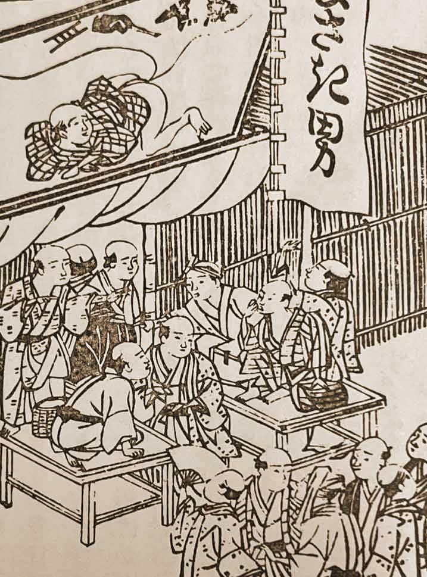
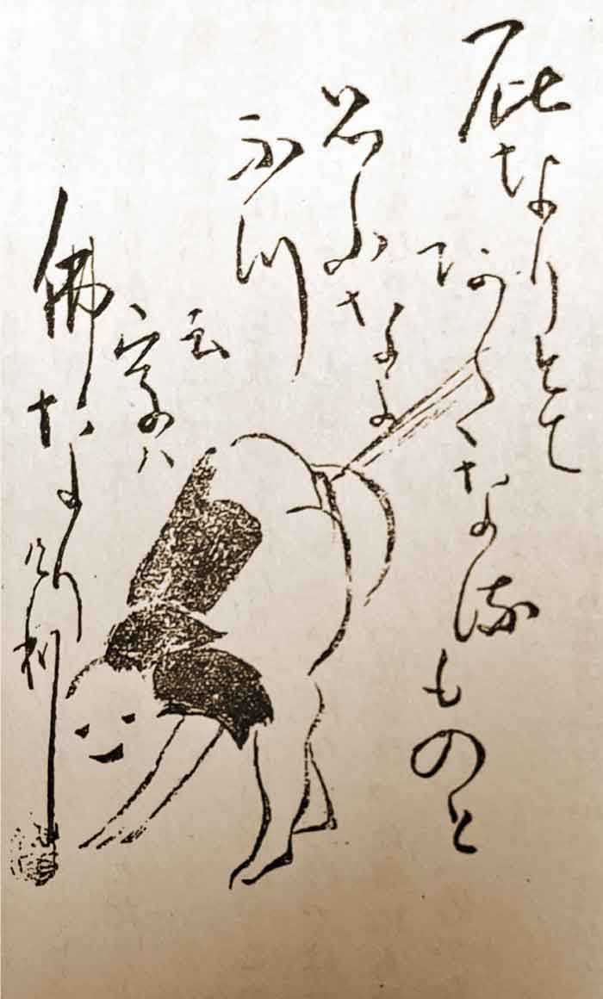
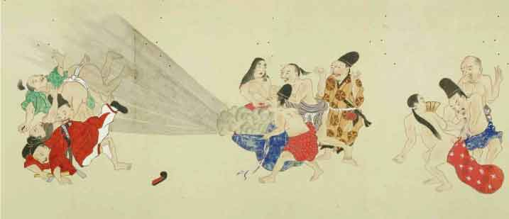

# [<ruby>名古屋<rt>なごや</rt></ruby><ruby>大学<rt>だいがく</rt></ruby> <ruby>夏<rt>なつ</rt></ruby>のテクノロジーフェスティバル](https://tech.imass.nagoya-u.ac.jp/)
# [おならでもつうしんできる？](https://tech.imass.nagoya-u.ac.jp/lecture.html#L4B)
#### なるほど！つうしんのしくみ

- セッションコード：[L4B](https://tech.imass.nagoya-u.ac.jp/lecture.html#L4B)
- <ruby>対象<rt>たいしょう</rt></ruby>：<ruby>小学生<rt>しょうがくせい</rt></ruby>（<ruby>特<rt>とく</rt></ruby>に<ruby>低学年<rt>ていがくねん</rt></ruby>・<ruby>中学年<rt>ちゅうがくねん</rt></ruby>におすすめ）
- <ruby>定員<rt>ていいん</rt></ruby>：250<ruby>名<rt>めい</rt></ruby>
- <ruby>会場<rt>かいじょう</rt></ruby>：<ruby>名古屋<rt>なごや</rt></ruby><ruby>大学<rt>だいがく</rt></ruby>　<ruby>坂田<rt>さかた</rt></ruby>・<ruby>平田<rt>ひらた</rt></ruby>ホール
- <ruby>日時<rt>にちじ</rt></ruby>：2024<ruby>年<rt>ねん</rt></ruby>8<ruby>月<rt>がつ</rt></ruby>28<ruby>日<rt>にち</rt></ruby>（<ruby>水<rt>すい</rt></ruby>）４<ruby>時間目<rt>じかんめ</rt></ruby>（15:20-16:50）
- <ruby>担当<rt>たんとう</rt></ruby>：[<ruby>教養教育院<rt>きょうようきょういくいん</rt></ruby>](https://www.ilas.nagoya-u.ac.jp)、[<ruby>工学研究科<rt>こうがくけんきゅうか</rt></ruby>・<ruby>情報・通信工学専攻<rt>じょうほう・つうしんこうがくせんこう</rt></ruby>](https://www.nuee.nagoya-u.ac.jp)　[<ruby>教授<rt>きょうじゅ</rt></ruby>　<ruby>山里敬也<rt>やまざとたかや</rt></ruby>](../../../team/Takaya-Yamazato)

<!--  -->

## こんなことを<ruby>学<rt>まな</rt></ruby>ぶよ

けいたい<ruby>電話<rt>でんわ</rt></ruby>は、<ruby>電波<rt>でんぱ</rt></ruby>を<ruby>使<rt>つか</rt></ruby>って<ruby>音<rt>おと</rt></ruby>を<ruby>遠<rt>とお</rt></ruby>くに<ruby>届<rt>とど</rt></ruby>けます。でも、<ruby>近<rt>ちか</rt></ruby>いところであれば、<ruby>糸<rt>いと</rt></ruby>を<ruby>使<rt>つか</rt></ruby>っても<ruby>音<rt>おと</rt></ruby>を<ruby>届<rt>とど</rt></ruby>けることができます。そう、<ruby>糸電話<rt>いとでんわ</rt></ruby>ですね！じつは、<ruby>糸<rt>いと</rt></ruby>だけじゃなく、<ruby>光<rt>ひかり</rt></ruby>や<ruby>音<rt>おと</rt></ruby>を<ruby>使<rt>つか</rt></ruby>っても<ruby>通信<rt>つうしん</rt></ruby>することができます。このしくみが<ruby>分<rt>わか</rt></ruby>かれば、「おなら」でも<ruby>通信<rt>つうしん</rt></ruby>ができるかもしれません。この<ruby>授業<rt>じゅぎょう</rt></ruby>では、「おなら<ruby>通信<rt>つうしん</rt></ruby>」にチャレンジします。みんな、おならで<ruby>通信<rt>つうしん</rt></ruby>はできるかな？

> ## 参加される保護者の皆様へのお願い<!-- omit in toc -->
>
> この度は、名古屋大学 夏のテクノロジーフェスティバルへご応募くださり、ありがとうございます。
> L4B「おならでもつうしんできる？なるほど！つうしんのしくみ」の講師を務めます、名古屋大学の山里でございます。
>
> さて、この講演では参加者の皆様に実際に「おならの音」を使った通信を試していただく予定です。そこで、ぜひ皆様に「おならの音」を録音して、お送りいただきたいと思います。ご家族でも、お友達でも、もちろんペットのおならの音でもかまいません。ご協力いただけますと幸いです。
> 
> 録音した「おならの音」をお送りいただける方はお手数ですが
> 
>    onara@yamazato.nuee.nagoya-u.ac.jp
>
> までご連絡ください。折り返しアップロード用URLをお送りします。
> 
> 準備の都合上、８月１９日（月）までにお送りいただけますと助かります。
>
> 締切を 8月23日（金）まで延長します。
> たくさんの「おなら音」をお送りください。
>
>「おならの音」のご提供は、もちろん任意ですが、多数の方にご協力いただけますと幸いです。
>
>ご提供いただいた「おならの音」は名古屋大学での教育・研究目的（本講演を含む）にのみ利用させていただき、それ以外では利用しません。ご提供いただく方のプライバシーに配慮し、お名前などは一切公表いたしません。
>
>公表に差し障りのないイニシャル、ニックネームなどを併せてお知らせ頂けますと、講演中にご紹介できます。
>
>どうぞたくさんの「おならの音」をご提供くださいますよう、お願い申し上げます。
>
>また、当日はおならを模擬した音を出せるものをご持参ください。パフパフと鳴るおもちゃのラッパなどで構いません。もちろん、お子様ご自身に「プーッ」と叫んでもらっても構いません。お子様とご相談の上、ご準備ください。

---

このページでは[<ruby>名古屋<rt>なごや</rt></ruby><ruby>大学<rt>だいがく</rt></ruby> <ruby>夏<rt>なつ</rt></ruby>のテクノロジーフェスティバル](https://tech.imass.nagoya-u.ac.jp/)の[おならでもつうしんできる？](https://tech.imass.nagoya-u.ac.jp/lecture.html)について、<ruby>知<rt>し</rt></ruby>っておいてほしいことを<ruby>書<rt>か</rt></ruby>くね。

お<ruby>父<rt>とう</rt></ruby>さん、お<ruby>母<rt>かあ</rt></ruby>さんといっしょに<ruby>読<rt>よ</rt></ruby>んでね！

---

## 目次　 <!-- omit in toc -->

- [「おなら<ruby>通信<rt>つうしん</rt></ruby>」チャレンジ！](#fart-challenge)
- [おならで<ruby>SOS<rt>エスオーエス</rt></ruby>を<ruby>送<rt>おく</rt></ruby>ってみよう！（おなら<ruby>通信<rt>つうしん</rt></ruby>のしくみ）](#how-it-works)
- [おならのにおいでも<ruby>通信<rt>つうしん</rt></ruby>はできるの？（デジタル<ruby>通信<rt>つうしん</rt></ruby>の<ruby>原理<rt>げんり</rt></ruby>）](#smell-communication)
- [もっと<ruby>速<rt>はや</rt></ruby>い<ruby>通信<rt>つうしん</rt></ruby>はできるの？（<ruby>光<rt>ひかり</rt></ruby>をつかった<ruby>通信<rt>つうしん</rt></ruby>と<ruby>電波<rt>でんぱ</rt></ruby>をつかった<ruby>通信<rt>つうしん</rt></ruby>）](#wired-and-wireless-communication)
- [さらに<ruby>勉強<rt>べんきょう</rt></ruby>するために](#For-further-study)

#### おまけ 　 <!-- omit in toc -->

- [おなら<ruby>通信<rt>つうしん</rt></ruby>のアイデアはここから<ruby>生<rt>う</rt></ruby>まれた？！](#the-fart-communication)
  - [<ruby>平賀源内<rt>ひらがげんない</rt></ruby>](#hiraga-gennai)
    - [<ruby>土用<rt>どよう</rt></ruby>の<ruby>丑<rt>うし</rt></ruby>の<ruby>日<rt>ひ</rt></ruby>](#doyou-no-ushino-hi)
    - [<ruby>エレキテル<rt>えれきてる</rt></ruby>](#erekiteru)
    - [<ruby>放屁論<rt>ほうひろん</rt></ruby>](#houhiron)
    - [<ruby>放屁論後編<rt>ほうひろんこうへん</rt></ruby>](#houhiron-kouhen)
  - [<ruby>江戸<rt>えど</rt></ruby>の<ruby>庶民<rt>しょみん</rt></ruby>はおならが<ruby>大好<rt>だいす</rt></ruby>き？！](#onara-daisuki)
  - [<ruby>放屁師<rt>ほうひし</rt></ruby>（<ruby>屁男<rt>へっぴりおとこ</rt></ruby>）](#houhishi)

---

## 「おなら<ruby>通信<rt>つうしん</rt></ruby>」チャレンジ！

  

    
  

    
<ruby>先生<rt>せんせい</rt></ruby>、この<ruby>授業<rt>じゅぎょう</rt></ruby>では「おなら<ruby>通信<rt>つうしん</rt></ruby>」にチャレンジするって<ruby>書<rt>か</rt></ruby>いてあるけど、ほんとうにおならで<ruby>通信<rt>つうしん</rt></ruby>するの？

    

      
    

    
もちろん。

  

    
  

    
でも、<ruby>授業中<rt>じゅぎょうちゅう</rt></ruby>にみんなが　プッ　プッ　プー　とおならしたら、<ruby>教室<rt>きょうしつ</rt></ruby>がおならでいっぱいになってたいへんだよ。マスクをもってくるようにアナウンスしなきゃ。

    

      
    

    
それはこまったなぁ、どうしよう・・・

  

    
  

    
だいじょうぶだよ。ぼく、くさくないおならのしかた<ruby>知<rt>し</rt></ruby>っているもん。ぜんぜんくさくないよ。
    

    

      
    

    
え、どうやるの。おしえて。
    

  

    
  

    
はやね、はやおき、<ruby>毎日<rt>まいにち</rt></ruby>ぐっすりねむること。すききらいなく、なんでもよく<ruby>食<rt>た</rt></ruby>べること。
    

    

      
    

    
なるほど。お<ruby>肉<rt>にく</rt></ruby>ばっかり<ruby>食<rt>た</rt></ruby>べていると、つぎの<ruby>日<rt>ひ</rt></ruby>のおならはくさいからね。
    

  

    
  

    
うん。お<ruby>肉<rt>にく</rt></ruby>じゃなくお<ruby>野菜<rt>やさい</rt></ruby>をたくさん<ruby>食<rt>た</rt></ruby>べるといいよ。あと<ruby>体<rt>からだ</rt></ruby>をうごかして、<ruby>運動<rt>うんどう</rt></ruby>するのもいいよ。ぼくは<ruby>毎日<rt>まいにち</rt></ruby>ラジオたいそうをやっているよ。
    

    

      
    

    
<ruby>健康的<rt>けんこうてき</rt></ruby>でいいね。おならくんすごい！
    

  

    
  

    
でも、<ruby>先生<rt>せんせい</rt></ruby>、おならって<ruby>声<rt>こえ</rt></ruby>みたいにだそうとおもっても、　プ〜　ってでないよ。<ruby>授業<rt>じゅぎょう</rt></ruby>のときにおならでないかも・・・
    

    

      
    

    
それはこまったなぁ、おならがでないと<ruby>通信<rt>つうしん</rt></ruby>もできないぞ。
    

  

    
  

    
おならの<ruby>音<rt>おと</rt></ruby>を<ruby>録音<rt>ろくおん</rt></ruby>して<ruby>使<rt>つか</rt></ruby>ったらどう？ぼくのおならは　プ〜　って、<ruby>明<rt>あか</rt></ruby>るく<ruby>元気<rt>げんき</rt></ruby>な<ruby>音<rt>おと</rt></ruby>がするよ。<ruby>録音<rt>ろくおん</rt></ruby>したおならの<ruby>音<rt>おと</rt></ruby>はつかえる？
    

    

      
    

    
いいね！みんなにおならの<ruby>音<rt>おと</rt></ruby>を<ruby>録音<rt>ろくおん</rt></ruby>して<ruby>送<rt>おく</rt></ruby>ってもらおうか。それをつかった<ruby>通信<rt>つうしん</rt></ruby>を<ruby>考<rt>かんが</rt></ruby>えるね。
    

  

    
  

    
ぼく、おもちゃのラッパをもっているけど、パフパフってぼくのおならの<ruby>音<rt>おと</rt></ruby>とにてるよ。
    

    

      
    

    
パフパフラッパならくさくないから<ruby>教室<rt>きょうしつ</rt></ruby>にもってきても<ruby>大丈夫<rt>だいじょうぶ</rt></ruby>だね。それをつかって「おなら<ruby>通信<rt>つうしん</rt></ruby>」をためしてみよう。
    

  

    
  

    
なんだか、すごく<ruby>楽<rt>たの</rt></ruby>しそうな<ruby>授業<rt>じゅぎょう</rt></ruby>だね！きたいしてもいい？
    

    

      
    

    
もちろん！みんなのおならの<ruby>音<rt>おと</rt></ruby>で<ruby>通信<rt>つうしん</rt></ruby>しちゃうね。おならの<ruby>音<rt>おと</rt></ruby>をたくさん<ruby>送<rt>おく</rt></ruby>ってね！
    

  

    
  

    
うん、わかった。プゥ〜って<ruby>元気<rt>げんき</rt></ruby>な大きな<ruby>音<rt>おと</rt></ruby>のおならを<ruby>録音<rt>ろくおん</rt></ruby>できるようにがんばるね！
    

-------

## おならで<ruby>SOS<rt>エスオーエス</rt></ruby>を<ruby>送<rt>おく</rt></ruby>ってみよう！（おなら<ruby>通信<rt>つうしん</rt></ruby>のしくみ）

  

    
  

    
<ruby>先生<rt>せんせい</rt></ruby>、おならでどうやって<ruby>通信<rt>つうしん</rt></ruby>するの？おしえて。
    

    

      
    

    
それは<ruby>授業<rt>じゅぎょう</rt></ruby>の<ruby>日<rt>ひ</rt></ruby>までお<ruby>楽<rt>たの</rt></ruby>しみにして。でも、ちょっとだけおしえるね。
    

  

    
  

    
わくわく。
    

    

      
    

    
おならくんはタイタニック<ruby>号<rt>ごう</rt></ruby>ってしってる？
    

  

    
  

    
しっているよ。ローザがのっていた<ruby>船<rt>ふね</rt></ruby>でしょ。<ruby>氷山<rt>ひょうざん</rt></ruby>にぶつかって<ruby>沈没<rt>ちんぼつ</rt></ruby>するんだよね。ザ・ドラえもんズ スペシャルでよんだよ。
    

    

      
    

    
おぉ、おならくんすごい。よくしっているね。<ruby>映画<rt>えいが</rt></ruby>のほうが<ruby>有名<rt>ゆうめい</rt></ruby>だと<ruby>思<rt>おも</rt></ruby>うけど、ドラえもんにものっているんだね。
    

  

    
  

    
<ruby>映画<rt>えいが</rt></ruby>はお<ruby>母<rt>かあ</rt></ruby>さんがみたことあるって<ruby>話<rt>はな</rt></ruby>していたよ。ヒロインのローズが<ruby>船<rt>ふね</rt></ruby>の<ruby>先<rt>さき</rt></ruby>で<ruby>手<rt>て</rt></ruby>を<ruby>広<rt>ひろ</rt></ruby>げるシーンが<ruby>有名<rt>ゆうめい</rt></ruby>だって。
    

    

      
    

    
そのタイタニック<ruby>号<rt>ごう</rt></ruby>から<ruby>世界<rt>せかい</rt></ruby>ではじめて<ruby>SOS<rt>エスオーエス</rt></ruby><ruby>信号<rt>しんごう</rt></ruby>が<ruby>送<rt>おく</rt></ruby>られたんだ。
    

  

    
  

    
<ruby>SOS<rt>エスオーエス</rt></ruby><ruby>信号<rt>しんごう</rt></ruby>？
    

    

      
    

    
<ruby>SOS<rt>エスオーエス</rt></ruby>は<ruby>英語<rt>えいご</rt></ruby>でわたしたちの<ruby>船<rt>ふね</rt></ruby>を<ruby>助<rt>たすけ</rt></ruby>けてください（<ruby>Save Our Ship<rt>セーブ　アワ シップ</rt></ruby>）のことで<ruby>遭難信号<rt>そうなんしんごう</rt></ruby>なんだ。
    

  

    
  

    
そうなんだ。
    

    

      
    

    
ハハハ、しゃれだね。 <ruby>当時<rt>とうじ</rt></ruby>は<ruby>SOS信号<rt>エスオーエスしんごう</rt></ruby>をだすのに<ruby>火花<rt>ひばな</rt></ruby>をつかったんだ。
    

  

    
  

    
<ruby>火花<rt>ひばな</rt></ruby>？<ruby>電波<rt>でんぱ</rt></ruby>じゃないの？
    

    

      
    

    
そう。 
    <ruby>火花<rt>ひばな</rt></ruby>が出るときに<ruby>電波<rt>でんぱ</rt></ruby>もいっしょにでるんだ。 
    <ruby>電波<rt>でんぱ</rt></ruby>は<ruby>遠<rt>とお</rt></ruby>くまで<ruby>飛<rt>と</rt></ruby>ぶんだ。
    だから、<ruby>船<rt>ふね</rt></ruby>から<ruby>陸地<rt>りくち</rt></ruby>まで<ruby>信号<rt>しんごう</rt></ruby>をとどけることができるんだ。
    

  

    
  

    
でも、<ruby>火花<rt>ひばな</rt></ruby>でどうやって<ruby>SOS信号<rt>エスオーエスしんごう</rt></ruby>をあらわしたの？
    

    

      
    

    
おならくん、いいところに<ruby>気<rt>き</rt></ruby>づいたね。 
    <ruby>火花<rt>ひばな</rt></ruby>をだしたり、<ruby>火花<rt>ひばな</rt></ruby>を<ruby>消<rt>け</rt></ruby>したりしたの。そうすると、<ruby>電波<rt>でんぱ</rt></ruby>もでたり、でなかったりするでしょ。
    

  

    
  

    
なるほど、<ruby>電波<rt>でんぱ</rt></ruby>をだしたり、ださなかったりしたんだね。
    

    

      
    

    
そう。 
    さらに<ruby>短<rt>みじか</rt></ruby>い<ruby>時間<rt>じかん</rt></ruby>の<ruby>火花<rt>ひばな</rt></ruby>と<ruby>長<rt>なが</rt></ruby>い<ruby>時間<rt>じかん</rt></ruby>つづく<ruby>火花<rt>ひばな</rt></ruby>の２つで<ruby>SOS信号<rt>エスオーエスしんごう</rt></ruby>をあらわしたんだ。
    

  

    
  

    
<ruby>短<rt>みじか</rt></ruby>い<ruby>火花<rt>ひばな</rt></ruby>と<ruby>長<rt>なが</rt></ruby>い<ruby>火花<rt>ひばな</rt></ruby>？ 
    つまり、<ruby>電波<rt>でんぱ</rt></ruby>が<ruby>短<rt>みじか</rt></ruby>い<ruby>時間<rt>じかん</rt></ruby>のものと<ruby>長<rt>なが</rt></ruby>い<ruby>時間<rt>じかん</rt></ruby>つづくものとで<ruby>SOS信号<rt>エスオーエスしんごう</rt></ruby>をあらわしたの？
    

    

      
    

    
そのとおり。 
    <ruby>短<rt>みじか</rt></ruby>い<ruby>電波<rt>でんぱ</rt></ruby>は<ruby>音<rt>おと</rt></ruby>であらわすと「ト」になるかな。 
    <ruby>長<rt>なが</rt></ruby>い<ruby>時間<rt>じかん</rt></ruby>の<ruby>電波<rt>でんぱ</rt></ruby>は「ツー」。 
    その２つの<ruby>組<rt>く</rt></ruby>み<ruby>合<rt>あ</rt></ruby>わせで <ruby>SOS信号<rt>エスオーエスしんごう</rt></ruby>をあらわしたんだ。
    

  

    
  

    
「ト」と「ツー」。
    

    

      
    

    
そう。 
    <ruby>S<rt>エス</rt></ruby>は「ト」を３<ruby>回<rt>かい</rt></ruby>、つまり「トトト」。 
    <ruby>O<rt>オー</rt></ruby>は「ツー」を３<ruby>回<rt>かい</rt></ruby>、つまり「ツーツーツー」。
    

  

    
  

    
ということは、<ruby>SOS<rt>エスオーエス</rt></ruby>は 
    「トトト　ツーツーツー　トトト」 
    になるの？
    

    

      
    

    
そのとおり。おならくんはすばらしいね！
    

  

    
  

    
えへへ。 
    ということは、おならでやると 
    「プップップッ　プゥ〜プゥ〜プゥ〜　プップップッ」 
    になるの？
    

    

      
    

    
おぉ、すばらしい。よくわかったね。 
    ・・・うぅん、それにしても、ちょっとだけ<ruby>種明<rt>たねあ</rt></ruby>かしをするつもりだったけど、ぜんぶバレちゃったなぁ。ハハハ。
    

> - 上記で「タイタニック号が世界初のSOSエスオーエスを発した」と説明しましたが、実際にはタイタニック号が最初ではありません。タイタニック号の悲劇と併せてSOSが最初と述べている書物も多いことからそのように書きました。印象に残りやすいですしね。より詳しく知りたい方は総務省の外郭団体である電波適正利用推進員協議会の[電波学習館](https://www.cleandenpa.net/museum/g_moku.html)・[第1回万国無線電信会議](https://www.cleandenpa.net/museum/gaku/gc.html)をご覧下さい。なお、同ページではタイタニック号の遭難モールス信号も聞けるようになっていますが、私が確認したところではうまく動作しないようです。
> 

-----

## おならのにおいでも<ruby>通信<rt>つうしん</rt></ruby>はできるの？（デジタル<ruby>通信<rt>つうしん</rt></ruby>の<ruby>原理<rt>げんり</rt></ruby>）

  

    
  

    
おなら<ruby>通信<rt>つうしん</rt></ruby>わかったもんね、へへへ。でも、<ruby>SOS<rt>エスオーエス</rt></ruby>をおならでやるのは<ruby>難<rt>むずか</rt></ruby>しいなぁ。<ruby>練習<rt>れんしゅう</rt></ruby>してもできないかも。
    

    

      
    

    
そうだね、ふつうの<ruby>人<rt>ひと</rt></ruby>には<ruby>難<rt>むずか</rt></ruby>しいと思うよ。でもね、おならで<ruby>歌<rt>うた</rt></ruby>を<ruby>歌<rt>うた</rt></ruby>うことができる<ruby>人<rt>ひと</rt></ruby>もいるんだよ。きっとこの<ruby>人<rt>ひと</rt></ruby>なら<ruby>SOS<rt>エスオーエス</rt></ruby>もかんたんにできるとおもうよ。このページの<ruby>最後<rt>さいご</rt></ruby>に<ruby>紹介<rt>しょうかい</rt></ruby>するね。
    

  

    
  

    
<ruby>先生<rt>せんせい</rt></ruby>、もしかして、おならの「<ruby>音<rt>おと</rt></ruby>」で<ruby>通信<rt>つうしん</rt></ruby>できるのなら、おならの「におい」でも<ruby>通信<rt>つうしん</rt></ruby>はできるの？
    

    

      
    

    
おならくん、いいところに<ruby>気<rt>き</rt></ruby>づいたね。さすがだよ。 
    そう、おならのにおいでも<ruby>通信<rt>つうしん</rt></ruby>はできるよ。
    

  

    
  

    
どうやってやるの？ 
    おしえて。
    

    

      
    

    
おならの<ruby>音<rt>おと</rt></ruby>をつかった<ruby>通信<rt>つうしん</rt></ruby>では、<ruby>短<rt>みじか</rt></ruby>いおならの<ruby>音<rt>おと</rt></ruby>「プッ」と<ruby>長<rt>なが</rt></ruby>いおならの<ruby>音<rt>おと</rt></ruby>「プゥ〜」の２つの<ruby>音<rt>おと</rt></ruby>をつかったよね。
    

  

    
  

    
うん。 
    「プッ」と「プゥ〜」だね。
    

    

      
    

    
そう。 
    <ruby>実<rt>じつ</rt></ruby>はこの２つというのがポイントなんだ。
    

  

    
  

    
２つ？ 
    <ruby>何<rt>なに</rt></ruby>か違うものが２つあれば<ruby>通信<rt>つうしん</rt></ruby>ができるの？
    

    

      
    

    
そう、そのとおり。 
    「プッ」と「プゥ〜」の２つ。あるいは、単に「プッ」ともう一つは<ruby>何<rt>なに</rt></ruby>も<ruby>音<rt>おと</rt></ruby>がしないことでもいいよ。
    

  

    
  

    
「プッ」と「しーん（<ruby>音<rt>おと</rt></ruby>がしない）」ってこと？
    

    

      
    

    
そう。 
    <ruby>音<rt>おと</rt></ruby>が「する」か「しない」か。これを「１」と「０」であらわすの。
    

  

    
  

    
「する」、「しない」を「１」と「０」？
    

    

      
    

    
そのとおり。 
    <ruby>電波<rt>でんぱ</rt></ruby>の<ruby>場合<rt>ばあい</rt></ruby>だと<ruby>電波<rt>でんぱ</rt></ruby>が「ある」か「ない」か。
    

  

    
  

    
ということは、おならのにおいだと「においがする」か「においがしない」なのかな？
    

    

      
    

    
そのとおり。 
    おならのにおいがする<ruby>場合<rt>ばあい</rt></ruby>を「１」、しない<ruby>場合<rt>ばあい</rt></ruby>を「０」とすればいいよ。
    

  

    
  

    
「１」と「０」ということは、これがデジタルなの？
    

    

      
    

    
さすが、おならくん、そのとおりだよ。 
    <ruby>情報<rt>じょうほう</rt></ruby>を<ruby>送<rt>おく</rt></ruby>る<ruby>方<rt>ほう</rt></ruby>と<ruby>受<rt>う</rt></ruby>けとる<ruby>方<rt>ほう</rt></ruby>とで２つの区別がつけば、<ruby>何<rt>なに</rt></ruby>をつかっても<ruby>通信<rt>つうしん</rt></ruby>ができるんだよ。この<ruby>場合<rt>ばあい</rt></ruby>「１」と「０」をつかうのでデジタル<ruby>通信<rt>つうしん</rt></ruby>というんだ。
    

  

    
  

    
「１」と「０」だからデジタル<ruby>通信<rt>つうしん</rt></ruby>なんだね。すごい。デジタルっていうからもっと<ruby>難<rt>むずか</rt></ruby>しいのかと思っていたよ。
    

    

      
    

    
<ruby>実<rt>じつ</rt></ruby>はね、<ruby>通信<rt>つうしん</rt></ruby>の<ruby>原理<rt>げんり</rt></ruby>としてはデジタル<ruby>通信<rt>つうしん</rt></ruby>がもっともかんたんなの。
    

  

    
  

    
おならのにおいでデジタル<ruby>通信<rt>つうしん</rt></ruby>ができるなんて、ちょっと、びっくりしちゃうな。 
    おならのにおいがする、しないが「１」と「０」をあらわすのだね。 
    なんだかすごいね！
    

    

      
    

    
でもね、デジタル<ruby>通信<rt>つうしん</rt></ruby>にはもう一つ<ruby>大事<rt>だいじ</rt></ruby>なことがあるんだ。
    

  

    
  

    
えっ、それは<ruby>何<rt>なに</rt></ruby>？
    

    

      
    

    
それはね、<ruby>時間<rt>じかん</rt></ruby>のことなんだ。どこからどこまでが「１」の<ruby>時間<rt>じかん</rt></ruby>で、どこからどこまでが「０」の<ruby>時間<rt>じかん</rt></ruby>なのか、ってこと。
    

  

    
  

    
おならのにおいがする<ruby>時間<rt>じかん</rt></ruby>としない<ruby>時間<rt>じかん</rt></ruby>？
    

    

      
    

    
そう、そのとおり。 
    おならくんのおならのにおいはどのくらいの<ruby>時間<rt>じかん</rt></ruby>、におっているかな？
    

  

    
  

    
そうだなぁ、だいたい１<ruby>分<rt>ぷん</rt></ruby>ぐらいはにおっているかなぁ。
    

    

      
    

    
なるほど。その<ruby>場合<rt>ばあい</rt></ruby>、「１」あるいは「０」は１<ruby>分<rt>ぷん</rt></ruby>おきに<ruby>送<rt>おく</rt></ruby>ればよいね。
    

  

    
  

    
ということは、たとえば、「１」「１」と<ruby>送<rt>おく</rt></ruby>りたい<ruby>場合<rt>ばあい</rt></ruby>は１<ruby>分<rt>ぷん</rt></ruby>おきに「プゥ〜」「プゥ〜」とおならをすればいいのかな？
    

    

      
    

    
そのとおり。「１」「０」「１」の<ruby>場合<rt>ばあい</rt></ruby>で考えてみようか。 
    <ruby>最初<rt>さいしょ</rt></ruby>は「１」なのでおならを「プゥ〜」、 
    次の１<ruby>分<rt>ぷん</rt></ruby>から２<ruby>分<rt>ふん</rt></ruby>までは「０」なので、おならをしないで「しーん（においがしない）」、 
    <ruby>最後<rt>さいご</rt></ruby>の２<ruby>分<rt>ふん</rt></ruby>から３<ruby>分<rt>ぷん</rt></ruby>までは「１」なので、また「プゥ〜」とおならをすればいいよ。
    

  

    
  

    
なるほど、<ruby>時計<rt>とけい</rt></ruby>にあわせて１<ruby>分<rt>ぷん</rt></ruby>おきにおならを「する」、「しない」で<ruby>情報<rt>じょうほう</rt></ruby>の「１」と「０」を<ruby>送<rt>おく</rt></ruby>ることができるのだね。 
    これがデジタル<ruby>通信<rt>つうしん</rt></ruby>なのか！なんだかすごい！
    

    

      
    

    
でもね、この<ruby>方法<rt>ほうほう</rt></ruby>だと「１」はおならのにおいがするからすぐにわかるけど、「０」のところ、つまり「おならをしていない」ことはわかりにくい<ruby>場合<rt>ばあい</rt></ruby>があるんだ。おならのにおいが<ruby>長<rt>なが</rt></ruby>くつづくこともあるからね。 
    このため、さっきの<ruby>SOS<rt>エスオーエス</rt></ruby>では「プッ」と「プゥ〜」の<ruby>長<rt>なが</rt></ruby>さのちがう２つの<ruby>信号<rt>しんごう</rt></ruby>をつかってあらわしたんだ。
    

  

    
  

    
なるほど、さすが、かしこいね！
    

  

      
    

    
デジタル<ruby>通信<rt>つうしん</rt></ruby>は「１」と「０」で<ruby>情報<rt>じょうほう</rt></ruby>を<ruby>伝<rt>つた</rt></ruby>えることができるのでかんたんなんだけど、「１」と「０」を<ruby>切<rt>き</rt></ruby>り<ruby>替<rt>か</rt></ruby>える<ruby>時間<rt>じかん</rt></ruby>がはっきりわかる<ruby>正確<rt>せいかく</rt></ruby>な<ruby>時計<rt>とけい</rt></ruby>も<ruby>必要<rt>ひつよう</rt></ruby>になるんだ。この<ruby>時計<rt>とけい</rt></ruby>が<ruby>必要<rt>ひつよう</rt></ruby>というところがデジタル<ruby>通信<rt>つうしん</rt></ruby>のポイントなんだよ。
    

------

## もっと<ruby>速<rt>はや</rt></ruby>い<ruby>通信<rt>つうしん</rt></ruby>はできるの？（<ruby>光<rt>ひかり</rt></ruby>をつかった<ruby>通信<rt>つうしん</rt></ruby>と<ruby>電波<rt>でんぱ</rt></ruby>をつかった<ruby>通信<rt>つうしん</rt></ruby>）

    

      
    

    
「おならのにおい」<ruby>通信<rt>つうしん</rt></ruby>は<ruby>情報<rt>じょうほう</rt></ruby>を<ruby>伝<rt>つた</rt></ruby>えるのに<ruby>時間<rt>じかん</rt></ruby>がかかるよね。なぜ<ruby>時間<rt>じかん</rt></ruby>がかかると思う？
    

  

    
  

    
それは、おならのにおいがなくなるまでに<ruby>時間<rt>じかん</rt></ruby>がかかるからだよ。だって、<ruby>時間<rt>じかん</rt></ruby>が<ruby>短<rt>みじか</rt></ruby>いと、<ruby>前<rt>まえ</rt></ruby>のおならがにおって「０」がわからなくなるもん！
    

    

      
    

    
そうだね。では、もっと<ruby>速<rt>はや</rt></ruby>い<ruby>通信<rt>つうしん</rt></ruby>をするためにはどうすればいいと思う？
    

  

    
  

    
この<ruby>世<rt>よ</rt></ruby>の<ruby>中<rt>なか</rt></ruby>で<ruby>一番速<rt>いちばんはや</rt></ruby>いものをつかって「１」と「０」をあらわせばいいのだね。 
    <ruby>一番速<rt>いちばんはや</rt></ruby>いもの、というと・・・
    わかった「<ruby>光<rt>ひかり</rt></ruby>」だね！
    

    

      
    

    
そのとおり。さすがおならくん、すごいね！ 
    この<ruby>世<rt>よ</rt></ruby>の<ruby>中<rt>なか</rt></ruby>で<ruby>一番速<rt>いちばんはや</rt></ruby>いものは「<ruby>光<rt>ひかり</rt></ruby>」です。 
    １<ruby>秒間<rt>びょうかん</rt></ruby>に<ruby>地球<rt>ちきゅう</rt></ruby>を７<ruby>回半<rt>かいはん</rt></ruby>も<ruby>回<rt>まわ</rt></ruby>る<ruby>速<rt>はや</rt></ruby>さだよ。
    

  

    
  

    
ということは「<ruby>光<rt>ひかり</rt></ruby>がある」、「なし」、で<ruby>通信<rt>つうしん</rt></ruby>をすればいいのかな？
    

    

      
    

    
そのとおり。<ruby>実<rt>じつ</rt></ruby>は、<ruby>光<rt>ひかり</rt></ruby>も<ruby>電波<rt>でんぱ</rt></ruby>も<ruby>電磁波<rt>でんじは</rt></ruby>のひとつなんだ。
    

  

    
  

    
<ruby>光<rt>ひかり</rt></ruby>と<ruby>電波<rt>でんぱ</rt></ruby>は<ruby>仲間<rt>なかま</rt></ruby>なんだね。
    

    

      
    

    
<ruby>光<rt>ひかり</rt></ruby>をつかった<ruby>通信<rt>つうしん</rt></ruby>に<ruby>光<rt>ひかり</rt></ruby>ファイバー<ruby>通信<rt>つうしん</rt></ruby>があるんだ。きっとおならくんのおうちにも<ruby>光<rt>ひかり</rt></ruby>ファイバーが入っているのでは？そこでつかわれているとおもうよ。
    

  

    
  

    
なるほど。 
    じゃあ、<ruby>電波<rt>でんぱ</rt></ruby>は？
    

    

      
    

    
<ruby>電波<rt>でんぱ</rt></ruby>はラジオやテレビ、けいたい<ruby>電話<rt>でんわ</rt></ruby>などの<ruby>無線<rt>むせん</rt></ruby><ruby>通信<rt>つうしん</rt></ruby>でつかわれているよ。 
    <ruby>光<rt>ひかり</rt></ruby>をつかう<ruby>光<rt>ひかり</rt></ruby>ファイバー<ruby>通信<rt>つうしん</rt></ruby>も<ruby>電波<rt>でんぱ</rt></ruby>をつかう<ruby>無線<rt>むせん</rt></ruby><ruby>通信<rt>つうしん</rt></ruby>のいずれもデジタル<ruby>通信<rt>つうしん</rt></ruby>が<ruby>多<rt>おお</rt></ruby>いんだよ。
    

  

    
  

    
たしかに<ruby>光<rt>ひかり</rt></ruby>は、パッとついたり<ruby>消<rt>き</rt></ruby>えたりできるから、おならのにおいみたいに<ruby>長<rt>なが</rt></ruby>い<ruby>間<rt>あいだ</rt></ruby>においがつづくことがないね。しかも、この<ruby>世<rt>よ</rt></ruby>の<ruby>中<rt>なお</rt></ruby>で<ruby>一番速<rt>いちばん はやい</rt></ruby>い！
    

    

      
    

    
そう。 
    <ruby>電波<rt>でんぱ</rt></ruby>も<ruby>光<rt>ひかり</rt></ruby>と同じ<ruby>電磁波<rt>でんじは</rt></ruby>のひとつなので<ruby>高速<rt>こうそく</rt></ruby>なんだ。
    

  

    
  

    
むむむ、ということは、<ruby>光<rt>ひかり</rt></ruby>ファイバーも<ruby>無線<rt>むせん</rt></ruby>もこの<ruby>世<rt>よ</rt></ruby>のなかで<ruby>一番速<rt>いちばんはや</rt></ruby>い<ruby>電磁波<rt>でんじは</rt></ruby>をつかうので、もっと<ruby>高速<rt>こうそく</rt></ruby>にはできないの？
    

    

      
    

    
もちろん、できるんだけどね・・・ 
    でもね、さっきデジタル<ruby>通信<rt>つうしん</rt></ruby>で<ruby>必要<rt>ひつよう</rt></ruby>といった<ruby>時計<rt>とけい</rt></ruby>が<ruby>難<rt>むずか</rt></ruby>しいんだ。
    

  

    
  

    
<ruby>時計<rt>とけい</rt></ruby>？
    

    

      
    

    
そう<ruby>時計<rt>とけい</rt></ruby>。 
    もっとちゃんというと「１」と「０」の<ruby>時間<rt>じかん</rt></ruby>を<ruby>正確<rt>せいかく</rt></ruby>にあらわすために<ruby>基準<rt>きじゅん</rt></ruby>となる<ruby>時間<rt>じかん</rt></ruby>のこと。 
    この<ruby>基準<rt>きじゅん</rt></ruby>となる<ruby>時間<rt>じかん</rt></ruby>を<ruby>作<rt>つく</rt></ruby>る<ruby>装置<rt>そうち</rt></ruby>のことを<ruby>発振回路<rt>はっしんかいろ</rt></ruby>というんだ。
    

  

    
  

    
<ruby>発振回路<rt>はっしんかいろ</rt></ruby>？
    

    

      
    

    
そう、<ruby>発振回路<rt>はっしんかいろ</rt></ruby>。 
    <ruby>発振回路<rt>はっしんかいろ</rt></ruby>が<ruby>刻<rt>きざ</rt></ruby>む<ruby>時間<rt>じかん</rt></ruby>にあわせて「１」か「０」のいずれかを<ruby>送<rt>おく</rt></ruby>るんだ。 
    なので、<ruby>発振回路<rt>はっしんかいろ</rt></ruby>が<ruby>正確<rt>せいかく</rt></ruby>に<ruby>短<rt>みじか</rt></ruby>い<ruby>時間<rt>じかん</rt></ruby>で<ruby>刻<rt>きざ</rt></ruby>むことでがだいじになるんだ。 
    <ruby>短<rt>みじか</rt></ruby>い<ruby>時間<rt>じかん</rt></ruby>で「１」と「０」を切り替えることができれば、それだけ<ruby>高速<rt>こうそく</rt></ruby>にたくさんの<ruby>情報<rt>じょうほう</rt></ruby>を<ruby>送<rt>おく</rt></ruby>ることができるからね。
    

  

    
  

    
なるほど、<ruby>高速<rt>こうそく</rt></ruby>な<ruby>発振回路<rt>はっしんかいろ</rt></ruby>が<ruby>必要<rt>ひつよう</rt></ruby>なんだね。
    

    

      
    

    
そう。 
    <ruby>名古屋<rt>なごや</rt></ruby>
    <ruby>大学<rt>だいがく</rt></ruby>だと
    <a href="http://www.semicond.nuee.nagoya-u.ac.jp/">
    <ruby>天野・本田研究室<rt>あまの・ほんだ けんきゅうしつ</rt></ruby>
    </a>の
    <a href="https://profs.provost.nagoya-u.ac.jp/html/100009220_ja.html">
    <ruby>久志本<rt>くしもと</rt></ruby>
    <ruby>真希<rt>まき</rt></ruby>
    <ruby>先生<rt>せんせい</rt></ruby>
    </a>が
    <ruby>研究<rt>けんきゅう</rt></ruby>しているよ。
    <a href="https://www.imass.nagoya-u.ac.jp/news_information/07_kushimoto.html">
    <ruby>世界最高速<rt>せかいさいこうそく</rt></ruby>の
    <ruby>発振回路<rt>はっしんかいろ</rt></ruby>
    </a>ができたって
    <ruby>発表<rt>はっぴょう</rt></ruby>していたよ。
    

  

    
  

    
うわぁ〜すごい！
    

    

      
    

    
<ruby>光<rt>ひかり</rt></ruby>については<a href="https://www.nuee.nagoya-u.ac.jp/labs/optelelab/"><ruby>西澤典彦先生<rt>にしざわ のりひこ せんせい</rt></ruby></a>が<ruby>研究<rt>けんきゅう</rt></ruby>しているよ。 
    <ruby>名古屋<rt>なごや</rt></ruby><ruby>大学<rt>だいがく</rt></ruby>テクノロジーフェスティバル<a href="https://tech.imass.nagoya-u.ac.jp/lecture.html#L3C">「すごい！ひかりのふしぎ、れーざーこうせんってすごい！」</a>の<ruby>先生<rt>せんせい</rt></ruby>でもあるよ。
    

  

    
  

    
みんな、すごいね。 
    で、<ruby>先生<rt>せんせい</rt></ruby>は<ruby>何<rt>なに</rt></ruby>の<ruby>研究<rt>けんきゅう</rt></ruby>をやっているの？
    

    

      
    

    
ぼくは<ruby>可視光通信<rt>かしこうつうしん</rt></ruby>っていってね、<ruby>目<rt>め</rt></ruby>で<ruby>見<rt>み</rt></ruby>える<ruby>光<rt>ひかり</rt></ruby>をつかった<ruby>通信<rt>つうしん</rt></ruby>を<ruby>研究<rt>けんきゅう</rt></ruby>しているんだ。 
    この<ruby>授業<rt>じゅぎょう</rt></ruby>でデモもやるよ。 
    <ruby>天野<rt>あまの</rt></ruby><ruby>浩<rt>ひろし</rt></ruby><ruby>先生<rt>せんせい</rt></ruby>が<ruby>発明<rt>はつめい</rt></ruby>した<ruby>LED<rt>エル イー ディ</rt></ruby>をつかって<ruby>通信<rt>つうしん</rt></ruby>をするんだ。 
    <a href="https://tech.imass.nagoya-u.ac.jp/lecture.html"><ruby>天野<rt>あまの</rt></ruby><ruby>先生<rt>せんせい</rt></ruby>の講演</a>はぜひきいてね。ちょっとむずかしいかもしれないけど、きっとワクワクするとおもうよ。
    

  

    
  

    
うわぁ〜すごいなぁ〜。 
    ぼくも<ruby>研究<rt>けんきゅう</rt></ruby>できるようになるかな？
    

    

      
    

    
もちろん。 
    まずは<a href="https://sudalab.skr.jp/members/jun_suda/"><ruby>須田<rt>すだ</rt></ruby><ruby>淳<rt>じゅん</rt></ruby><ruby>先生<rt>せんせい</rt></ruby></a>の<a href="https://tech.imass.nagoya-u.ac.jp/lecture.html#L1B">「でんきのしくみ、作りかた。おもしろい！でんきのはなし」</a>をきいてみたら？きっと<ruby>研究<rt>けんきゅう</rt></ruby>の<ruby>楽<rt>たの</rt></ruby>しさをおしえてくれるとおもうよ。 
    <ruby>研究<rt>けんきゅう</rt></ruby>はとっても<ruby>楽<rt>たの</rt></ruby>しいし、やりがいもあるよ。ぜひ、いっしょに<ruby>研究<rt>けんきゅう</rt></ruby>をやろう！ 
    でもね、<ruby>実<rt>じつ</rt></ruby>はなかなかおもうようにいかなんだ！そういうところも<ruby>楽<rt>たの</rt></ruby>しいんだけどね、ハハハ。
    

  

    
  

    
いいなぁ、ぼく、<ruby>大<rt>おお</rt></ruby>きくなったら<ruby>研究者<rt>けんきゅうしゃ</rt></ruby>になるからね。 
    よろしくおねがいします。 
    <ruby>将来<rt>しょうらい</rt></ruby>、おなら<ruby>通信<rt>つうしん</rt></ruby>ができるように、まいにち<ruby>練習<rt>れんしゅう</rt></ruby>するね。 
    まるで<ruby>話<rt>はな</rt></ruby>すみたいに「プッ」と「プゥ〜」のおならができるようなれるといいなぁ〜。
    

    

      
    

    
ハハハ。なんかちがうけど、がんばって！
    

-----

## さらに<ruby>勉強<rt>べんきょう</rt></ruby>するために

<ruby>通信<rt>つうしん</rt></ruby>についてさらに<ruby>勉強<rt>べんきょう</rt></ruby>するためのサイトをご<ruby>紹介<rt>しょうかい</rt></ruby>します。

このリストはアップデートしていくので、ときどき、<ruby>見<rt>み</rt></ruby>に<ruby>来<rt>き</rt></ruby>てね。
また、お<ruby>薦<rt>すす</rt></ruby>めの<ruby>サイト<rt>さいと</rt></ruby>があれば<ruby>是非<rt>ぜひ</rt></ruby><ruby>教<rt>おし</rt></ruby>えてください！

1. [<ruby>総務省<rt>そうむしょう</rt></ruby> <ruby>子供<rt>こども</rt></ruby>のための<ruby>情報通信白書<rt>じょうほうつうしんはくしょ</rt></ruby>](https://www.soumu.go.jp/hakusho-kids/)
   - https://www.soumu.go.jp/hakusho-kids/
   - インターネットやスマホの<ruby>仕組<rt>しく</rt></ruby>みについて、わかりやすく<ruby>説明<rt>せつめい</rt></ruby>しているよ。インターネットがどうやってつながるのか、どんなふうに<ruby>情報<rt>じょうほう</rt></ruby>が<ruby>送<rt>おく</rt></ruby>られるのかを<ruby>楽<rt>たの</rt></ruby>しく<ruby>学<rt>まな</rt></ruby>べるよ。ここの[<ruby>情報通信用語集<rt>じょうほうつうしんようごしゅう</rt></ruby>](https://www.soumu.go.jp/main_sosiki/cybersecurity/kokumin/glossary/)も<ruby>充実<rt>じゅうじつ</rt></ruby>しているので、わからない<ruby>言葉<rt>ことば</rt></ruby>があればこのサイトで<ruby>調<rt>しら</rt></ruby>べることができるよ。

1. [<ruby>総務省<rt>そうむしょう</rt></ruby> インターネットを<ruby>利用<rt>りよう</rt></ruby>したサービス](https://www.soumu.go.jp/main_sosiki/cybersecurity/kokumin/basic/service/)
   - https://www.soumu.go.jp/main_sosiki/cybersecurity/kokumin/basic/service/
   - インターネットやインターネットをつかったサービスの<ruby>仕組み<rt>しくみ</rt></ruby>や<ruby>安全<rt>あんぜん</rt></ruby>に<ruby>使<rt>つか</rt></ruby>うためのコツをわかりやすく<ruby>説明<rt>せつめい</rt></ruby>しているよ。

1. [<ruby>電子情報通信学会<rt>でんしじょうほうつうしんがっかい</rt></ruby>　こどものひろば](https://www.ieice.org/jpn/uiei/hiroba.html)
   - https://www.ieice.org/jpn/uiei/hiroba.html
   - <ruby>先生<rt>せんせい</rt></ruby>もこの<ruby>学会<rt>がっかい</rt></ruby>の<ruby>会員<rt>かいいん</rt></ruby>だよ。<ruby>電話<rt>でんわ</rt></ruby>のことやインターネットのことを<ruby>説明<rt>せつめい</rt></ruby>しているよ。

1. [<ruby>電子情報通信学会<rt>でんしじょうほうつうしんがっかい</rt></ruby>　こどもに<ruby>教<rt>おし</rt></ruby>えたい<ruby>通信<rt>つうしん</rt></ruby>のしくみ](https://www.ieice.org/~cs-edit/magazine/howto.html)
   - https://www.ieice.org/~cs-edit/magazine/howto.html
   - デモをやる[<ruby>可視光通信<rt>かしこうつうしん</rt></ruby>](https://www.jstage.jst.go.jp/article/bplus/12/3/12_174/_pdf)はここに<ruby>載<rt></rt></ruby>っているのとおなじだよ。LEDをピカピカ<ruby>光<rt>ひか</rt></ruby>らせて<ruby>（音声）信号<rt>（おんせい）しんごう</rt></ruby>を<ruby>送<rt></rt></ruby>り、<ruby>太陽電池<rt>たいようでんち</rt></ruby>で<ruby>受信<rt>じゅしん</rt></ruby>するんだよ。

1. [<ruby>電波<rt>でんぱ</rt></ruby><ruby>適正<rt>てきせい</rt></ruby><ruby>利用<rt>りよう</rt></ruby><ruby>推進<rt>すいしん</rt></ruby><ruby>員<rt>いん</rt></ruby><ruby>協議会<rt>きょうぎかい</rt></ruby>　<ruby>電波<rt>でんぱ</rt></ruby><ruby>学習館<rt>がくしゅうかん</rt></ruby>](https://www.cleandenpa.net/museum/g_moku.html)
   - https://www.cleandenpa.net/museum/g_moku.html
   - ガウス、マックスウェル、アンペール、ヘルツ、ファラデーなど<ruby>電波<rt>でんぱ</rt></ruby>を<ruby>発見<rt>はっけん</rt></ruby>した<ruby>偉人<rt>いじん</rt></ruby>とその<ruby>業績<rt>ぎょうせき</rt></ruby>の<ruby>説明<rt>せつめい</rt></ruby>や、マルコーニによる<ruby>初期<rt>しょき</rt></ruby>の<ruby>無線通信<rt>むせんつうしん</rt></ruby>の<ruby>仕組<rt>しく</rt></ruby>みなどの<ruby>説明<rt>せつめい</rt></ruby>があるよ。また、<ruby>鉱石<rt>こうせき</rt></ruby><ruby>ラジオ<rt>らじお</rt></ruby>の<ruby>作<rt>つ</rt></ruby>り<ruby>方<rt>かた</rt></ruby>もあるので<ruby>試<rt>ため</rt></ruby>してみると<ruby>楽<rt>たの</rt></ruby>しいよ。

1. [<ruby>子供<rt>こども</rt></ruby>の<ruby>科学<rt>かがく</rt></ruby>](https://www.kodomonokagaku.com)
   - https://www.kodomonokagaku.com
   - インターネットやコンピュータについて、<ruby>楽<rt>たの</rt></ruby>しい<ruby>記事<rt>きじ</rt></ruby>や<ruby>特集<rt>とくしゅう</rt></ruby>がいっぱいのサイト。たとえば[<ruby>衛星通信<rt>えいせいつうしん</rt></ruby><ruby>大研究<rt>だいけんきゅう</rt></ruby>](https://www.kodomonokagaku.com/eisei/)はとてもおもしろいよ。ほかにも、[ノーベル<ruby>賞<rt>しょう</rt></ruby>スペシャルサイト](https://www.kodomonokagaku.com/read/27909/)では<ruby>赤崎 勇<rt>あかさき いさむ</rt></ruby><ruby>先生<rt>せんせい</rt></ruby>、<ruby>天野<rt>あまの</rt></ruby><ruby>浩<rt>ひろし</rt></ruby><ruby>先生<rt>せんせい</rt></ruby>、<ruby>中村 修二<rt>なかむら しゅうじ</rt></ruby><ruby>先生<rt>せんせい</rt></ruby>が発明した[<ruby>青色<rt>あおいろ</rt></ruby><ruby>LED<rt>エルイーディ</rt></ruby>](https://www.kodomonokagaku.com/read/28115/)のことも<ruby>学<rt>まな</rt></ruby>べるよ。ぜひ、<ruby>読<rt>よ</rt></ruby>んでね。

1. [<ruby>月間<rt>げっかん</rt></ruby><ruby>FB<rt>エフビー</rt></ruby>ニュース](https://www.fbnews.jp/)　子供の<ruby>無線教室<rt>むせんきょうしつ</rt></ruby> ～<ruby>電波<rt>でんぱ</rt></ruby>のフシギをやさしく<ruby>学<rt>まな</rt></ruby>ぼう～
   - <ruby>全部<rt>ぜんぶ</rt></ruby>で10<ruby>回<rt>かい</rt></ruby>のシリーズになっていて、<ruby>電波<rt>でんぱ</rt></ruby>、<ruby>アンテナ<rt>あんてな</rt></ruby>から<ruby>無線機<rt>むせんき</rt></ruby>までくわしい<ruby>説明<rt>せつめい</rt></ruby>があるよ。<ruby>電波<rt>でんぱ</rt></ruby>や<ruby>無線通信<rt>むせんつうしん</rt></ruby>を<ruby>楽<rt>たの</rt></ruby>しく<ruby>学<rt>まな</rt></ruby>ぶことができるよ。
     - [第1回「<ruby>電波<rt>でんぱ</rt></ruby>ってなあに?」](https://www.fbnews.jp/201701/musenkyoushitsu/)
     - [第2回「<ruby>電波<rt>でんぱ</rt></ruby>の<ruby>発見<rt>はっけん</rt></ruby>と<ruby>利用<rt>りよう</rt></ruby>の<ruby>歴史<rt>れきし</rt></ruby>」](https://www.fbnews.jp/201702/musenkyoushitsu/index.html)
     - [第3回「<ruby>電波<rt>でんぱ</rt></ruby>はどうやって<ruby>伝<rt>つた</rt></ruby>わるの？」](https://www.fbnews.jp/201703/musenkyoushitsu/index.html)
     - [第4回「<ruby>電波<rt>でんぱ</rt></ruby>の<ruby>性質<rt>せいしつ</rt></ruby>を<ruby>覚<rt>おぼ</rt></ruby>えよう」](https://www.fbnews.jp/201704/musenkyoushitsu/index.html)
     - [第5回「<ruby>周波数<rt>しゅうはすう</rt></ruby>によって<ruby>変<rt>か</rt></ruby>わる、<ruby>電波<rt>でんぱ</rt></ruby>の<ruby>特徴<rt>とくちょう</rt></ruby>」](https://www.fbnews.jp/201705/musenkyoushitsu/index.html)
     - [第6回「<ruby>電波<rt>でんぱ</rt></ruby>はいろいろなところで<ruby>大活躍<rt>だいかつやく</rt></ruby>！！」](https://www.fbnews.jp/201706/musenkyoushitsu/index.html)
     - [第7回「<ruby>電波<rt>でんぱ</rt></ruby>はどうやって<ruby>海外<rt>かいがい</rt></ruby>や<ruby>宇宙<rt>うちゅう</rt></ruby>に<ruby>届<rt>とど</rt></ruby>くの?」](https://www.fbnews.jp/201707/musenkyoushitsu/index.html)
     - [第8回「<ruby>無線機<rt>むせんき</rt></ruby>にはどんなものがあるの？」](https://www.fbnews.jp/201708/musenkyoushitsu/index.html)
     - [第9回「<ruby>アンテナ<rt>あんてな</rt></ruby>の<ruby>形<rt>かたち</rt></ruby>や<ruby>大<rt>おお</rt></ruby>きさに<ruby>注目<rt>ちゅうもく</rt></ruby>！！」](https://www.fbnews.jp/201709/musenkyoushitsu/index.html)
     - [最終回「<ruby>アマチュア無線<rt>あまちゅあむせん</rt></ruby>の<ruby>免許<rt>めんきょ</rt></ruby>を<ruby>取<rt>と</rt></ruby>ろう！」](https://www.fbnews.jp/201701/musenkyoushitsu/)

1. [<ruby>電気通信大学<rt>でんきつうしんだいがく</rt></ruby>60<ruby>年史<rt>ねんし</rt></ruby>　<ruby>前編<rt>ぜんへん</rt></ruby>](http://www.museum.uec.ac.jp/60th-anniversary/zenpen/)
   - http://www.museum.uec.ac.jp/60th-anniversary/zenpen/index.html
   - タイタニックの<ruby>無線機<rt>むせんき</rt></ruby>（マルコーニ<ruby>無線機<rt>むせんき</rt></ruby>）について、もっと<ruby>知<rt>し</rt></ruby>りたい<ruby>方<rt>かた</rt></ruby>はこちらも<ruby>読<rt>よ</rt></ruby>んでね。でも、ちょっと<ruby>難<rt>むずか</rt></ruby>しいです。

-----

# おまけ

ここからは、ちょっと<ruby>難<rt>むず</rt>かしいと<ruby>思<rt>おも</rt></ruby>うので、お<ruby>父<rt>とう</rt></ruby>さん、お<ruby>母<rt>かあ</rt></ruby>さんと<ruby>一緒<rt>いっしょ</rt></ruby>に<ruby>読<rt>よ</rt></ruby>んでね。

## おなら<ruby>通信<rt>つうしん</rt></ruby>のアイデアはここから生まれた？！

「おなら」とは、「<ruby>鳴<rt>な</rt></ruby>らす」に「お」をつけて、「す」を取った<ruby>言葉<rt>ことば</rt></ruby>です。<ruby>昔<rt>むかし</rt></ruby>、<ruby>女<rt>おんな</rt></ruby>の<ruby>人<rt>ひと</rt></ruby>が「<ruby>屁<rt>へ</rt></ruby>」と<ruby>言<rt>い</rt></ruby>うのが<ruby>恥<rt>は</rt></ruby>ずかしかったので、おならの<ruby>音<rt>おと</rt></ruby>を<ruby>鳴<rt>なら</rt></ruby>したことを「お<ruby>鳴<rt>な</rt></ruby>ら」と<ruby>上品<rt>じょうひん</rt></ruby>に<ruby>言<rt>い</rt></ruby>ったのが<ruby>始<rt>はじ</rt></ruby>まりです。<ruby>面白<rt>おもしろ</rt></ruby>いですね。

おなら<ruby>通信<rt>つうしん</rt></ruby>のアイデアは<ruby>平賀源内<rt>ひらがげんない</rt></ruby>から<ruby>生<rt>う</rt></ruby>まれました。
ぼくもびっくりしましたが、<ruby>平賀源内<rt>ひらがげんない</rt></ruby>はおならが<ruby>大好<rt>だいす</rt></ruby>きだったみたいです。

<!-- ギネスの<ruby>世界記録<rt>せかいきろく</rt></ruby>から生まれました。僕もびっくりしましたが、おならでギネス<ruby>世界記録<rt>せかいきろく</rt></ruby>を狙えるのですね。

ちなみに、おなら<ruby>通信<rt>つうしん</rt></ruby>を試したした<ruby>人<rt>ひと</rt></ruby>はいないみたいです(^_^)
まぁ名乗っていないだけだとは思いますが、おなら<ruby>通信<rt>つうしん</rt></ruby>は<ruby>世界<rt>せかい</rt></ruby>初の試みかも知れません。さすがに、これでギネス<ruby>世界記録<rt>せかいきろく</rt></ruby>を狙えるとは思えませんが、面白いことには違いないですね。なんせ、おなら<ruby>通信<rt>つうしん</rt></ruby>の授業は、世界では初めてなんですから。ハハハ。
 -->

ここから、<ruby>平賀源内<rt>ひらがげんない</rt></ruby>と<ruby>彼<rt>かれ</rt></ruby>を<ruby>感服<rt>かんぷく</rt></ruby>させた<ruby>霧降<rt>きりふり</rt></ruby><ruby>花咲男<rt>はなさきおとこ</rt></ruby>について<ruby>書<rt>か</rt></ruby>いていきます。
<ruby>平賀源内<rt>ひらがげんない</rt></ruby>は、<ruby>霧降<rt>きりふり</rt></ruby><ruby>花咲男<rt>はなさきおとこ</rt></ruby>について「<ruby>放屁論<rt>ほうひろん</rt></ruby>」と「<ruby>放屁論後編<rt>ほうひろんこうへん</rt></ruby>」いう<ruby>本<rt>ほん</rt></ruby>を<ruby>書<rt>か</rt></ruby>くぐらいですから、よっぽど<ruby>好<rt>す</rt></ruby>きだったのでしょうね。びっくりです。

<!--
## 平賀源内

平賀 源内（享保13（1728）年 - 安永8（1780）年）は、江戸時代の学者であり発明家、作家としても知られています。
「土用の丑の日」を作った人と言うと分かるかな？

 
「平賀鳩渓肖像」 木村黙老著『戯作者考補遺』（写本）より、慶應義塾図書館所蔵 
出展：<a href="https://ja.wikipedia.org/wiki/平賀源内" alt="平賀源内">https://ja.wikipedia.org/wiki/平賀源内</a>

 

源内は通称で、たくさんの名前を使い分けていました。たとえば、絵は鳩渓（きゅうけい）、戯作者は風来山人（ふうらいさんじん）、浄瑠璃作者としては福内鬼外（ふくうちきがい）、そして、生活に窮して細工物を作り売りした頃には貧家銭内（ひんかぜにない）と名のっていました。

「京都三条糸屋の娘　姉は十八妹は十五　諸国大名弓矢で殺す　糸屋の娘は目で殺す」の作者とのうわさもあります。
-->

## <ruby>平賀<rt>ひらが</rt></ruby><ruby>源内<rt>げんない</rt></ruby>

<ruby>平賀<rt>ひらが</rt></ruby><ruby>源内<rt>げんない</rt></ruby>（<ruby>享保<rt>きょうほう</rt></ruby>13（1728）<ruby>年<rt>ねん</rt></ruby> - <ruby>安永<rt>あんえい</rt></ruby>8（1780）<ruby>年<rt>ねん</rt></ruby>）は、<ruby>江戸<rt>えど</rt></ruby><ruby>時代<rt>じだい</rt></ruby>の<ruby>学者<rt>がくしゃ</rt></ruby>であり<ruby>発明家<rt>はつめいか</rt></ruby>、<ruby>作家<rt>さっか</rt></ruby>としても<ruby>知<rt>し</rt></ruby>られています。

「<ruby>土用<rt>どよう</rt></ruby>の<ruby>丑<rt>うし</rt></ruby>の<ruby>日<rt>ひ</rt></ruby>」を<ruby>作<rt>つく</rt></ruby>った<ruby>人<rt>ひと</rt></ruby>と<ruby>言<rt>い</rt></ruby>うと<ruby>分<rt>わ</rt></ruby>かるかな？

 
「<ruby>平賀<rt>ひらが</rt></ruby><ruby>鳩渓<rt>きゅうけい</rt></ruby><ruby>肖像<rt>しょうぞう</rt></ruby>」 <ruby>木村<rt>きむら</rt></ruby><ruby>黙老<rt>もくろう</rt></ruby><ruby>著<rt>ちょ</rt></ruby>『<ruby>戯作者<rt>げさくしゃ</rt></ruby><ruby>考補遺<rt>こうほい</rt></ruby>』（<ruby>写本<rt>しゃほん</rt></ruby>）より、<ruby>慶應<rt>けいおう</rt></ruby><ruby>義塾<rt>ぎじゅく</rt></ruby><ruby>図書館<rt>としょかん</rt></ruby><ruby>所蔵<rt>しょぞう</rt></ruby> 
出展：<a href="https://ja.wikipedia.org/wiki/平賀源内" alt="平賀源内">https://ja.wikipedia.org/wiki/平賀源内</a>

 

<ruby>源内<rt>げんない</rt></ruby>は<ruby>通称<rt>つうしょう</rt></ruby>で、たくさんの<ruby>名前<rt>なまえ</rt></ruby>を<ruby>使<rt>つか</rt></ruby>い<ruby>分<rt>わ</rt></ruby>けていました。たとえば、<ruby>絵<rt>え</rt></ruby>は<ruby>鳩渓<rt>きゅうけい</rt></ruby>、<ruby>戯作者<rt>げさくしゃ</rt></ruby>は<ruby>風来山人<rt>ふうらいさんじん</rt></ruby>、<ruby>浄瑠璃<rt>じょうるり</rt></ruby><ruby>作者<rt>さっか</rt></ruby>としては<ruby>福内鬼外<rt>ふくうちきがい</rt></ruby>、そして、<ruby>生活<rt>せいかつ</rt></ruby>に<ruby>窮<rt>きゅう</rt></ruby>して<ruby>細工物<rt>さいくもの</rt></ruby>を<ruby>作<rt>つく</rt></ruby>り<ruby>売<rt>う</rt></ruby>りした<ruby>頃<rt>ころ</rt></ruby>には<ruby>貧家銭内<rt>ひんかぜにない</rt></ruby>と<ruby>名<rt>な</rt></ruby>のっていました。

「<ruby>京都<rt>きょうと</rt></ruby><ruby>三条<rt>さんじょう</rt></ruby><ruby>糸屋<rt>いとや</rt></ruby>の<ruby>娘<rt>むすめ</rt></ruby>　<ruby>姉<rt>あね</rt></ruby>は<ruby>十八<rt>じゅうはち</rt></ruby><ruby>妹<rt>いもうと</rt></ruby>は<ruby>十五<rt>じゅうご</rt></ruby>　<ruby>諸国<rt>しょこく</rt></ruby><ruby>大名<rt>だいみょう</rt></ruby><ruby>弓矢<rt>ゆみや</rt></ruby>で<ruby>殺<rt>ころ</rt></ruby>す　<ruby>糸屋<rt>いとや</rt></ruby>の<ruby>娘<rt>むすめ</rt></ruby>は<ruby>目<rt>め</rt></ruby>で<ruby>殺<rt>ころ</rt></ruby>す」の<ruby>作者<rt>さっか</rt></ruby>とのうわさもあります。

<!-- 
### 土用の丑の日

源内先生は、夏の暑い日に、あるうなぎ屋の店主からうなぎが売れないので困っている、何とかして欲しいと相談されました。
そこで、「本日土用丑の日」と書いて、店先のよく見えるところに貼りだすように店主に言いました。
そして、土用丑の日に「う」のつくものを食べると「無病息災」になる、と広めたところ、うなぎが飛ぶように売れ、以後、土用の丑の日にうなぎを食べる習慣が広まりました。

NHKの面白い動画がありますので、どうぞご覧下さい。

- [江戸時代屈指のマルチクリエイター！「土用の丑」のキャッチコピーで有名な【平賀源内】の年収は？| 今野浩喜のなりきり偉人伝 | 偉人の年収 How much？| NHK](https://www.youtube.com/watch?v=EoypW-o3s1g)
-->

### <ruby>土用<rt>どよう</rt></ruby>の<ruby>丑<rt>うし</rt></ruby>の<ruby>日<rt>ひ</rt></ruby>

<ruby>源内<rt>げんない</rt></ruby><ruby>先生<rt>せんせい</rt></ruby>は、<ruby>夏<rt>なつ</rt></ruby>の<ruby>暑<rt>あつ</rt></ruby>い<ruby>日<rt>ひ</rt></ruby>に、ある<ruby>鰻屋<rt>うなぎや</rt></ruby>の<ruby>店主<rt>てんしゅ</rt></ruby>からうなぎが<ruby>売<rt>う</rt></ruby>れないので<ruby>困<rt>こま</rt></ruby>っている、<ruby>何<rt>なん</rt></ruby>とかして<ruby>欲<rt>ほ</rt></ruby>しいと<ruby>相談<rt>そうだん</rt></ruby>されました。
そこで、「<ruby>本日<rt>ほんじつ</rt></ruby><ruby>土用丑<rt>どよううし</rt></ruby>の<ruby>日<rt>ひ</rt></ruby>」と<ruby>書<rt>か</rt></ruby>いて、<ruby>店先<rt>みせさき</rt></ruby>のよく<ruby>見<rt>み</rt></ruby>えるところに<ruby>貼<rt>は</rt></ruby>りだすように<ruby>店主<rt>てんしゅ</rt></ruby>に<ruby>言<rt>い</rt></ruby>いました。
そして、<ruby>土用丑<rt>どよううし</rt></ruby>の<ruby>日<rt>ひ</rt></ruby>に「う」のつくものを<ruby>食<rt>た</rt></ruby>べると「<ruby>無病息災<rt>むびょうそくさい</rt></ruby>」になる、と<ruby>広<rt>ひろ</rt></ruby>めたところ、うなぎが<ruby>飛<rt>と</rt></ruby>ぶように<ruby>売<rt>う</rt></ruby>れ、<ruby>以後<rt>いご</rt></ruby>、<ruby>土用<rt>どよう</rt></ruby>の<ruby>丑<rt>うし</rt></ruby>の<ruby>日<rt>ひ</rt></ruby>にうなぎを<ruby>食<rt>た</rt></ruby>べる<ruby>習慣<rt>しゅうかん</rt></ruby>が<ruby>広<rt>ひろ</rt></ruby>まりました。

NHKの<ruby>面白<rt>おもしろ</rt></ruby>い<ruby>動画<rt>どうが</rt></ruby>がありますので、どうぞご<ruby>覧<rt>らん</rt></ruby>ください。

- [<ruby>江戸時代屈指<rt>えどじだいくっし</rt></ruby>の<ruby>マルチクリエイター<rt></rt></ruby>！「<ruby>土用<rt>どよう</rt></ruby>の<ruby>丑<rt>うし</rt></ruby>」の<ruby>キャッチコピー<rt></rt></ruby>で<ruby>有名<rt>ゆうめい</rt></ruby>な【<ruby>平賀源内<rt>ひらがげんない</rt></ruby>】の<ruby>年収<rt>ねんしゅう</rt></ruby>は？| <ruby>今野浩喜<rt>こんのひろき</rt></ruby>のなりきり<ruby>偉人伝<rt>いじんでん</rt></ruby> | <ruby>偉人<rt>いじん</rt></ruby>の<ruby>年収<rt>ねんしゅう</rt></ruby> How much？| NHK](https://www.youtube.com/watch?v=EoypW-o3s1g)

<!-- 
### エレキテル

さて、この授業では、タイタニック号の無線機を紹介しました。火花で電波を飛ばす装置のことです。
この火花を出す装置を作って一躍人気者になったのが平賀源内です。

ちなみに電波があることを世界で初めて予言したのはイギリスの理論物理学者、ジェームス・クラーク・マクスウェルです。
その後、同じくドイツの科学者ハインリヒ・ルドルフ・ヘルツが、自宅の実験室で電波の存在を初めて実証しました。
その頃の日本は新撰組が活躍していた江戸時代末期。詳しくは以下を読んでね。

- [子供の無線教室 ～電波のフシギをやさしく学ぼう～ 第2回 「電波の発見と利用の歴史」](https://www.fbnews.jp/201702/musenkyoushitsu/)

源内先生が生きていたときには、まだ電波も発見されていないです。ようやく火花を出すことができるようになったころのお話しです。

 
平賀源内作のエレキテル（複製）、国立科学博物館 
出展：<a href="https://ja.wikipedia.org/wiki/平賀源内" alt="平賀源内">https://ja.wikipedia.org/wiki/平賀源内</a>

 

さて、源内先生は、オランダで病気の治療などに使われていた機械ををまねて、エレキテルを作りました。
エレキテルは摩擦によって火花（正確には静電気）を発生できる静電気発生装置です。

 
1787年発行の蘭学書「紅毛雑話」に描かれたエレキテル 
出展：<a href="https://ja.wikipedia.org/wiki/エレキテル" alt="エレキテル">https://ja.wikipedia.org/wiki/エレキテル</a>

 

この浮世絵は森島中良の『紅毛雑話』に描かれた江戸時代の見世物です。エレキテルはとても評判だったようです。

右にいる人がエレキテルについたハンドルを回転させています。ハンドルが回るとエレキテルの中にあるガラス瓶がこすれて、摩擦で電気が発生します。
発生した電気は、導線を通して、台に座っている左の人へ送られます。すると、その人の頭から火花が出ます。

この図だと分かりにくいので、詳しくはこちらのNHK動画をご覧下さい。

- [NHK for School 平賀源内](https://www2.nhk.or.jp/school/watch/clip/?das_id=D0005310506_00000) 
-->

### エレキテル

さて、この<ruby>授業<rt>じゅぎょう</rt></ruby>では、<ruby>タイタニック<rt></rt></ruby><ruby>号<rt>ごう</rt></ruby>の<ruby>無線機<rt>むせんき</rt></ruby>を<ruby>紹介<rt>しょうかい</rt></ruby>しました。<ruby>火花<rt>ひばな</rt></ruby>で<ruby>電波<rt>でんぱ</rt></ruby>を<ruby>飛<rt>と</rt></ruby>ばす<ruby>装置<rt>そうち</rt></ruby>のことです。
この<ruby>火花<rt>ひばな</rt></ruby>を<ruby>出<rt>だ</rt></ruby>す<ruby>装置<rt>そうち</rt></ruby>を<ruby>作<rt>つく</rt></ruby>って<ruby>一躍<rt>いちやく</rt></ruby><ruby>人気者<rt>にんきもの</rt></ruby>になったのが<ruby>平賀源内<rt>ひらがげんない</rt></ruby>です。

ちなみに<ruby>電波<rt>でんぱ</rt></ruby>があることを<ruby>世界<rt>せかい</rt></ruby>で<ruby>初<rt>はじ</rt></ruby>めて<ruby>予言<rt>よげん</rt></ruby>したのは<ruby>イギリス<rt></rt></ruby>の<ruby>理論物理学者<rt>りろんぶつりがくしゃ</rt></ruby>、<ruby>ジェームス<rt></rt></ruby>・<ruby>クラーク<rt></rt></ruby>・<ruby>マクスウェル<rt></rt></ruby>です。
その<ruby>後<rt>ご</rt></ruby>、<ruby>同<rt>おな</rt></ruby>じく<ruby>ドイツ<rt></rt></ruby>の<ruby>科学者<rt>かがくしゃ</rt></ruby><ruby>ハインリヒ<rt></rt></ruby>・<ruby>ルドルフ<rt></rt></ruby>・<ruby>ヘルツ<rt></rt></ruby>が、<ruby>自宅<rt>じたく</rt></ruby>の<ruby>実験室<rt>じっけんしつ</rt></ruby>で<ruby>電波<rt>でんぱ</rt></ruby>の<ruby>存在<rt>そんざい</rt></ruby>を<ruby>初<rt>はじ</rt></ruby>めて<ruby>実証<rt>じっしょう</rt></ruby>しました。
その<ruby>頃<rt>ころ</rt></ruby>の<ruby>日本<rt>にほん</rt></ruby>は<ruby>新撰組<rt>しんせんぐみ</rt></ruby>が<ruby>活躍<rt>かつやく</rt></ruby>していた<ruby>江戸時代末期<rt>えどじだいまっき</rt></ruby>。<ruby>詳<rt>くわ</rt></ruby>しくは<ruby>以下<rt>いか</rt></ruby>を<ruby>読<rt>よ</rt></ruby>んでね。

- [<ruby>子供<rt>こども</rt></ruby>の<ruby>無線教室<rt>むせんきょうしつ</rt></ruby> ～<ruby>電波<rt>でんぱ</rt></ruby>のフシギをやさしく<ruby>学<rt>まな</rt></ruby>ぼう～ <ruby>第2回<rt>だいにかい</rt></ruby> 「<ruby>電波<rt>でんぱ</rt></ruby>の<ruby>発見<rt>はっけん</rt></ruby>と<ruby>利用<rt>りよう</rt></ruby>の<ruby>歴史<rt>れきし</rt></ruby>」](https://www.fbnews.jp/201702/musenkyoushitsu/)

<ruby>源内<rt>げんない</rt></ruby><ruby>先生<rt>せんせい</rt></ruby>が<ruby>生<rt>い</rt></ruby>きていたときには、まだ<ruby>電波<rt>でんぱ</rt></ruby>も<ruby>発見<rt>はっけん</rt></ruby>されていないです。ようやく<ruby>火花<rt>ひばな</rt></ruby>を<ruby>出<rt>だ</rt></ruby>すことができるようになったころのお<ruby>話<rt>はな</rt></ruby>しです。

 
<ruby>平賀源内<rt>ひらがげんない</rt></ruby><ruby>作<rt>さく</rt></ruby>の<ruby>エレキテル<rt></rt></ruby>（<ruby>複製<rt>ふくせい</rt></ruby>）、<ruby>国立科学博物館<rt>こくりつかがくはくぶつかん</rt></ruby> 
出展：<a href="https://ja.wikipedia.org/wiki/平賀源内" alt="平賀源内">https://ja.wikipedia.org/wiki/平賀源内</a>

 

さて、<ruby>源内<rt>げんない</rt></ruby><ruby>先生<rt>せんせい</rt></ruby>は、<ruby>オランダ<rt></rt></ruby>で<ruby>病気<rt>びょうき</rt></ruby>の<ruby>治療<rt>ちりょう</rt></ruby>などに<ruby>使<rt>つか</rt></ruby>われていた<ruby>機械<rt>きかい</rt></ruby>をまねて、<ruby>エレキテル<rt></rt></ruby>を<ruby>作<rt>つく</rt></ruby>りました。
<ruby>エレキテル<rt></rt></ruby>は<ruby>摩擦<rt>まさつ</rt></ruby>によって<ruby>火花<rt>ひばな</rt></ruby>（<ruby>正確<rt>せいかく</rt></ruby>には<ruby>静電気<rt>せいでんき</rt></ruby>）を<ruby>発生<rt>はっせい</rt></ruby>できる<ruby>静電気発生装置<rt>せいでんきはっせいそうち</rt></ruby>です。

 
1787<ruby>年<rt>ねん</rt></ruby><ruby>発行<rt>はっこう</rt></ruby>の<ruby>蘭学書<rt>らんがくしょ</rt></ruby>「<ruby>紅毛雑話<rt>こうもうざつわ</rt></ruby>」に<ruby>描<rt>えが</rt></ruby>かれた<ruby>エレキテル<rt></rt></ruby> 
出展：<a href="https://ja.wikipedia.org/wiki/エレキテル" alt="エレキテル">https://ja.wikipedia.org/wiki/エレキテル</a>

 

この<ruby>浮世絵<rt>うきよえ</rt></ruby>は<ruby>森島中良<rt>もりしまちゅうりょう</rt></ruby>の『<ruby>紅毛雑話<rt>こうもうざつわ</rt></ruby>』に<ruby>描<rt>か</rt></ruby>かれた<ruby>江戸時代<rt>えどじだい</rt></ruby>の<ruby>見世物<rt>みせもの</rt></ruby>です。エレキテルはとても<ruby>評判<rt>ひょうばん</rt></ruby>だったようです。

<ruby>右<rt>みぎ</rt></ruby>にいる<ruby>人<rt>ひと</rt></ruby>がエレキテルについたハンドルを<ruby>回転<rt>かいてん</rt></ruby>させています。ハンドルが<ruby>回<rt>まわ</rt></ruby>るとエレキテルの<ruby>中<rt>なか</rt></ruby>にある<ruby>ガラス瓶<rt>がらすびん</rt></ruby>がこすれて、<ruby>摩擦<rt>まさつ</rt></ruby>で<ruby>電気<rt>でんき</rt></ruby>が<ruby>発生<rt>はっせい</rt></ruby>します。
<ruby>発生<rt>はっせい</rt></ruby>した<ruby>電気<rt>でんき</rt></ruby>は、<ruby>導線<rt>どうせん</rt></ruby>を<ruby>通<rt>とお</rt></ruby>して、<ruby>台<rt>だい</rt></ruby>に<ruby>座<rt>すわ</rt></ruby>っている<ruby>左<rt>ひだり</rt></ruby>の<ruby>人<rt>ひと</rt></ruby>へ<ruby>送<rt>おく</rt></ruby>られます。すると、その<ruby>人<rt>ひと</rt></ruby>の<ruby>頭<rt>あたま</rt></ruby>から<ruby>火花<rt>ひばな</rt></ruby>が<ruby>出<rt>で</rt></ruby>ます。

この<ruby>図<rt>ず</rt></ruby>だと<ruby>分<rt>わ</rt></ruby>かりにくいので、<ruby>詳<rt>くわ</rt></ruby>しくはこちらのNHK<ruby>動画<rt>どうが</rt></ruby>をご<ruby>覧<rt>らん</rt></ruby>ください。

- [NHK for School <ruby>平賀源内<rt>ひらがげんない</rt></ruby>](https://www2.nhk.or.jp/school/watch/clip/?das_id=D0005310506_00000)

<!--
### 放屁論

さて、好奇心旺盛な源内先生は安永3年（1774年）に「放屁論」を書きます。「論」とありますので「放屁」つまり「おなら」のことを論じています。
と言っても、おならそのもの、というよりは当時、屁芸（おなら芸）で江戸を沸かせていた放屁男、霧降花咲男について書いています。

 
昔語花咲男（霧降花咲男） 
出展：「日本の名著22 杉田玄白、平賀源内、司馬江漢」中央公論社、昭和46年 
平賀源内「放屁論」樽林忠男訳、P.381 より引用 

 

この浮世絵は、両国橋のほとりにある見世物小屋でおこなれているおなら芸の様子が描かれています。
のぼりに書いてあるのが「昔語花咲男（霧降花咲男）」です。たくさんの人がおなら芸の見物に訪れています。
上にいる霧降花咲男のおしりからは、ぷぅ〜とばかりに、左から、はしご、「へ」と書いた何か、そしてかすれて分かりにくいですが、何やらにわとりも描いてありますね。

霧降花咲男は、まず最初にめでたい三番叟（さんばそう）にあわせて、おならを「トッハヒョロヒョロヒッヒッヒッ」と拍子もよく奏でると、次に鶏の鳴く音「コッケ コッコー」にあわせて「ブッブ ブッブー」。
その後が水車で「ブゥブゥ」とおならをしながら、自分の体をくるくると宙返りさせ、まるで水車が水の勢いにおされ、次々と水をくみ上げては流すおどりを舞います。
はしご芸にいたっては、はしごの両側の長い木になぞらえて「プーッ」「プーッ」と長いおならを2つ。後は横木になぞらえて短いのを「プッ」「プッ」「プッ」といくつか入れる。
最後に「トトト」とくさびを打つように「プププ」。 

霧降花咲男を見物した人々はいたく感心し、「大笑い尻の穴から梯子が出」と絶賛したのでありました。
当然、源内先生もいたく感銘を受けたようです。
-->

### <ruby>放屁論<rt>ほうひろん</rt></ruby>

さて、<ruby>好奇心<rt>こうきしん</rt></ruby><ruby>旺盛<rt>おうせい</rt></ruby>な<ruby>源内先生<rt>げんないせんせい</rt></ruby>は<ruby>安永<rt>あんえい</rt></ruby>3<ruby>年<rt>ねん</rt></ruby>（1774<ruby>年<rt>ねん</rt></ruby>）に「<ruby>放屁論<rt>ほうひろん</rt></ruby>」を<ruby>書<rt>か</rt></ruby>きます。「<ruby>論<rt>ろん</rt></ruby>」とありますので「<ruby>放屁<rt>ほうひ</rt></ruby>」つまり「おなら」のことを<ruby>論<rt>ろん</rt></ruby>じています。
と<ruby>言<rt>い</rt></ruby>っても、おならそのもの、というよりは<ruby>当時<rt>とうじ</rt></ruby>、<ruby>屁芸<rt>へげい</rt></ruby>（おなら<ruby>芸<rt>げい</rt></ruby>）で<ruby>江戸<rt>えど</rt></ruby>を<ruby>沸<rt>わ</rt></ruby>かせていた<ruby>放屁男<rt>ほうひおとこ</rt></ruby>、<ruby>霧降花咲男<rt>きりふりはなさきおとこ</rt></ruby>について<ruby>書<rt>か</rt></ruby>いています。

 
<ruby>昔語花咲男<rt>むかしがたりはなさきおとこ</rt></ruby>（<ruby>霧降花咲男<rt>きりふりはなさきおとこ</rt></ruby>） 
出展：「日本の名著22 杉田玄白、平賀源内、司馬江漢」中央公論社、昭和46年 
平賀源内「放屁論」樽林忠男訳、P.381 より引用 

 

この<ruby>浮世絵<rt>うきよえ</rt></ruby>は、<ruby>両国橋<rt>りょうごくばし</rt></ruby>のほとりにある<ruby>見世物小屋<rt>みせものごや</rt></ruby>でおこなれているおなら<ruby>芸<rt>げい</rt></ruby>の<ruby>様子<rt>ようす</rt></ruby>が<ruby>描<rt>えが</rt></ruby>かれています。
のぼりに<ruby>書<rt>か</rt></ruby>いてあるのが「<ruby>昔語花咲男<rt>むかしがたりはなさきおとこ</rt></ruby>（<ruby>霧降花咲男<rt>きりふりはなさきおとこ</rt></ruby>）」です。たくさんの<ruby>人<rt>ひと</rt></ruby>がおなら<ruby>芸<rt>げい</rt></ruby>の<ruby>見物<rt>けんぶつ</rt></ruby>に<ruby>訪<rt>おとず</rt></ruby>れています。
<ruby>上<rt>うえ</rt></ruby>にいる<ruby>霧降花咲男<rt>きりふりはなさきおとこ</rt></ruby>のおしりからは、ぷぅ〜とばかりに、<ruby>左<rt>ひだり</rt></ruby>から、はしご、「へ」と<ruby>書<rt>か</rt></ruby>いた<ruby>何<rt>なに</rt></ruby>か、そしてかすれて<ruby>分<rt>わ</rt></ruby>かりにくいですが、<ruby>何<rt>なん</rt></ruby>やらにわとりも<ruby>描<rt>か</rt></ruby>いてありますね。

<ruby>霧降花咲男<rt>きりふりはなさきおとこ</rt></ruby>は、まず<ruby>最初<rt>さいしょ</rt></ruby>にめでたい<ruby>三番叟<rt>さんばそう</rt></ruby>にあわせて、おならを「トッハヒョロヒョロヒッヒッヒッ」と<ruby>拍子<rt>ひょうし</rt></ruby>もよく<ruby>奏<rt>かな</rt></ruby>でます。

<ruby>次<rt>つぎ</rt></ruby>に<ruby>鶏<rt>にわとり</rt></ruby>の<ruby>鳴<rt>な</rt></ruby>く<ruby>音<rt>おと</rt></ruby>「コッケ コッコー」にあわせて「ブッブ ブッブー」。

そして、<ruby>水車<rt>すいしゃ</rt></ruby>です。
「ブゥブゥ」とおならをしながら、<ruby>自分<rt>じぶん</rt></ruby>の<ruby>体<rt>からだ</rt></ruby>をくるくると<ruby>宙返<rt>ちゅうがえ</rt></ruby>り。まるで<ruby>水車<rt>すいしゃ</rt></ruby>が<ruby>水<rt>みず</rt></ruby>の<ruby>勢<rt>いきお</rt></ruby>いにおされ、<ruby>次々<rt>つぎつぎ</rt></ruby>と<ruby>水<rt>みず</rt></ruby>をくみ<ruby>上<rt>あ</rt></ruby>げては<ruby>流<rt>なが</rt></ruby>すようなおどりを<ruby>舞<rt>ま</rt></ruby>います。

はしご<ruby>芸<rt>げい</rt></ruby>にいたっては、はしごの<ruby>両側<rt>りょうがわ</rt></ruby>の<ruby>長<rt>なが</rt></ruby>い<ruby>木<rt>き</rt></ruby>になぞらえて「プーッ」「プーッ」と<ruby>長<rt>なが</rt></ruby>いおならを2つ。<ruby>後<rt>あと</rt></ruby>は<ruby>横木<rt>よこぎ</rt></ruby>になぞらえて<ruby>短<rt>みじか</rt></ruby>いのを「プッ」「プッ」「プッ」といくつか<ruby>入<rt>い</rt></ruby>れる。
<ruby>最後<rt>さいご</rt></ruby>に「トトト」とくさびを<ruby>打<rt>う</rt></ruby>つように「プププ」。

<ruby>霧降花咲男<rt>きりふりはなさきおとこ</rt></ruby>を<ruby>見物<rt>けんぶつ</rt></ruby>した<ruby>人々<rt>ひとびと</rt></ruby>はいたく<ruby>感心<rt>かんしん</rt></ruby>し、「<ruby>大笑<rt>おおわら</rt></ruby>い<ruby>尻<rt>しり</rt></ruby>の<ruby>穴<rt>あな</rt></ruby>から<ruby>梯子<rt>はしご</rt></ruby>が<ruby>出<rt>で</rt></ruby>」と<ruby>絶賛<rt>ぜっさん</rt></ruby>したのでありました。
<ruby>当然<rt>とうぜん</rt></ruby>、<ruby>源内先生<rt>げんないせんせい</rt></ruby>もいたく<ruby>感銘<rt>かんめい</rt></ruby>を<ruby>受<rt>う</rt></ruby>けたようです。

<!-- 
ところが、この話を聞いていたお侍さんが、源内先生にそれは間違っている、と言うのです。

「源内先生ほどの博識のある方が、おならごときに感心しているのはけしからん。そもそもおならなどは人の前でひるものでは無い。もし、誤っておならをしようものなら、武士は腹を切ることになるかも知れない。
げんに品川（遊郭）の何とかという女が客の前でついおならをしたところ、その座にいた者達が笑ったので、彼女はついに耐えきれなくなって、一間に隠って自害しようとしたでは無いか。

このように、普通の人なら人の恥とするおならを、見世物小屋にわざわざのぼりをかけ、衆目の目にさらすとは無作法もいいところである。それで金儲けをしているとは何事か。そもそも、そんなおなら芸を見にくるやつがバカ者だと思っているのに，源内先生も悪乗りをするとは、まったくあいそがついたというところだ。」

と、こんな調子で源内先生に説教をたれはじめるのである。 
-->

ところが、この<ruby>話<rt>はなし</rt></ruby>を<ruby>聞<rt>き</rt></ruby>いていたお<ruby>侍<rt>さむらい</rt></ruby>さんが、<ruby>源内先生<rt>げんないせんせい</rt></ruby>にそれは<ruby>間違<rt>まちが</rt></ruby>っている、と<ruby>言<rt>い</rt></ruby>うのです。

「<ruby>源内先生<rt>げんないせんせい</rt></ruby>ほどの<ruby>博識<rt>はくしき</rt></ruby>のある<ruby>方<rt>かた</rt></ruby>が、おならごときに<ruby>感心<rt>かんしん</rt></ruby>しているのはけしからん。そもそもおならなどは<ruby>人<rt>ひと</rt></ruby>の<ruby>前<rt>まえ</rt></ruby>でひるものではない。もし、<ruby>誤<rt>あやま</rt></ruby>っておならをしようものなら、<ruby>武士<rt>ぶし</rt></ruby>は<ruby>腹<rt>はら</rt></ruby>を<ruby>切<rt>き</rt></ruby>ることになるかもしれない。
げんに<ruby>品川<rt>しながわ</rt></ruby>（<ruby>遊郭<rt>ゆうかく</rt></ruby>）の<ruby>何<rt>なん</rt></ruby>とかという<ruby>女<rt>おんな</rt></ruby>が<ruby>客<rt>きゃく</rt></ruby>の<ruby>前<rt>まえ</rt></ruby>でついおならをしたところ、その<ruby>座<rt>ざ</rt></ruby>にいた<ruby>者達<rt>ものたち</rt></ruby>が<ruby>笑<rt>わら</rt></ruby>ったので、<ruby>彼女<rt>かのじょ</rt></ruby>はついに<ruby>耐<rt>た</rt></ruby>えきれなくなって、<ruby>一間<rt>ひとま</rt></ruby>に<ruby>隠<rt>かく</rt></ruby>れて<ruby>自害<rt>じがい</rt></ruby>しようとしたではないか。

このように、<ruby>普通<rt>ふつう</rt></ruby>の<ruby>人<rt>ひと</rt></ruby>なら<ruby>人<rt>ひと</rt></ruby>の<ruby>恥<rt>はじ</rt></ruby>とするおならを、<ruby>見世物小屋<rt>みせものごや</rt></ruby>にわざわざのぼりをかけ、<ruby>衆目<rt>しゅうもく</rt></ruby>の<ruby>目<rt>め</rt></ruby>にさらすとは<ruby>無作法<rt>ぶさほう</rt></ruby>もいいところである。それで<ruby>金儲<rt>かねもう</rt></ruby>けをしているとは<ruby>何事<rt>なにごと</rt></ruby>か。そもそも、そんなおなら<ruby>芸<rt>げい</rt></ruby>を<ruby>見<rt>み</rt></ruby>にくるやつがバカ<ruby>者<rt>もの</rt></ruby>だと<ruby>思<rt>おも</rt></ruby>っているのに，<ruby>源内先生<rt>げんないせんせい</rt></ruby>も<ruby>悪乗<rt>わるの</rt></ruby>りをするとは、まったくあいそがついたというところだ。」

と、こんな<ruby>調子<rt>ちょうし</rt></ruby>で<ruby>源内先生<rt>げんないせんせい</rt></ruby>に<ruby>説教<rt>せっきょう</rt></ruby>をたれはじめるのである。

<!-- 
これを静かに聴いていた源内先生は、お侍さんに、「あなたのおっしゃることは、まことにもってもっともです。
しかし、それだけではまだ道というものの偉大さを知っているとは言えません。
孔子は童謡もバカにしません。
私がこのおなら男をもちあげるのも、それなりの理由があるからであります。

そもそも天地にあるものの中でもっとも下品なものといえば大小便にとどめを刺すでしょう。
ところが、糞小便といった汚いものでも、すべて五穀を実らせる肥やしとなり、万民を養うもとになるのです。

ところが、このおならばっかりは、ひった者がしばらくはお腹がすっきりして気持ちがいいだけで、まったく無益無能の不要物なのです。

たしかに、おならには音がある。しかし、太鼓や鼓のように聞けるような音でも無い。においもするが香水のように使うわけにもいかない。
それどころか、人を臭がらせ、尻よりでて空に消えてゆき、肥料にもならなければ、まったく何の役にも立ちません。

このように、天地でまったく無用のものとなりはて、何の役に立たなかったものを、この男の思いつきで、いろいろと工夫をこらし、さまざまにおならをへりわけ、大入り満員の評判となっているのです。 
-->

これを<ruby>静<rt>しず</rt></ruby>かに<ruby>聴<rt>き</rt></ruby>いていた<ruby>源内先生<rt>げんないせんせい</rt></ruby>は、お<ruby>侍<rt>さむらい</rt></ruby>さんに、「あなたのおっしゃることは、まことにもってもっともです。
しかし、それだけではまだ<ruby>道<rt>みち</rt></ruby>というものの<ruby>偉大<rt>いだい</rt></ruby>さを<ruby>知<rt>し</rt></ruby>っているとは<ruby>言<rt>い</rt></ruby>えません。
<ruby>孔子<rt>こうし</rt></ruby>は<ruby>童謡<rt>どうよう</rt></ruby>もバカにしません。
私がこのおなら<ruby>男<rt>おとこ</rt></ruby>をもちあげるのも、それなりの<ruby>理由<rt>りゆう</rt></ruby>があるからであります。

そもそも<ruby>天地<rt>てんち</rt></ruby>にあるものの中でもっとも<ruby>下品<rt>げひん</rt></ruby>なものといえば<ruby>大小便<rt>だいしょうべん</rt></ruby>にとどめを<ruby>刺<rt>さ</rt></ruby>すでしょう。
ところが、<ruby>糞小便<rt>くそしょうべん</rt></ruby>といった<ruby>汚<rt>きたな</rt></ruby>いものでも、すべて<ruby>五穀<rt>ごこく</rt></ruby>を<ruby>実<rt>み</rt></ruby>らせる<ruby>肥<rt>こやし</rt></ruby>となり、<ruby>万民<rt>ばんみん</rt></ruby>を<ruby>養<rt>やしな</rt></ruby>うもとになるのです。

ところが、このおならばっかりは、ひった<ruby>者<rt>もの</rt></ruby>がしばらくはお<ruby>腹<rt>なか</rt></ruby>がすっきりして<ruby>気持<rt>きも</rt></ruby>ちがいいだけで、まったく<ruby>無益<rt>むえき</rt></ruby><ruby>無能<rt>むのう</rt></ruby>の<ruby>不要物<rt>ふようぶつ</rt></ruby>なのです。

たしかに、おならには<ruby>音<rt>おと</rt></ruby>がある。しかし、<ruby>太鼓<rt>たいこ</rt></ruby>や<ruby>鼓<rt>つづみ</rt></ruby>のように<ruby>聞<rt>き</rt></ruby>けるような<ruby>音<rt>おと</rt></ruby>でもない。においもするが<ruby>香水<rt>こうすい</rt></ruby>のように使うわけにもいかない。
それどころか、人を<ruby>臭<rt>くさ</rt></ruby>がらせ、<ruby>尻<rt>しり</rt></ruby>よりでて<ruby>空<rt>そら</rt></ruby>に<ruby>消<rt>き</rt></ruby>えてゆき、<ruby>肥料<rt>ひりょう</rt></ruby>にもならなければ、まったく<ruby>何<rt>なん</rt></ruby>の<ruby>役<rt>やく</rt></ruby>にも立ちません。

このように、<ruby>天地<rt>てんち</rt></ruby>でまったく<ruby>無用<rt>むよう</rt></ruby>のものとなりはて、<ruby>何<rt>なん</rt></ruby>の<ruby>役<rt>やく</rt></ruby>にも立たなかったものを、この<ruby>男<rt>おとこ</rt></ruby>の<ruby>思<rt>おも</rt></ruby>いつきで、いろいろと<ruby>工夫<rt>くふう</rt></ruby>をこらし、さまざまにおならをへりわけ、<ruby>大入<rt>おおい</rt></ruby>り<ruby>満員<rt>まんいん</rt></ruby>の<ruby>評判<rt>ひょうばん</rt></ruby>となっているのです。

<!-- 
このおなら男は、自分自身で工夫するだけだから、師匠もいなければ口伝もない。
ないない尽くしから初めて、発生や呼吸の調子を覚え、五音十二律も自然とそなわって、それぞれをおならでひりわけることは、ヘタな浄瑠璃よりもおならの方が抜群にいいものです。

たかがおなら、されどおならであります。
まったく役に立たないおならであっても、心をこめて修行をすればこんなに素晴らしい芸になるのだから、もし、賢人がいて、このおならのようにいろいろと工夫をし、天下の人を救うことがあるならば、その功績はどんなに大きいことだろうかと考えます。
思慮をめぐらしながら修行をすれば、おならでさえも、このように役に立つものです。

わたしは、このおならの音をかりて、自暴自棄・未熟・無精のものたちの眠りをさましたいのです。 
-->

このおなら<ruby>男<rt>おとこ</rt></ruby>は、<ruby>自分自身<rt>じぶんじしん</rt></ruby>で<ruby>工夫<rt>くふう</rt></ruby>するだけだから、<ruby>師匠<rt>ししょう</rt></ruby>もいなければ<ruby>口<rt>くち</rt></ruby>づたえもない。
ないないづくしからはじめて、<ruby>発生<rt>はっせい</rt></ruby>や<ruby>呼吸<rt>こきゅう</rt></ruby>の<ruby>調子<rt>ちょうし</rt></ruby>を覚え、<ruby>五音<rt>ごおん</rt></ruby><ruby>十二律<rt>じゅうにりつ</rt></ruby>も<ruby>自然<rt>しぜん</rt></ruby>とそなわって、それぞれをおならでひりわけることは、ヘタな<ruby>浄瑠璃<rt>じょうるり</rt></ruby>よりもおならのほうが<ruby>抜群<rt>ばつぐん</rt></ruby>にいいものです。

たかがおなら、されどおならであります。

まったく<ruby>役<rt>やく</rt></ruby>に立たないおならであっても、心をこめて<ruby>修行<rt>しゅぎょう</rt></ruby>をすればこんなに<ruby>素晴<rt>すば</rt></ruby>らしい<ruby>芸<rt>げい</rt></ruby>になるのだから、もし、<ruby>賢人<rt>けんじん</rt></ruby>がいて、このおならのようにいろいろと<ruby>工夫<rt>くふう</rt></ruby>をし、<ruby>天下<rt>てんか</rt></ruby>の<ruby>人<rt>ひと</rt></ruby>を<ruby>救<rt>すく</rt></ruby>うことがあるならば、その<ruby>功績<rt>こうせき</rt></ruby>はどんなに<ruby>大<rt>おお</rt></ruby>きいことだろうかとかんがえます。
<ruby>思慮<rt>しりょ</rt></ruby>をめぐらしながら<ruby>修行<rt>しゅぎょう</rt></ruby>をすれば、おならでさえも、このように<ruby>役<rt>やく</rt></ruby>にたつものです。

わたしは、このおならの<ruby>音<rt>おと</rt></ruby>をかりて、<ruby>自暴自棄<rt>じぼうじき</rt></ruby>・<ruby>未熟<rt>みじゅく</rt></ruby>・<ruby>無精<rt>ぶしょう</rt></ruby>のものたちの<ruby>眠<rt>ねむ</rt></ruby>りをさましたいのです。

<!-- 
と言ってみたもののどうもうさん臭い話になりました。

あなたが、わたしの言っていることはまるで屁のようだと思われるなら、そう思われても結構です。

わたしもまた、あなたのおっしゃることを屁とも思わないだけですから。」

ようするに、源内先生は、ただ世の決まりや価値観に無批判に従うだけの多くの人に比べて、オリジナリティに溢れ、我が道を突き進む人（霧降花咲男）をほめ讃えているのです。

さすが源内先生、研究者はこうでなくちゃ！  
-->

といってみたものの、どうも、うさん<ruby>臭<rt>くさ</rt>い<ruby>話<rt>はな</rt></ruby>になりました。

あなたが、わたしの<ruby>言<rt>い</rt></ruby>っていることはまるで<ruby>屁<rt>へ</rt></ruby>のようだと<ruby>思<rt>おも</rt></ruby>われるなら、そう<ruby>思<rt>おも</rt></ruby>われても<ruby>結構<rt>けっこう</rt></ruby>です。

わたしもまた、あなたのおっしゃることを<ruby>屁<rt>へ</rt></ruby>とも<ruby>思<rt>おも</rt></ruby>わないだけですから。」

ようするに、<ruby>源内先生<rt>げんないせんせい</rt></ruby>は、ただ<ruby>世<rt>よ</rt></ruby>の<ruby>決<rt>き</rt></ruby>まりや<ruby>価値観<rt>かちかん</rt></ruby>に<ruby>無批判<rt>むひはん</rt></ruby>に<ruby>従<rt>したが</rt></ruby>うだけの<ruby>多<rt>おお</rt></ruby>くの<ruby>人<rt>ひと</rt></ruby>にくらべて、オリジナリティに<ruby>溢<rt>あふ</rt></ruby>れ、わが<ruby>道<rt>みち</rt></ruby>を<ruby>突<rt>つ</rt></ruby>き<ruby>進<rt>すす</rt></ruby>む<ruby>人<rt>ひと</rt></ruby>（<ruby>霧降花咲男<rt>きりふりはなさきおとこ</rt></ruby>）をほめ<ruby>讃<rt>たた</rt></ruby>えているのです。

さすが<ruby>源内先生<rt>げんないせんせい</rt></ruby>、<ruby>研究者<rt>けんきゅうしゃ</rt></ruby>はこうでなくちゃ！

### <ruby>放屁論<rt>ほうひろん</rt></ruby><ruby>後編<rt>こうへん</rt></ruby>

<!-- 
源内先生のおならの話はまだまだ続きます。今度はエレキテルが出てきます。
登場人物は貧家銭内という見るもみすぼらしい浪人。何の取り柄も無い男だったが、そのうちにエレキテルセイリテイトとかいう、人の体から火を出して病気を治す発電機を作り出した。

ある日、なんとかという屋敷に勤める儒者がやってきて、このエレキテルを眺めていたが、そのあげく、どのような原理によって火が出るのか、後学のために知りたいというのである。

すると、この家の主人である銭内は、こっくりとうなずいて、「書物を読むことばかりが学問ではありませんが」と言いつつ一冊の本を取り出す。
その本の表紙には「昔語花咲男放屁論」と書かれていた。銭内はさっそく「放屁論」、すなわち、花咲男のおなら芸のことを、長々と話しはじめるのである。
花咲男の生い立ちから始まり、どのようにしておなら芸を身に付けたのか、また、おなら芸がいかに素晴らしく、また、評判なのか、などなど。

これを聞いていた儒者は、「わたしは、おならの講釈を聞きに来たのではない。例のエレキテルより火が出る道理を聞きたいのである。さては、わたしのことを屁のようにバカされてはおられるのでは無いか。」とかんかんになって怒りだした。 
-->

<ruby>源内先生<rt>げんないせんせい</rt></ruby>のおならの<ruby>話<rt>はなし</rt></ruby>はまだまだ<ruby>続<rt>つづ</rt></ruby>きます。
<ruby>今度<rt>こんど</rt></ruby>はエレキテルが<ruby>出<rt>で</rt></ruby>てきます。

<ruby>登場人物<rt>とうじょうじんぶつ</rt></ruby>は<ruby>貧家銭内<rt>ひんかぜにない</rt></ruby>という<ruby>見る<rt>み</rt></ruby>も<ruby>見<rt>みすぼ</rt></ruby>らしい<ruby>浪人<rt>ろうにん</rt></ruby>。<ruby>何<rt>なん</rt></ruby>の<ruby>取柄<rt>とりえ</rt></ruby>も<ruby>無<rt>な</rt></ruby>い<ruby>男<rt>おとこ</rt></ruby>だったが、そのうちにエレキテルセイリテイトとかいう、<ruby>人<rt>ひと</rt></ruby>の<ruby>体<rt>からだ</rt></ruby>から<ruby>火<rt>ひ</rt></ruby>を<ruby>出<rt>だ</rt></ruby>して<ruby>病気<rt>びょうき</rt></ruby>を<ruby>治<rt>なお</rt></ruby>す<ruby>発電機<rt>はつでんき</rt></ruby>を<ruby>作<rt>つく</rt></ruby>り<ruby>出<rt>だ</rt></ruby>した。

<ruby>ある日<rt>あるひ</rt></ruby>、なんとかという<ruby>屋敷<rt>やしき</rt></ruby>に<ruby>勤<rt>つと</rt></ruby>める<ruby>儒者<rt>じゅしゃ</rt></ruby>がやってきて、このエレキテルを<ruby>眺<rt>なが</rt></ruby>めていたが、そのあげく、どのような<ruby>原理<rt>げんり</rt></ruby>によって<ruby>火<rt>ひ</rt></ruby>が<ruby>出<rt>で</rt></ruby>るのか、<ruby>後学<rt>こうがく</rt></ruby>のために<ruby>知<rt>し</rt></ruby>りたいというのである。

すると、この<ruby>家<rt>いえ</rt></ruby>の<ruby>主人<rt>しゅじん</rt></ruby>である<ruby>銭内<rt>ぜにない</rt></ruby>は、こっくりとうなずいて、「<ruby>書物<rt>しょもつ</rt></ruby>を<ruby>読<rt>よ</rt></ruby>むことばかりが<ruby>学問<rt>がくもん</rt></ruby>ではありませんが」と<ruby>言<rt>い</rt></ruby>いつつ<ruby>一冊<rt>いっさつ</rt></ruby>の<ruby>本<rt>ほん</rt></ruby>を<ruby>取<rt>と</rt></ruby>り<ruby>出<rt>だ</rt></ruby>す。その<ruby>本<rt>ほん</rt></ruby>の<ruby>表紙<rt>ひょうし</rt></ruby>には「<ruby>昔語花咲男放屁論<rt>むかしがたりはなさかおとこほうひろん</rt></ruby>」と<ruby>書<rt>か</rt></ruby>かれていた。<ruby>銭内<rt>ぜにない</rt></ruby>はさっそく「<ruby>放屁論<rt>ほうひろん</rt></ruby>」、すなわち、<ruby>花咲男<rt>はなさかおとこ</rt></ruby>のおなら<ruby>芸<rt>げい</rt></ruby>のことを、<ruby>長々<rt>ながなが</rt></ruby>と<ruby>話<rt>はな</rt></ruby>しはじめるのである。
<ruby>花咲男<rt>はなさかおとこ</rt></ruby>の<ruby>生<rt>う</rt></ruby>い<ruby>立<rt>た</rt></ruby>ちから<ruby>始<rt>はじ</rt></ruby>まり、どのようにしておなら<ruby>芸<rt>げい</rt></ruby>を<ruby>身<rt>み</rt></ruby>に<ruby>付<rt>つ</rt></ruby>けたのか、また、おなら<ruby>芸<rt>げい</rt></ruby>がいかに<ruby>素晴<rt>すば</rt></ruby>らしく、また、<ruby>評判<rt>ひょうばん</rt></ruby>なのか、などなど。

これを<ruby>聞<rt>き</rt></ruby>いていた<ruby>儒者<rt>じゅしゃ</rt></ruby>は、「わたしは、おならの<ruby>講釈<rt>こうしゃく</rt></ruby>を<ruby>聞<rt>き</rt></ruby>きに<ruby>来<rt>き</rt></ruby>たのではない。<ruby>例<rt>れい</rt></ruby>のエレキテルより<ruby>火<rt>ひ</rt></ruby>が<ruby>出<rt>で</rt></ruby>る<ruby>道理<rt>どうり</rt></ruby>を<ruby>聞<rt>き</rt></ruby>きたいのである。さては、わたしのことを<ruby>屁<rt>へ</rt></ruby>のようにバカされてはおられるのでは<ruby>無<rt>な</rt></ruby>いか。」とかんかんになって<ruby>怒<rt>おこ</rt></ruby>りだした。

<!-- 
銭内はことばを和らげて、「エレキテルから火がでる道理をお聞きしたいとのことですが、この全世界をひっくるめての大理論ですから、一朝一夕に論ずるわけにはゆきません。もっとも手頃な身近なたとえをあげてお教えしようと思ったので、この放屁論をとりあげたのです。

おならが出ても火が出ても、すべてそれらはこの体という小天地から出たもの、別に不思議がることはないのです。ところが、ものの道理を良く知らない連中は、火打ち石から出る火はいつも見なれているので変に思わず、エレキテルより出る火は、まるで邪法や魔術のように考え、からくりや操り人形と同じように思ってしまいます。

結局のところ、エレキテルを使うことで人の体から火が出る道理も、おならが出るのと同じなのであります。どちらも体から出るもの、同じです。エレキテルもヘレキテルと名前を替えれば良いのかも知れません。
自分のおならの臭いは、自分自身には分からないですよね。これと同じで、たとえ火が出たとしても大したことはありません。」
と、まじめに説明したのであります。

源内先生は、よほど、霧降花咲男のおなら芸が気に入っていたようですね。 
-->

<ruby>銭内<rt>ぜにない</rt></ruby>はことばを<ruby>和<rt>やわ</rt></ruby>らげて、「エレキテルから<ruby>火<rt>ひ</rt></ruby>がでる<ruby>道理<rt>どうり</rt></ruby>をお<ruby>聞<rt>き</rt></ruby>きしたいとのことですが、この<ruby>全世界<rt>ぜんせかい</rt></ruby>をひっくるめての<ruby>大理論<rt>だいりろん</rt></ruby>ですから、<ruby>一朝一夕<rt>いっちょういっせき</rt></ruby>に<ruby>論<rt>ろん</rt></ruby>ずるわけにはゆきません。もっとも<ruby>手頃<rt>てごろ</rt></ruby>な<ruby>身近<rt>みぢか</rt></ruby>なたとえをあげてお<ruby>教<rt>おし</rt></ruby>えしようと<ruby>思<rt>おも</rt></ruby>ったので、この<ruby>放屁論<rt>ほうひろん</rt></ruby>をとりあげたのです。

おならが<ruby>出<rt>で</rt></ruby>ても<ruby>火<rt>ひ</rt></ruby>が<ruby>出<rt>で</rt></ruby>ても、すべてそれらはこの<ruby>体<rt>からだ</rt></ruby>という<ruby>小天地<rt>しょうてんち</rt></ruby>から<ruby>出<rt>で</rt></ruby>たもの、<ruby>別<rt>べつ</rt></ruby>に<ruby>不思議<rt>ふしぎ</rt></ruby>がることはないのです。ところが、ものの<ruby>道理<rt>どうり</rt></ruby>を<ruby>良<rt>よ</rt></ruby>く<ruby>知<rt>し</rt></ruby>らない<ruby>連中<rt>れんちゅう</rt></ruby>は、<ruby>火打<rt>ひう</rt></ruby>ち<ruby>石<rt>いし</rt></ruby>から<ruby>出<rt>で</rt></ruby>る<ruby>火<rt>ひ</rt></ruby>はいつも<ruby>見慣<rt>みな</rt></ruby>れているので<ruby>変<rt>へん</rt></ruby>に<ruby>思<rt>おも</rt></ruby>わず、エレキテルより<ruby>出<rt>で</rt></ruby>る<ruby>火<rt>ひ</rt></ruby>は、まるで<ruby>邪法<rt>じゃほう</rt></ruby>や<ruby>魔術<rt>まじゅつ</rt></ruby>のように<ruby>考<rt>かんが</rt></ruby>え、からくりや<ruby>操<rt>あやつ</rt></ruby>り<ruby>人形<rt>にんぎょう</rt></ruby>と<ruby>同<rt>おな</rt></ruby>じように<ruby>思<rt>おも</rt></ruby>ってしまいます。

<ruby>結局<rt>けっきょく</rt></ruby>のところ、エレキテルを<ruby>使<rt>つか</rt></ruby>うことで<ruby>人<rt>ひと</rt></ruby>の<ruby>体<rt>からだ</rt></ruby>から<ruby>火<rt>ひ</rt></ruby>が<ruby>出<rt>で</rt></ruby>る<ruby>道理<rt>どうり</rt></ruby>も、おならが<ruby>出<rt>で</rt></ruby>るのと<ruby>同<rt>おな</rt></ruby>じなのであります。どちらも<ruby>体<rt>からだ</rt></ruby>から<ruby>出<rt>で</rt></ruby>るもの、<ruby>同<rt>おな</rt></ruby>じです。エレキテルもヘレキテルと<ruby>名前<rt>なまえ</rt></ruby>を<ruby>替<rt>か</rt></ruby>えれば<ruby>良<rt>よ</rt></ruby>いのかも<ruby>知<rt>し</rt></ruby>れません。
<ruby>自分<rt>じぶん</rt></ruby>のおならの<ruby>臭<rt>にお</rt></ruby>いは、<ruby>自分自身<rt>じぶんじしん</rt></ruby>には<ruby>分<rt>わ</rt></ruby>からないですよね。これと<ruby>同<rt>おな</rt></ruby>じで、たとえ<ruby>火<rt>ひ</rt></ruby>が<ruby>出<rt>で</rt></ruby>たとしても<ruby>大<rt>たい</rt></ruby>したことはありません。」
と、まじめに<ruby>説明<rt>せつめい</rt></ruby>したのであります。

<ruby>源内先生<rt>げんないせんせい</rt></ruby>は、よほど、<ruby>霧降花咲男<rt>きりふりはなさかおとこ</rt></ruby>のおなら<ruby>芸<rt>げい</rt></ruby>が<ruby>気<rt>き</rt></ruby>に<ruby>入<rt>い</rt></ruby>っていたようですね。

---

<!-- 
## 江戸の庶民はおならが大好き？！

 
仙厓和尚の自画自賛（「屁なりとてあだなるものと思うなよ　ぶっという字は仏なり」） 
出展：佐藤清彦、おなら考、青弓社、1994年、P.37 より引用

 

一休が、奈良の片田舎にいおりを結んでいるとき、在家の庄左衛門という男が訪ねてきた。帰るとき、はたと手を打って尋ねた。
「大事なことを忘れていました。どのようにすれば仏になれるのでしょうか。」

一休は、「それは簡単なことだ」と、いきなり、お尻を出すと雷のようなおならを一発。
「仏には、ここにてなるは」と答えた。

<a href="https://www.wul.waseda.ac.jp/kotenseki/html/chi04/chi04_01029/index.html" alt="屁合戦絵巻、早稲田大学図書館">

 
放屁合戦（一部のみ掲載）</a> 
出展：<a href="https://www.wul.waseda.ac.jp/kotenseki/html/chi04/chi04_01029/index.html" alt="屁合戦絵巻、早稲田大学図書館">屁合戦絵巻、早稲田大学図書館</a> 
<a href="https://ja.wikipedia.org/wiki/放屁合戦" alt="放屁合戦">https://ja.wikipedia.org/wiki/放屁合戦</a>

 

最後にご紹介するのが、放屁合戦を題材にした絵巻です。江戸時代末期のものだそうです。
上図は一部のみ掲載しています。なんせ、絵巻ですのでとても長いです。出展にリンクを貼ってありますので、ぜひ、クリックして全体をごらんください。 
-->

## <ruby>江戸<rt>えど</rt></ruby>の<ruby>庶民<rt>しょみん</rt></ruby>はおならが<ruby>大好<rt>だいす</rt></ruby>き？！

 
<ruby>仙厓和尚<rt>せんがいおしょう</rt></ruby>の<ruby>自画自賛<rt>じがじさん</rt></ruby>（「<ruby>屁<rt>へ</rt></ruby>なりとてあだなるものと<ruby>思<rt>おも</rt></ruby>うなよ　ぶっという<ruby>字<rt>じ</rt></ruby>は<ruby>仏<rt>ほとけ</rt></ruby>なり」） 
<ruby>出展<rt>しゅってん</rt></ruby>：<ruby>佐藤清彦<rt>さとうきよひこ</rt></ruby>、おなら<ruby>考<rt>こう</rt></ruby>、<ruby>青弓社<rt>せいきゅうしゃ</rt></ruby>、1994<ruby>年<rt>ねん</rt></ruby>、P.37 より<ruby>引用<rt>いんよう</rt></ruby>

 

<ruby>一休<rt>いっきゅう</rt></ruby>が、<ruby>奈良<rt>なら</rt></ruby>の<ruby>片田舎<rt>かたいなか</rt></ruby>にいおりを<ruby>結<rt>むす</rt></ruby>んでいるとき、<ruby>在家<rt>ざいけ</rt></ruby>の<ruby>庄左衛門<rt>しょうざえもん</rt></ruby>という<ruby>男<rt>おとこ</rt></ruby>が<ruby>訪<rt>たず</rt></ruby>ねてきた。

<ruby>帰<rt>かえ</rt></ruby>るとき、はたと<ruby>手<rt>て</rt></ruby>を<ruby>打<rt>う</rt></ruby>って<ruby>尋<rt>たず</rt></ruby>ねた。
「<ruby>大事<rt>だいじ</rt></ruby>なことを<ruby>忘<rt>わす</rt></ruby>れていました。どのようにすれば<ruby>仏<rt>ほとけ</rt></ruby>になれるのでしょうか。」

<ruby>一休<rt>いっきゅう</rt></ruby>は、「それは<ruby>簡単<rt>かんたん</rt></ruby>なことだ」と、いきなり、お<ruby>尻<rt>しり</rt></ruby>を<ruby>出<rt>だ</rt></ruby>すと<ruby>雷<rt>かみなり</rt></ruby>のようなおならを<ruby>一発<rt>いっぱつ</rt></ruby>。

「<ruby>仏<rt>ほとけ</rt></ruby>には、ここにてなるは」と<ruby>答<rt>こた</rt></ruby>えた。

<a href="https://www.wul.waseda.ac.jp/kotenseki/html/chi04/chi04_01029/index.html" alt="屁合戦絵巻、早稲田大学図書館">

 
<ruby>放屁合戦<rt>ほうひがっせん</rt></ruby>（<ruby>一部<rt>いちぶ</rt></ruby>のみ<ruby>掲載<rt>けいさい</rt></ruby>）</a> 
出展：<a href="https://www.wul.waseda.ac.jp/kotenseki/html/chi04/chi04_01029/index.html" alt="屁合戦絵巻、早稲田大学図書館"><ruby>屁合戦絵巻<rt>ほうひがっせんえまき</rt></ruby>、<ruby>早稲田大学<rt>わせだだいがく</rt></ruby><ruby>図書館<rt>としょかん</rt></ruby></a> 
<a href="https://ja.wikipedia.org/wiki/放屁合戦" alt="放屁合戦">https://ja.wikipedia.org/wiki/放屁合戦</a>

 

<ruby>最後<rt>さいご</rt></ruby>にご<ruby>紹介<rt>しょうかい</rt></ruby>するのが、<ruby>放屁合戦<rt>ほうひがっせん</rt></ruby>を<ruby>題材<rt>だいざい</rt></ruby>にした<ruby>絵巻<rt>えまき</rt></ruby>です。<ruby>江戸時代末期<rt>えどじだいまっき</rt></ruby>のものだそうです。
<ruby>上図<rt>じょうず</rt></ruby>は<ruby>一部<rt>いちぶ</rt></ruby>のみ<ruby>掲載<rt>けいさい</rt></ruby>しています。なんせ、<ruby>絵巻<rt>えまき</rt></ruby>ですのでとても<ruby>長<rt>なが</rt></ruby>いです。<ruby>出展<rt>しゅってん</rt></ruby>にリンクを<ruby>貼<rt>は</rt></ruby>ってありますので、ぜひ、クリックして<ruby>全体<rt>ぜんたい</rt></ruby>をごらんください。

---

<!-- 
## 放屁師（屁男）

おならを自由自在に操る人がいます。
さらに、芸にまで高めていた人がいます。
この芸のことを曲屁（きょくべ）と言います。
おならの音の高さや長さ、強さをさまざまに変えることができるのです。

霧降花咲男のように、おならをすることで人を楽しませる芸人を放屁師（ほうひし）または屁男（へっぴりおとこ）と言います。
尾張藩士で江戸時代の名古屋の浮世絵師の猿猴庵（えんこうあん）が描いた猿猴庵合纂四集 19ページに屁男の説明がありますので、クリックしてご覧ください。

- [財団法人 東洋文庫 所蔵　画像データベース（東洋学多言語資料のマルチメディア電子図書館情報システム）](https://www.toyo-bunko.org/gazou/index_img.php?tg=H3&c1=あ)
   - [猿猴庵合纂四集 屁男](https://www.toyo-bunko.org/gazou/2010/gazo2010_read.php?TGName=3-I-b-12_04&iTargetPage=19&size=1000)
   - https://www.toyo-bunko.org

最後に、現在の放屁師として有名な方をご紹介します。 
-->

## <ruby>放屁師<rt>ほうひし</rt></ruby>（<ruby>屁男<rt>へっぴりおとこ</rt></ruby>）

おならを<ruby>自由自在<rt>じゆうじざい</rt></ruby>に<ruby>操<rt>あやつ</rt></ruby>る<ruby>人<rt>ひと</rt></ruby>がいます。
さらに、<ruby>芸<rt>げい</rt></ruby>にまで<ruby>高<rt>たか</rt></ruby>めていた<ruby>人<rt>ひと</rt></ruby>がいました。この<ruby>芸<rt>げい</rt></ruby>のことを<ruby>曲屁<rt>きょくべ</rt></ruby>と<ruby>言<rt>い</rt></ruby>います。
おならの<ruby>音<rt>おと</rt></ruby>の<ruby>高<rt>たか</rt></ruby>さや<ruby>長<rt>なが</rt></ruby>さ、<ruby>強<rt>つよ</rt></ruby>さをさまざまに<ruby>変<rt>か</rt></ruby>えることができるのです。

<ruby>霧降花咲男<rt>きりふりはなさきおとこ</rt></ruby>のように、おならをすることで<ruby>人<rt>ひと</rt></ruby>を<ruby>楽<rt>たの</rt></ruby>しませる<ruby>芸人<rt>げいにん</rt></ruby>を<ruby>放屁師<rt>ほうひし</rt></ruby>または<ruby>屁男<rt>へっぴりおとこ</rt></ruby>と<ruby>言<rt>い</rt></ruby>います。

<ruby>尾張藩士<rt>おわりはんし</rt></ruby>で<ruby>江戸時代<rt>えどじだい</rt></ruby>の<ruby>名古屋<rt>なごや</rt></ruby>の<ruby>浮世絵師<rt>うきよえし</rt></ruby>の<ruby>猿猴庵<rt>えんこうあん</rt></ruby>が<ruby>描<rt>えが</rt></ruby>いた<ruby>猿猴庵合纂四集<rt>えんこうあんごうさんよんしゅう</rt></ruby> 19<ruby>ページ<rt>ぺーじ</rt></ruby>に<ruby>屁男<rt>へっぴりおとこ</rt></ruby>の<ruby>説明<rt>せつめい</rt></ruby>がありますので、クリックしてご<ruby>覧<rt>らん</rt></ruby>ください。

- [<ruby>財団法人<rt>ざいだんほうじん</rt></ruby> <ruby>東洋文庫<rt>とうようぶんこ</rt></ruby> <ruby>所蔵<rt>しょぞう</rt></ruby>　<ruby>画像<rt>がぞう</rt></ruby>データベース（<ruby>東洋学多言語資料<rt>とうようがくたげんごしりょう</rt></ruby>のマルチメディア<ruby>電子図書館<rt>でんしとしょかん</rt></ruby><ruby>情報<rt>じょうほう</rt></ruby>システム）](https://www.toyo-bunko.org/gazou/index_img.php?tg=H3&c1=あ)
   - [<ruby>猿猴庵合纂四集<rt>えんこうあんごうさんよんしゅう</rt></ruby> <ruby>屁男<rt>へっぴりおとこ</rt></ruby>](https://www.toyo-bunko.org/gazou/2010/gazo2010_read.php?TGName=3-I-b-12_04&iTargetPage=19&size=1000)
   - https://www.toyo-bunko.org

<ruby>最後<rt>さいご</rt></ruby>に、<ruby>現在<rt>げんざい</rt></ruby>の<ruby>放屁師<rt>ほうひし</rt></ruby>として<ruby>有名<rt>ゆうめい</rt></ruby>な<ruby>方<rt>かた</rt></ruby>をご<ruby>紹介<rt>しょうかい</rt></ruby>します。

<!--
- 松下誠司
  - ドリフにおならの音を提供したことがあるレジェンドです。レコードも出していて、志村けんのお気に入りだったとか。おなら音源専門店もやっています。

- 市川こいくち
  - 吉本興業所属の芸人（放屁師）です。自由自在におならをこくことができます。日本より海外で有名かも。ゴットタレントの動画は抱腹絶倒です。

- ミスターメタン（Mr Methane）
  - イギリスの放屁師です。放屁師のことを英語で Flatulist と言います。さて、この方、なんと、[ギネスの世界記録保持者](https://www.guinnessworldrecords.jp/world-records/651584-longest-career-as-a-flatulist)です。しかも「おなら」で。すごいですね。

この方々であれば、おなら通信はできますね。でも、こんな特技の無い人はどうすれば良いのでしょうか？
練習してできるものでもありませんし・・・

ドラえもんの「[音楽イモ](https://ja.wikipedia.org/wiki/ドラえもんのひみつ道具_(おは-おん)#音楽イモ)」を食べるしかないかも、です。ハハハ。 
-->

- <ruby>松下誠司<rt>まつしたせいじ</rt></ruby>
  - ドリフにおならの<ruby>音<rt>おと</rt></ruby>を<ruby>提供<rt>ていきょう</rt></ruby>したことがあるレジェンドです。レコードも<ruby>出<rt>だ</rt></ruby>していて、<ruby>志村<rt>しむら</rt></ruby>けんのお<ruby>気<rt>き</rt></ruby>に<ruby>入<rt>い</rt></ruby>りだったとか。おなら<ruby>音源<rt>おんげん</rt></ruby><ruby>専門店<rt>せんもんてん</rt></ruby>もやっています。

- <ruby>市川<rt>いちかわ</rt></ruby>こいくち
  - <ruby>吉本興業<rt>よしもとこうぎょう</rt></ruby><ruby>所属<rt>しょぞく</rt></ruby>の<ruby>芸人<rt>げいにん</rt></ruby>（<ruby>放屁師<rt>ほうひし</rt></ruby>）です。<ruby>自由自在<rt>じゆうじざい</rt></ruby>におならをこくことができます。<ruby>日本<rt>にほん</rt></ruby>より<ruby>海外<rt>かいがい</rt></ruby>で<ruby>有名<rt>ゆうめい</rt></ruby>かも。ゴットタレントの<ruby>動画<rt>どうが</rt></ruby>は<ruby>抱腹絶倒<rt>ほうふくぜっとう</rt></ruby>です。

- ミスターメタン（Mr Methane）
  - イギリスの<ruby>放屁師<rt>ほうひし</rt></ruby>です。<ruby>放屁師<rt>ほうひし</rt></ruby>のことを<ruby>英語<rt>えいご</rt></ruby>で Flatulist と<ruby>言<rt>い</rt></ruby>います。さて、この<ruby>方<rt>かた</rt></ruby>、なんと、[ギネスの<ruby>世界記録保持者<rt>せかいきろくほじしゃ</rt></ruby>](https://www.guinnessworldrecords.jp/world-records/651584-longest-career-as-a-flatulist)です。しかも「おなら」で。すごいですね。ちなみに、ギネスの<ruby>説明文<rt>せつめいぶん</rt></ruby>に<ruby>霧降花咲男<rt>きりふりはなさかおとこ</rt></ruby>も<ruby>書<rt>か</rt></ruby>いてあります。すごいですね。

この<ruby>方々<rt>かたがた</rt></ruby>であれば、おなら<ruby>通信<rt>つうしん</rt></ruby>はできますね。
でも、こんな<ruby>特技<rt>とくぎ</rt></ruby>の<ruby>無<rt>な</rt></ruby>い<ruby>人<rt>ひと</rt></ruby>はどうすれば<ruby>良<rt>よ</rt></ruby>いのでしょうか？
<ruby>練習<rt>れんしゅう</rt></ruby>してできるものでもありませんし・・・

ドラえもんの「[<ruby>音楽イモ<rt>おんがくいも</rt></ruby>](https://ja.wikipedia.org/wiki/ドラえもんのひみつ道具_(おは-おん)#音楽イモ)」を<ruby>食<rt>た</rt></ruby>べるしかないかも、です。ハハハ。

ちなみに、お<ruby>魚<rt>さかな</rt></ruby>のニシンはおならで<ruby>会話<rt>かいわ</rt></ruby>をするそうです。<ruby>片山先生<rt>かたやませんせい</rt></ruby>に<ruby>教<rt>おしえ</rt></ruby>えてもらいました。すごいですね！

 ----

#### 参考文献

- 責任編集　芳賀徹、「日本の名著22 杉田玄白、平賀源内、司馬江漢」、中央公論社、昭和46年
  - 平賀源内「放屁論」樽林忠男訳、平賀源内「放屁論後編」樽林忠男訳
- 責任編集　久松潜一他、「日本の古典25　江戸小説集II」、河出書房新社、昭和49年
  - 風来山人「放屁論」いいだ・もも訳、風来山人「放屁論後編」いいだ・もも訳
  > おまけに書いた話はこれら2つの文献を参考にまとめたものです。 

- 佐藤清彦、「おなら考」、青弓社、1994年
  > 一休さんのお話しはここからです。

- 浅暮三文、「我が尻よ、高らかに謳え、愛の唄を」、河出書房新社、2022年
  > フランス語で放屁師のことをペトマーヌと言いますが、これは、主人公のピップがフランスとの国境カタルーニャで師匠に出会い、おなら芸を身に付け、ナチスの支配下にあったパリで、ペトマーヌとしてデビューするまでの成長物語。ピップの師匠は実在の放屁師ジョゼフ・ピュジョールがモデル。ジョゼフ・ピュジョールはパリ・ムーランルージュでおなら芸を披露して一世を風靡しました。ジョゼフ・ピュジョールのおなら芸はネットでも観ることができます。

- ブルック・バーカー、 服部京子 (訳）、「せつない動物図鑑」、ダイヤモンド社、2017年
  > ニシンのおならのお話はここに書いてあります。

書籍以外の参考文献は本文中にリンクと共に記載してあります。 

<!-- 
#### <ruby>参考文献<rt>さんこうぶんけん</rt></ruby>

- <ruby>責任編集<rt>せきにんへんしゅう</rt></ruby>　<ruby>芳賀徹<rt>はがとおる</rt></ruby>、「<ruby>日本<rt>にほん</rt></ruby>の<ruby>名著<rt>めいちょ</rt></ruby>22 <ruby>杉田玄白<rt>すぎたげんぱく</rt></ruby>、<ruby>平賀源内<rt>ひらがげんない</rt></ruby>、<ruby>司馬江漢<rt>しばこうかん</rt></ruby>」、<ruby>中央公論社<rt>ちゅうおうこうろんしゃ</rt></ruby>、<ruby>昭和<rt>しょうわ</rt></ruby>46<ruby>年<rt>ねん</rt></ruby>
  - <ruby>平賀源内<rt>ひらがげんない</rt></ruby>「<ruby>放屁論<rt>ほうひろん</rt></ruby>」<ruby>樽林忠男<rt>たるばやしただお</rt></ruby><ruby>訳<rt>やく</rt></ruby>、<ruby>平賀源内<rt>ひらがげんない</rt></ruby>「<ruby>放屁論後編<rt>ほうひろんごへん</rt></ruby>」<ruby>樽林忠男<rt>たるばやしただお</rt></ruby><ruby>訳<rt>やく</rt></ruby>
- <ruby>責任編集<rt>せきにんへんしゅう</rt></ruby>　<ruby>久松潜一<rt>ひさまつせんいち</rt></ruby><ruby>他<rt>た</rt></ruby>、「<ruby>日本<rt>にほん</rt></ruby>の<ruby>古典<rt>こてん</rt></ruby>25　<ruby>江戸小説集<rt>えどしょうせつしゅう</rt></ruby>II」、<ruby>河出書房新社<rt>かわでしょぼうしんしゃ</rt></ruby>、<ruby>昭和<rt>しょうわ</rt></ruby>49<ruby>年<rt>ねん</rt></ruby>
  - <ruby>風来山人<rt>ふうらいさんじん</rt></ruby>「<ruby>放屁論<rt>ほうひろん</rt></ruby>」いいだ・もも<ruby>訳<rt>やく</rt></ruby>、<ruby>風来山人<rt>ふうらいさんじん</rt></ruby>「<ruby>放屁論後編<rt>ほうひろんごへん</rt></ruby>」いいだ・もも<ruby>訳<rt>やく</rt></ruby>
- <ruby>佐藤清彦<rt>さとうきよひこ</rt></ruby>、「おなら<ruby>考<rt>こう</rt></ruby>」、<ruby>青弓社<rt>せいきゅうしゃ</rt></ruby>、1994<ruby>年<rt>ねん</rt></ruby>
- <ruby>浅暮三文<rt>あさくれさんもん</rt></ruby>、「<ruby>我<rt>わ</rt></ruby>が<ruby>尻<rt>しり</rt></ruby>よ、<ruby>高<rt>たか</rt></ruby>らかに<ruby>謳<rt>うた</rt></ruby>え、<ruby>愛<rt>あい</rt></ruby>の<ruby>唄<rt>うた</rt></ruby>を」、<ruby>河出書房新社<rt>かわでしょぼうしんしゃ</rt></ruby>、2022<ruby>年<rt>ねん</rt></ruby>

<ruby>書籍<rt>しょせき</rt></ruby>い<ruby>外<rt>がい</rt></ruby>の<ruby>参考文献<rt>さんこうぶんけん</rt></ruby>は<ruby>本文<rt>ほんぶん</rt></ruby><ruby>中<rt>ちゅう</rt></ruby>にリンクと<ruby>共<rt>とも</rt></ruby>に<ruby>記載<rt>きさい</rt></ruby>してあります。 
-->