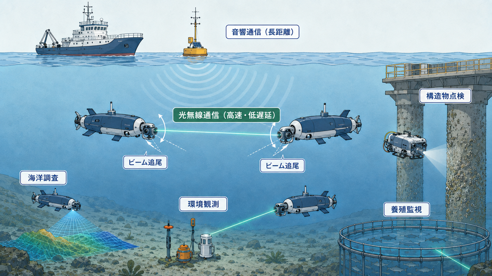
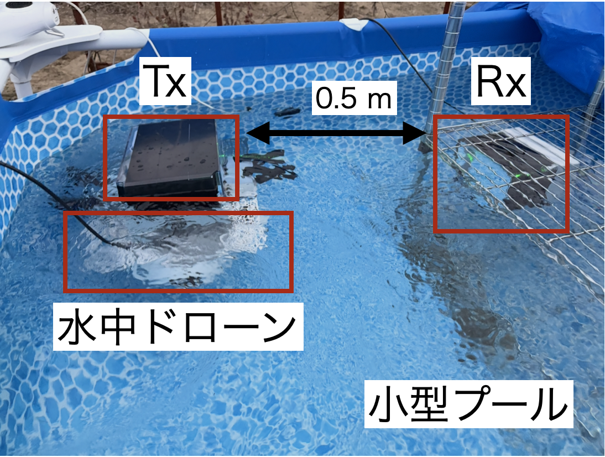

## 水中における通信

海洋は地球表面の約7割を占めており，海洋資源の調査，水中構造物の点検，環境観測，災害対応など，さまざまな分野で水中ロボットやセンサの活用が進められています．これらの機器を遠隔から操作し，取得した画像やセンサ情報を送るためには，水中で利用できる無線通信技術が不可欠です．

しかし，地上で広く利用されている電波は，水中，特に海水中では大きく減衰するため，長距離・高速通信には適していません．そのため，現在の水中通信では主に音波を用いる音響通信が利用されています．音響通信は比較的長い距離まで信号を届けられる一方，光無線通信と比較して通信速度が低く，伝搬遅延が大きいという制約があります．高精細な映像の伝送や水中ロボットのリアルタイム制御には，より高速で遅延の小さい通信手段が求められます．

## 水中光無線通信

水中光無線通信は，LEDやレーザダイオードから送信した光を高速に変調し，フォトダイオードやカメラなどの受信機で検出することで情報を伝送する技術です．

水はすべての波長の光を同じように通すわけではありません．水質にもよりますが，青色から緑色付近の光は水中で比較的減衰が小さいため，水中光無線通信ではこの波長帯が主に利用されます．光を用いることで，音響通信と比べて高速かつ低遅延な通信が可能になり，高精細画像・映像の伝送や水中機器のリアルタイム制御への応用が期待されています．

一方で，光通信が音響通信をすべて置き換えるわけではありません．音響通信は長距離通信に適し，光通信は比較的短い距離での高速通信に適しています．将来的には，音響通信で広い範囲の接続を確保し，必要な場所で光通信へ切り替えて大容量データを送るなど，両者を組み合わせた利用が重要になると考えられます．

## 水中光無線通信の課題

水中光無線通信を実際の海中環境へ適用するためには，主に次の課題を解決する必要があります．

### 光の減衰

水中では，水分子や浮遊物による吸収・散乱によって光が減衰します．特に濁った水では，受信機に届く光が弱くなるだけでなく，散乱光によって信号波形が乱れ，通信品質が低下します．したがって，水質や通信距離に応じた波長，送信光強度，変調方式および誤り訂正方式の設計が必要です．

### 光軸のずれ

レーザ光を用いる場合，光を狭い範囲へ集中させることで受信光強度を高められますが，送信機と受信機の向きが少しずれただけでも通信が途切れる可能性があります．実際の水中では，波や潮流によって機器が揺れ，水中ロボットも移動・回転します．このため，送信機と受信機の間で光軸を維持する技術が重要になります．

### 水中環境の変動

実環境では，濁度，周囲光，気泡，浮遊物および水流が時間とともに変化します．実験室内の静止した水槽で通信できるだけでは不十分であり，このような変動がある環境でも通信を継続できるシステムが求められます．

## 追尾システムと通信の両立

本研究室では，水中光無線通信における通信性能だけでなく，移動や揺れがある状況で光リンクを維持するためのビーム追尾技術に着目しています．受信機に到達した光の位置を複数のフォトダイオードやカメラで検出し，その情報をもとに光学系の向きを制御することで，光軸のずれを補正します．

追尾と通信は，別々に成立すればよいわけではありません．追尾用センサが光を検出できても，通信用受信機に十分な光が届かなければデータは正しく受信できません．反対に，静止状態で高い通信速度を達成できても，機器が動いたときに光軸を維持できなければ実環境では利用できません．

そこで本研究では，受信光強度や追尾誤差だけでなく，ビット誤り率や通信維持時間も同時に評価します．また，ビームの太さ，追尾制御の速度，受信機の構成，水の濁りなどが，追尾性能と通信性能の両方に与える影響を明らかにします．これにより，単に光を追い続けるだけではなく，移動中も情報を安定して伝送できる水中光無線通信システムの実現を目指しています．

## 実験系
小型プールにおいて，水中ドローンに搭載した送信機(Tx)と固定された受信機(Rx)間で追尾しながら通信を行う実験を実施しました．

